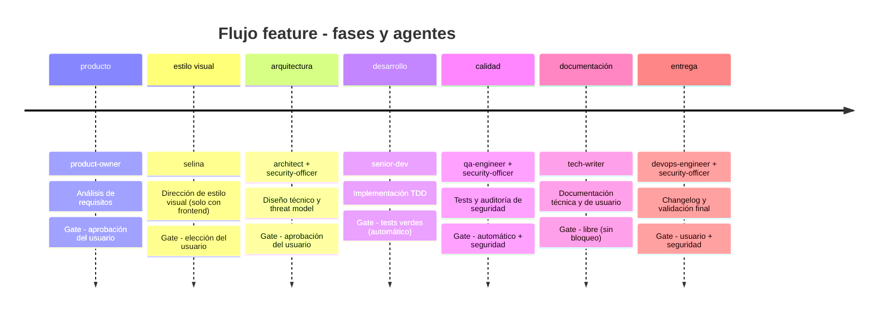

```text
█████╗ ██╗     ███████╗██████╗ ███████╗██████╗     ██████╗ ███████╗██╗   ██╗
██╔══██╗██║     ██╔════╝██╔══██╗██╔════╝██╔══██╗    ██╔══██╗██╔════╝██║   ██║
███████║██║     █████╗  ██████╔╝█████╗  ██║  ██║    ██║  ██║█████╗  ██║   ██║
██╔══██║██║     ██╔══╝  ██╔══██╗██╔══╝  ██║  ██║    ██║  ██║██╔══╝  ╚██╗ ██╔╝
██║  ██║███████╗██║     ██║  ██║███████╗██████╔╝    ██████╔╝███████╗ ╚████╔╝
╚═╝  ╚═╝╚══════╝╚═╝     ╚═╝  ╚═╝╚══════╝╚═════╝     ╚═════╝ ╚══════╝  ╚═══╝
```

**Plugin de ingeniería de software automatizada para [Claude Code](https://code.claude.com/docs/en/overview).**

10 agentes (8 de núcleo, Selina si hay frontend y Lucius bajo demanda), catálogo de 11 skills de proceso, memoria persistente de decisiones por proyecto, 6 flujos de trabajo con quality gates verificables con evidencia, fase de estilo visual condicional, modo autopilot y compliance europeo (RGPD, NIS2, CRA) integrado desde el diseño.

[Documentación completa](https://alfred-dev.com/) -- [Instalar](#instalación) -- [Equipo](#el-equipo) -- [Comandos](#comandos) -- [Arquitectura](#arquitectura)

---

## Qué es Alfred Dev

Alfred Dev es un plugin que orquesta el ciclo de desarrollo de software con agentes autónomos. Cada agente tiene un rol concreto, un ámbito delimitado y quality gates que impiden avanzar a la siguiente fase sin evidencia. El sistema está pensado para que ningún artefacto llegue a producción sin haber pasado por producto, arquitectura, desarrollo con TDD, revisión de seguridad, QA y documentación.

El runtime detecta el stack del proyecto con `config_loader.detect_stack()` (Node.js/TypeScript, Python, Rust, Go, Ruby, Elixir, Java/Kotlin, PHP, C#/.NET, Swift) y adapta artefactos al ecosistema real: frameworks, gestores de paquetes, runners de tests y estructura de directorios cuando esos manifiestos existen.

La documentación viva del proyecto auditado vive en `docs/project/` (índice, arquitectura, compliance, threat-model, dependencias, mapa y estado). Los ADRs van a `docs/adr/`. Esos ficheros no son este repositorio: los crea el plugin en el repo donde trabajas.

## El equipo

Alfred Dev no es un agente monolítico que intenta saberlo todo. Es un equipo de **10 especialistas**, cada uno con un rol delimitado, personalidad propia y quality gates verificables con evidencia. Un modelo generalista rinde mejor con un rol concreto e instrucciones focalizadas que cuando se le pide que sea todo a la vez.

Cada agente se invoca como un subproceso de Claude Code mediante la herramienta **Agent**. Arranca con su propio system prompt, sin heredar sesgos ni ruido de conversaciones anteriores. El resultado no se promete determinista, pero sí más controlable: el mismo rol, las mismas instrucciones y los mismos artefactos reducen la variabilidad y facilitan revisar si cumplió su contrato.

Tres principios de diseño:

- **Responsabilidad única.** El Artesano escribe código; El Paranoico audita seguridad. Ninguno invade el territorio del otro.
- **Herramientas restringidas.** No todos los agentes necesitan el sistema de ficheros o la terminal. Limitar herramientas reduce la superficie de error.
- **Quality gates entre fases.** Ningún artefacto pasa de fase sin un punto de control. Las gates pueden ser automáticas (tests verdes), manuales (aprobación del usuario) o combinadas (automático + seguridad).

Frontera del núcleo:

- **`product-owner`** decide **qué** problema se resuelve y **por qué**.
- **`architect`** decide **cómo** se implementa técnicamente.
- **`alfred`** decide **cuándo** interviene cada uno, en qué orden y con qué gate.

Si esas tres responsabilidades se mezclan, el flujo deja de ser previsible. Alfred coordina; no redefine alcance ni diseño por su cuenta.

### Flujo feature: cronología de fases

El flujo `feature` es el más completo: hasta siete fases secuenciales. La fase `estilo_visual` solo aparece si el proyecto tiene frontend. El `security-officer` interviene en arquitectura, calidad y entrega: la seguridad no es un paso final.



El `security-officer` valida el threat model en arquitectura, audita el código en calidad y da el visto bueno en entrega. Detectar un problema de seguridad pronto sale más barato que detectarlo en producción.

## Instalación

Una sola línea. El script verifica el entorno, registra en Claude Code una
fuente GitHub global para Alfred Dev e instala el plugin con la CLI nativa de Claude Code.
No pisa `~/.claude/skills` ni crea `~/.claude/skills/alfred/SKILL.md` ni
`~/.claude/commands/alfred.md`. La entrada es `/alfred-dev:alfred`.
Parchea hooks y `.mcp.json` si el `python3` por defecto no es compatible.

Antes de instalar, limpia el checkout local del marketplace
(`~/.claude/plugins/marketplaces/alfred-dev`) y lo vuelve a registrar, para no
materializar una caché antigua. La instalación soportada es siempre global de
usuario: si existían rastros `local` o `project` del propio Alfred Dev, el
instalador los normaliza y reinstala con `--scope user`. No usa un marketplace
oficial de Anthropic: usa la CLI nativa para registrar una fuente propia no oficial.

```bash
curl -fsSL https://raw.githubusercontent.com/686f6c61/alfred-dev/main/install.sh | bash
```

Si ya tienes este repo clonado localmente, también puedes invocarlo así:

```bash
bash ./install.sh
```

Después de instalar, en una sesión abierta ejecuta `/reload-plugins` para cargar
Alfred Dev sin reiniciar. Si Claude Code avisa por coste/caché de MCP o el
plugin no aparece, reinicia Claude Code. Verifica con:

```bash
/alfred-dev:alfred
```

En Windows (PowerShell):

```powershell
irm https://raw.githubusercontent.com/686f6c61/alfred-dev/main/install.ps1 | iex
```

Requisitos:

- [Claude Code](https://code.claude.com/docs/en/overview) instalado, configurado y actualizado. Alfred Dev 0.7.0 requiere una CLI con plugins, skills, hooks y MCP.
- Python 3.10+ (para hooks, core y MCP en macOS, Linux y Windows).

Para desinstalar:

```bash
# macOS / Linux
curl -fsSL https://raw.githubusercontent.com/686f6c61/alfred-dev/main/uninstall.sh | bash
```

```bash
# macOS / Linux, desde el repo clonado
bash ./uninstall.sh
```

```powershell
# Windows
irm https://raw.githubusercontent.com/686f6c61/alfred-dev/main/uninstall.ps1 | iex
```

El desinstalador retira el plugin y la fuente del marketplace en scope `user`.
Si queda un alias global `/alfred` de instalaciones 0.6, también lo limpia.
No borra `.claude/` del proyecto (config, memoria SQLite, handoff).

`/alfred-dev:update` compara la versión instalada con el último GitHub Release
y guía la actualización. Añadir el marketplace `686f6c61/alfred-dev` instala
lo que haya en la rama por defecto `main`.

## Inicio rápido

Una vez instalado, habla en castellano. No hace falta memorizar slash commands.

```text
sigue donde lo dejé
el login peta con eñes
cambia el texto del botón
```

El hook `prompt-route.py` sugiere la ruta si el texto no trae slash. `/alfred-dev:alfred`
decide si toca mapear, discutir, retomar, abrir UAT o arrancar un flujo.
Si quieres el flujo largo:

```text
/alfred-dev:feature sistema de login con email y password
```

`/alfred-dev:ajustes` cambia autonomía y Lucius. `/alfred-dev:feature` recorre
hasta 7 fases (producto, estilo visual, arquitectura, desarrollo, calidad,
documentación, entrega). Autopilot solo resuelve gates de usuario configuradas;
no salta tests, seguridad, evidencia ni confirmación humana de despliegue.
La fase de estilo visual se activa solo si hay interfaz.

## Novedades en v0.7.0

Recorte alineado con el SDK de Claude Code: 10 agentes (`inherit`), 11 skills planas, 18 comandos publicados. La entrada es `/alfred-dev:alfred`. Continuidad pública: `alfred`, `progress` y `retomar`. Sin alias global `/alfred`, sin stop-hook Ralph y sin reescribir `settings.json`. El servidor de memoria usa MCP stdio moderno y arranca `mcp/memory_server.py` con FastMCP si el paquete `mcp` está instalado. Secret-guard cubre Write, Edit, Bash y tools MCP de escritura. Agent Teams solo si el usuario ya lo tiene activo. La auditoría viva está en [docs/release.md](docs/release.md). El histórico de 0.6.x está en el [changelog](CHANGELOG.md).

## Comandos

Toda la interfaz se controla desde la línea de comandos de Claude Code. La entrada principal es `/alfred-dev:alfred`. El resto usa el mismo prefijo `/alfred-dev:`. No hay alias global `/alfred`. `plugin.json` publica 18 comandos. En `commands/` quedan helpers internos que no se listan como slash: `next`, `search`, `_composicion.md` y `_docs_vivas.md`.

### Core

| Comando | Descripción |
|---------|-------------|
| `/alfred-dev:alfred` | Entrada contextual: decide si toca mapear, discutir, retomar, abrir UAT o arrancar un flujo multiagente. |
| `/alfred-dev:feature <desc>` | Ciclo completo de hasta 7 fases. Alfred pregunta desde qué fase arrancar. |
| `/alfred-dev:quick <desc>` | Flujo ligero para cambios pequeños con menos ceremonia que `feature`. |
| `/alfred-dev:fix <desc>` | Corrección de bugs en 3 fases: diagnóstico, corrección TDD, validación. |
| `/alfred-dev:spike <tema>` | Investigación técnica sin compromiso: prototipos, benchmarks, hallazgos. |
| `/alfred-dev:discuss <desc>` | Refina una idea o fase y deja `docs/project/discovery.md` antes de abrir `feature`. |
| `/alfred-dev:map-codebase` | Analiza un repo existente y deja `docs/project/codebase-map.md` y `docs/project/current.md`. |
| `/alfred-dev:progress` | Resume kanban, bloqueos, trazabilidad, UAT y estado operativo. |
| `/alfred-dev:uat` | Crea o cierra la validación humana, separada de los tests automáticos. |
| `/alfred-dev:audit` | Auditoría con 4 agentes en paralelo: calidad, seguridad, arquitectura, documentación. |
| `/alfred-dev:ship` | Release: auditoría final, changelog, versionado semántico, despliegue. |
| `/alfred-dev:memory-ui` | Abre o cierra la UI local de la memoria SQLite. |
| `/alfred-dev:ajustes` | Configurar autonomía, stack, Lucius, memoria y personalidad. |

### Operativos

| Comando | Descripción |
|---------|-------------|
| `/alfred-dev:retomar` | Retoma una sesión pausada usando el handoff y el estado guardado. |
| `/alfred-dev:pause` | Pausa el trabajo en curso y genera handoff persistente. |
| `/alfred-dev:sync-github [owner/repo]` | Refleja el tablero local en GitHub Issues usando `gh`. |
| `/alfred-dev:lucius [dir] [--scope X]` | Segunda opinión técnica vía Codex CLI. |
| `/alfred-dev:update` | Comprueba si hay versión nueva (GitHub Releases) y actualiza el plugin. |

### Ejemplo de uso

```
> /alfred-dev:feature sistema de autenticación con OAuth2

Alfred activa el flujo de hasta 7 fases:
  1. Producto        -- PRD con historias de usuario y criterios de aceptación
  2. Estilo visual   -- Tres propuestas en navegador (solo si hay UI)
  3. Arquitectura    -- Diseño de componentes, ADRs, threat model en paralelo
  4. Desarrollo      -- Implementación TDD (rojo-verde-refactor)
  5. Calidad         -- Code review + OWASP + compliance + SBOM
  6. Documentación   -- API docs, guía de usuario, changelog
  7. Entrega         -- Pipeline CI/CD, Docker, deploy

Cada transición entre fases requiere superar la quality gate correspondiente.
```

Los 6 flujos del orquestador son `feature` (hasta 7 fases), `fix` (3), `spike` (2),
`ship` (4), `audit` (1) y `quick` (2).

## Arquitectura

### Agentes de núcleo (8 + Selina)

El plugin publica 10 agentes: 8 de núcleo, Selina si hay frontend y Lucius bajo demanda. La configuración del proyecto no desactiva el núcleo, pero Alfred no los invoca todos a la vez: cada flujo activa el rol de la fase, las señales del proyecto y las gates pendientes. El kanban y la trazabilidad los escribe el runtime, no un agente de project manager.

| Agente | Rol | Modelo | Responsabilidad |
|--------|-----|--------|-----------------|
| **Alfred** | Orquestador | inherit | Coordina flujos, activa agentes, evalúa gates entre fases |
| **El Buscador de Problemas** | Product Owner | inherit | PRDs, historias de usuario, criterios de aceptación, análisis competitivo |
| **Selina** | Dirección visual | inherit | Tres propuestas en navegador, artefacto `docs/style-direction.md`, gate de estilo |
| **El Dibujante de Cajas** | Arquitecto | inherit | Diseño de sistemas, ADRs, diagramas Mermaid, matrices de decisión |
| **El Artesano** | Senior Dev | inherit | Implementación TDD, refactoring, commits atómicos |
| **El Paranoico** | Security Officer | inherit | OWASP Top 10, threat modeling STRIDE, SBOM, compliance RGPD/NIS2/CRA |
| **El Rompe-cosas** | QA Engineer | inherit | Test plans, code review, exploratorio, integración, E2E, regresión |
| **El Fontanero** | DevOps Engineer | inherit | Docker multi-stage, CI/CD, deploy, monitoring, observabilidad |
| **El Escriba** | Tech Writer | inherit | Sync corto por fase (cabeceras, docstrings, `docs/project/`); en documentación: API docs, arquitectura, guías, changelogs |

Los 10 agentes declaran `model: inherit` y usan el modelo de la sesión. Selina ocupa la fase condicional entre producto y arquitectura. Solo se activa si `has_frontend(stack)` es verdadero.

### Agente opcional (Lucius)

El único opcional del runtime es **Lucius**, segunda opinión vía Codex CLI. Se activa con `/alfred-dev:ajustes` o al pedir una auditoría externa. No hay data-engineer, ux-reviewer, github-manager, librarian ni el resto del catálogo 0.6. Más detalles en la [documentación de configuración](docs/configuration.md#composicion-dinamica-de-equipo).

### Skills (11)

Cada skill es una habilidad plana en `skills/*/SKILL.md`. El catálogo publicado es:

```
skills/
  compliance-check/
  evaluate-dependency/
  incident-response/
  memory/
  pr-workflow/
  sbom-generate/
  sonarqube/
  style-direction/
  sync-project-docs/
  threat-model/
  write-adr/
```

Los skills con side effects (`style-direction`, `sonarqube`, `incident-response`, `pr-workflow`) declaran `disable-model-invocation: true`.

### Hooks (10)

Los hooks interceptan eventos del ciclo de vida de Claude Code. Este plugin registra 10 scripts en `SessionStart`, `SessionEnd`, `UserPromptSubmit`, `PreToolUse` y `PostToolUse`. `activity-capture.py` está en tres matchers (12 registros en total). No registra Stop, UserPromptExpansion ni PreCompact.

| Hook | Evento | Función |
|------|--------|---------|
| `session-bootstrap.sh` | `SessionStart` | Bootstrap síncrono: config local, memoria, permisos y wrapper de continuidad |
| `session-start.sh` | `SessionStart` | Briefing de sesión, protocolo de hablar sin slash y contexto de continuidad |
| `session-end.py` | `SessionEnd` | Detiene Memory UI y escribe el cierre de sesión (fail-open) |
| `prompt-route.py` | `UserPromptSubmit` | Si el texto no trae slash, sugiere fix/quick/retomar según la petición |
| `secret-guard.py` | `PreToolUse` (Write/Edit/Bash/MCP) | Bloquea escritura de secretos |
| `dangerous-command-guard.py` | `PreToolUse` (Bash) | Bloquea comandos destructivos (`rm -rf /`, force push, DROP DATABASE) |
| `sensitive-read-guard.py` | `PreToolUse` (Read) | Avisa al leer ficheros sensibles (claves privadas, `.env`, credenciales) |
| `quality-gate.py` | `PostToolUse` (Bash) | Avisa cuando un runner de tests falla, usando salida y exit code |
| `evidence-guard.py` | `PostToolUse` (Bash) | Registra evidencia de ejecución de tests para verificación de gates |
| `activity-capture.py` | `PostToolUse` + `UserPromptSubmit` | Captura automática de actividad, commits e iteraciones |

### Templates (8)

Plantillas que los agentes usan para generar artefactos con estructura estable:

- `prd.md` -- Product Requirements Document
- `adr.md` -- Architecture Decision Record
- `test-plan.md` -- Plan de testing por riesgo
- `threat-model.md` -- Modelado de amenazas STRIDE
- `sbom.md` -- Software Bill of Materials
- `changelog-entry.md` -- Entrada de changelog (Keep a Changelog)
- `release-notes.md` -- Notas de release con resumen ejecutivo
- `compliance.md` -- Checklist de cumplimiento del proyecto

### Core Python

El núcleo del plugin está implementado en Python con tests unitarios. Los
módulos se agrupan por responsabilidad para no prometer un contador fijo
que quede obsoleto cuando crece el runtime:

| Familia | Módulos principales | Función |
|---------|---------------------|---------|
| Orquestación | `orchestrator.py` | Máquina de estados de 6 flujos, sesiones, gates, autopilot, loop iterativo |
| Personalidad | `personality.py` | Frases, tono, anuncios y formato de veredicto |
| Configuración | `config_loader.py`, `optional_agents.py`, `config_cli.py` | Carga de config, detección de stack, menús de `/alfred-dev:ajustes` y Lucius |
| Continuidad | `continuity.py`, `session_report.py`, `session_brief.py`, `hygiene.py` | Helpers, pausa/reanudación, briefing, higiene de ship y UAT |
| Docs vivas | `project_docs.py` | Esqueleto y comprobación de `docs/project/` y `docs/adr/` |
| Enrutado | `prompt_route.py` | Clasifica prompts sin slash (fix, quick, retomar, map-codebase) |
| Memoria | `memory.py`, `memory_config.py`, `memory_sync.py`, `memory_ui_server.py` | SQLite local, sync Markdown y UI local GET |
| Seguridad | `secrets.py` | Sanitización y detección de secretos reutilizada por memoria, empaquetado y guards |
| Selina visual | `selina_visual.py`, `selina_style_*.py` | Dirección visual condicional, catálogo, opciones y selector |

```bash
# Ejecutar tests
python3 -m pytest tests/ -v
```

## Quality gates

Las quality gates son puntos de control verificables entre fases. Si las condiciones de una gate no se cumplen, el flujo se detiene o queda pendiente con una siguiente acción clara. Autopilot solo resuelve gates de usuario configuradas; no salta tests, seguridad, evidencia ni confirmación humana de despliegue.

El orquestador define 5 tipos: `libre`, `usuario`, `automatico`, `usuario+seguridad` y `automatico+seguridad`.

| Gate | Condición |
|------|-----------|
| PRD aprobado | El usuario valida el PRD antes de pasar a arquitectura |
| Diseño aprobado | El usuario aprueba el diseño Y el security officer lo valida |
| Tests en verde | Todos los tests pasan antes de pasar a calidad |
| Evidencia verificada | Las afirmaciones de tests deben estar respaldadas por salida real registrada por `evidence-guard.py` |
| Loop iterativo | Si una gate falla, se reintenta hasta 5 veces con feedback antes de escalar al usuario |
| QA + seguridad | El QA engineer y el security officer aprueban en paralelo |
| Documentación completa | Todos los artefactos están documentados con checklist/evidencia revisable |
| Pipeline verde | CI/CD verde, sin usuario root en contenedor, sin secretos en imagen |

Cada gate produce un veredicto formal: **APROBADO**, **APROBADO CON CONDICIONES** o **RECHAZADO**, con hallazgos bloqueantes y próxima acción recomendada.

## Compliance

El plugin integra verificaciones de compliance europeo en el flujo de desarrollo:

- **RGPD** -- Protección de datos desde el diseño. Verificación de base legal, minimización de datos, derechos de los interesados.
- **NIS2** -- Directiva de ciberseguridad para operadores esenciales. Gestión de riesgos, notificación de incidentes, cadena de suministro.
- **CRA** -- Cyber Resilience Act. Requisitos de ciber-resiliencia para productos digitales con componentes conectados.
- **OWASP Top 10** -- Verificación sistemática de las 10 vulnerabilidades más explotadas en cada revisión de seguridad.
- **SBOM** -- Generación automática del Software Bill of Materials con inventario de dependencias, licencias y CVEs conocidos.

## Detección de stack

`core/config_loader.py` (`detect_stack()`) analiza el directorio del proyecto al cargar la configuración. El bootstrap de `SessionStart` materializa `.claude/alfred-dev.local.md` con ese resultado. No lo hace `session-start.sh`: ese hook inyecta el briefing y el protocolo de hablar sin slash.

| Lenguaje | Señales | Qué detecta además |
|----------|---------|-------------------|
| Node.js / TypeScript | `package.json` (+ `tsconfig.json` eleva a TypeScript) | Frameworks: Next, Nuxt, Astro, Remix, Gatsby, Svelte, Solid, Qwik, Vue, React, Angular, Hono, Express, Fastify, Koa, Nest. ORM, runner y bundler si están en dependencias. |
| Python | `pyproject.toml`, `setup.py`, `requirements.txt` | FastAPI, Django, Flask, Starlette, Litestar, Sanic, Tornado, aiohttp. ORM y runner si aparecen en manifiestos. |
| Rust | `Cargo.toml` | Runtime y lenguaje. No infiere framework. |
| Go | `go.mod` | Runtime y lenguaje. No infiere framework. |
| Ruby | `Gemfile` | Runtime y lenguaje. No infiere framework. |
| Elixir | `mix.exs` | Runtime y lenguaje. No infiere framework. |
| Java / Kotlin | `pom.xml`, `build.gradle`, `build.gradle.kts` | Spring Boot, Quarkus, Micronaut. Kotlin si hay `.kt` o Gradle Kotlin. |
| PHP | `composer.json` | Laravel, Symfony, Slim. |
| C# / .NET | `*.csproj`, `*.sln` | ASP.NET o Blazor. |
| Swift | `Package.swift` | Vapor si aparece en el manifiesto. |

Selina solo entra si el framework detectado está en el conjunto frontend (Next, Nuxt, Astro, Remix, Gatsby, Svelte, Solid, Qwik, Vue, React, Angular).

## Memoria persistente

Alfred Dev recuerda decisiones, commits e iteraciones entre sesiones. La memoria se almacena en SQLite local (`.claude/alfred-memory.db`) dentro de cada proyecto, sin servicios remotos.

`load_config()` parte de `memoria.enabled: false` si no hay fichero local. En la primera sesión, `session-bootstrap.sh` siembra `.claude/alfred-dev.local.md` con memoria activa. A partir de ahí, `/alfred-dev:ajustes` puede desactivarla. Si está apagada, los flujos siguen; las sesiones futuras no tendrán histórico.

Con la memoria activa, `activity-capture.py` registra eventos en `UserPromptSubmit` y `PostToolUse` (Write, Edit, Bash): iteraciones, fases, commits (SHA, autor, ficheros) y actividad de la sesión. Las decisiones se consultan con el servidor MCP y `/alfred-dev:memory-ui`. No hay agente Bibliotecario.

Funcionalidades principales:

- **Trazabilidad**: problema, decisión, commit y validación enlazados con IDs.
- **Búsqueda**: texto completo con FTS5, filtros `since`/`until`, etiquetas y estado (`active`/`superseded`/`deprecated`).
- **Servidor MCP** (`alfred-memory`): 15 herramientas (buscar, registrar, consultar, estadísticas, iteraciones, ciclo de vida de decisiones, integridad, export/import). Habla MCP stdio moderno (JSON por línea) y mantiene lectura compatible con el framing `Content-Length` antiguo.
- **Memory UI**: visor local GET en loopback sobre `.claude/alfred-memory.db`. No importa el historial de Git al abrir. `POST` no está implementado. `/alfred-dev:memory-ui stop` y `SessionEnd` detienen el servidor.
- **Importación MCP**: la tool `memory_import` sí puede cargar commits de Git o ADRs de `docs/adr/` cuando un agente la invoca; eso no ocurre al abrir la UI.
- **Contexto de sesión**: `session-start.sh` inyecta un briefing de estado, última decisión y ADRs aceptados.
- **Exportación**: `memory_export` escribe decisiones a Markdown con formato ADR.
- **Seguridad**: sanitización de secretos con los mismos patrones que `secret-guard.py`, permisos `0600` en la base de datos.
- **Migración**: el esquema se actualiza con backup previo al abrir bases antiguas.

## Estructura del proyecto

```
alfred-dev/
  .claude-plugin/
    plugin.json           # Manifiesto del plugin (version, 18 comandos)
    marketplace.json      # Metadatos de la fuente no oficial
  .mcp.json               # Servidor MCP alfred-memory (stdio)
  agents/                 # 10 agentes (8 de núcleo + Selina + Lucius)
  commands/               # 18 comandos publicados + helpers internos
  skills/                 # Catálogo publicado de 11 skills planas
  hooks/                  # 10 scripts + hooks.json
  core/                   # Motor de orquestación, memoria e informes (Python)
  mcp/                    # Servidor MCP stdio (memoria persistente)
  templates/              # 8 plantillas de artefactos
  visual/                 # Companion local de Selina (servidor y HTML)
  tests/                  # Tests y contratos de release (pytest)
  docs/                   # Documentación técnica del plugin
  scripts/                # Auditoría de release y smokes
  install.sh / install.ps1
  uninstall.sh / uninstall.ps1
```

La landing pública se mantiene en la rama `Alfred-Astro` y se despliega desde Coolify sobre el VPS. La rama `main` contiene solo el plugin, su runtime y sus tests.

## Configuracion

El plugin se configura por proyecto con `.claude/alfred-dev.local.md` en la raíz del proyecto. En la primera sesión, `SessionStart` lo crea si falta con autonomía por fases en `autonomo` y memoria activa; después `/alfred-dev:ajustes` permite cambiarlo a `interactivo` o `semi-autonomo`. El único opcional es Lucius:

```yaml
---
autonomia:
  producto: autonomo
  arquitectura: autonomo
  desarrollo: autonomo
  calidad: autonomo
  documentacion: autonomo
  entrega: autonomo

agentes_opcionales:
  lucius: false

memoria:
  enabled: true
  sync_to_native: true
  sync_commits_limit: 10
  capture_decisions: true
  capture_commits: true
  retention_days: 365

personalidad:
  nivel_sarcasmo: 3
  verbosidad: normal
  idioma: es
  celebrar_victorias: true
  insultar_malas_practicas: true
---

Notas adicionales del proyecto que Alfred debe tener en cuenta.
```

Los tres niveles de autonomía por fase son `interactivo` (pide confirmación), `semi-autonomo` y `autonomo`. Autopilot no salta tests, seguridad, evidencia ni el deploy.

## Descargo de responsabilidad

**Alfred Dev** es un proyecto independiente de código abierto. No está afiliado, patrocinado ni respaldado por **Anthropic** ni por el equipo de **Claude Code**.

El software se entrega en su estado actual, sin garantías de ningún tipo, expresas o implícitas, incluidas las de comerciabilidad, adecuación a un fin concreto y ausencia de infracción. En ningún caso los autores o titulares de los derechos de autor serán responsables de reclamaciones, daños u otras responsabilidades derivadas del uso del software.

Alfred Dev ejecuta agentes que pueden crear, modificar y eliminar ficheros, ejecutar comandos en terminal e interactuar con servicios externos (GitHub, Docker, etc.). El usuario es responsable de revisar y aprobar las acciones que el plugin propone antes de su ejecución.

Los agentes utilizan modelos de lenguaje que pueden generar contenido incorrecto, incompleto o inadecuado. Las salidas del plugin son sugerencias que requieren revisión humana, no resultados definitivos.

## Licencia

MIT

---

[Documentación completa](https://alfred-dev.com/) | [Código fuente](https://github.com/686f6c61/alfred-dev)
