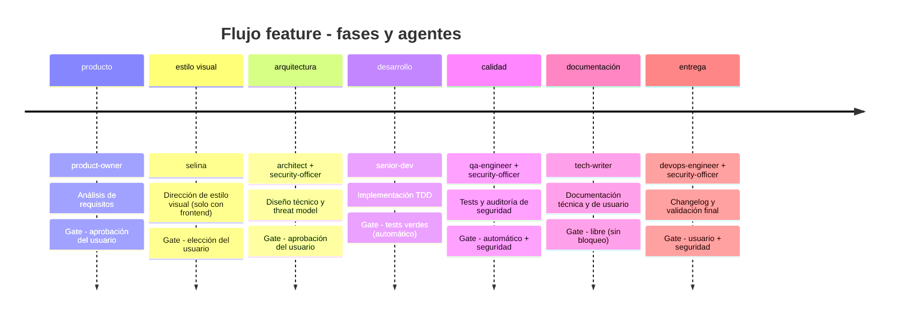

```text
█████╗ ██╗     ███████╗██████╗ ███████╗██████╗     ██████╗ ███████╗██╗   ██╗
██╔══██╗██║     ██╔════╝██╔══██╗██╔════╝██╔══██╗    ██╔══██╗██╔════╝██║   ██║
███████║██║     █████╗  ██████╔╝█████╗  ██║  ██║    ██║  ██║█████╗  ██║   ██║
██╔══██║██║     ██╔══╝  ██╔══██╗██╔══╝  ██║  ██║    ██║  ██║██╔══╝  ╚██╗ ██╔╝
██║  ██║███████╗██║     ██║  ██║███████╗██████╔╝    ██████╔╝███████╗ ╚████╔╝
╚═╝  ╚═╝╚══════╝╚═╝     ╚═╝  ╚═╝╚══════╝╚═════╝     ╚═════╝ ╚══════╝  ╚═══╝
```

**Plugin de ingeniería de software automatizada para [Claude Code](https://code.claude.com/docs/en/overview).**

19 agentes especializados con personalidad propia (10 de nucleo + 9 opcionales), catalogo publicado de 62 skills en 15 dominios, memoria persistente de decisiones por proyecto, 6 flujos de trabajo con quality gates verificables, fase de estilo visual condicional, verificacion de evidencia automatica, modo autopilot y compliance europeo (RGPD, NIS2, CRA) integrado desde el diseno.

[Documentación completa](https://alfred-dev.com/) -- [Instalar](#instalación) -- [Equipo](#el-equipo) -- [Comandos](#comandos) -- [Arquitectura](#arquitectura)

---

## Qué es Alfred Dev

Alfred Dev es un plugin que orquesta el ciclo completo de desarrollo de software a través de agentes autónomos. Cada agente tiene un rol concreto, un ámbito de actuación delimitado y quality gates que impiden avanzar a la siguiente fase sin cumplir los criterios de calidad. El sistema está diseñado para que ningún artefacto llegue a producción sin haber pasado por producto, arquitectura, desarrollo con TDD, revisión de seguridad, QA y documentación.

El plugin detecta automáticamente el stack tecnológico del proyecto (Node.js, Python, Rust, Go, Ruby, Elixir, Java/Kotlin, PHP, C#/.NET, Swift) y adapta los artefactos generados al ecosistema real: frameworks, gestores de paquetes, convenciones de testing y estructura de directorios.

## El equipo

Alfred Dev no es un agente monolítico que intenta saberlo todo y hacerlo todo. Es un equipo de **19 especialistas**, cada uno con un rol delimitado, herramientas restringidas, personalidad propia y quality gates verificables con evidencia. Esta decisión de diseño responde a un principio fundamental: un modelo de IA generalista rinde mejor cuando se le asigna un rol concreto con instrucciones focalizadas que cuando se le pide que sea todo a la vez.

Cada agente se invoca como un subproceso de Claude Code mediante la herramienta **Agent**. Esto garantiza aislamiento de contexto: el agente arranca con su propio system prompt, sin heredar sesgos ni ruido de conversaciones anteriores. El resultado no se promete determinista, pero sí más controlable: el mismo rol, con las mismas instrucciones y artefactos, reduce variabilidad y facilita revisar si el agente cumplió su contrato.

La filosofía detrás de esta arquitectura se resume en tres principios:

- **Responsabilidad única.** Cada agente tiene un ámbito de actuación claro. El Artesano escribe código; El Paranoico audita seguridad. Ninguno invade el territorio del otro.
- **Herramientas restringidas.** No todos los agentes necesitan acceso al sistema de ficheros o a la terminal. Limitar las herramientas por agente reduce la superficie de error y fuerza la especialización.
- **Quality gates entre fases.** Ningún artefacto pasa de una fase a la siguiente sin superar un punto de control. Estos gates pueden ser automáticos (tests verdes), manuales (aprobación del usuario) o combinados (automático + seguridad).

Hay una frontera especialmente importante en el núcleo:

- **`product-owner`** decide **qué** problema se resuelve y **por qué**.
- **`architect`** decide **cómo** se implementa técnicamente.
- **`alfred`** decide **cuándo** interviene cada uno, en qué orden y con qué gate.

Si esas tres responsabilidades se mezclan, el flujo deja de ser previsible. Por eso Alfred coordina, pero no redefine alcance ni diseño por su cuenta.

### Flujo feature: cronología de fases

El flujo `feature` es el más completo del sistema y el que mejor ilustra cómo colaboran los agentes. Cada feature nueva atraviesa hasta siete fases secuenciales: la fase visual `estilo_visual` solo aparece cuando el proyecto tiene frontend. El `security-officer` aparece en tres fases distintas porque la seguridad no es un paso final, sino una preocupación transversal que acompaña al desarrollo desde el diseño hasta la entrega.



El diagrama muestra algo importante: la seguridad no se comprueba al final, sino que interviene en la arquitectura (para validar el threat model), en la calidad (para auditar el código) y en la entrega (para dar el visto bueno final). Esta presencia transversal del `security-officer` es una decisión deliberada para que los problemas de seguridad se detecten lo antes posible, cuando corregirlos es barato.

## Instalación

Una sola línea. El script verifica el entorno, registra en Claude Code una
fuente GitHub global para Alfred Dev, instala el plugin, crea el alias personal
global invocable `~/.claude/skills/alfred/SKILL.md` y elimina el shim personal
obsoleto `~/.claude/commands/alfred.md` si existe, para que `/alfred` salga una
sola vez en cualquier proyecto,
y parchea hooks/MCP si el `python3` por defecto no es compatible. La
instalación soportada es siempre global de usuario: si existían rastros
`local` o `project` del propio Alfred Dev, el instalador los normaliza antes de
reinstalar con `--scope user`. No usa un marketplace oficial de Anthropic: usa
la CLI nativa de Claude Code para registrar una fuente propia no oficial:

```bash
curl -fsSL https://raw.githubusercontent.com/686f6c61/alfred-dev/main/install.sh | bash
```

Si ya tienes este repo clonado localmente, tambien puedes invocarlo asi:

```bash
bash ./install.sh
```

Después de instalar, en una sesión abierta ejecuta `/reload-plugins` para cargar
Alfred Dev sin reiniciar. Si Claude Code avisa por coste/caché de MCP o el
plugin no aparece, reinicia Claude Code. Verifica con:

```bash
/alfred
```

En Windows (PowerShell):

```powershell
irm https://raw.githubusercontent.com/686f6c61/alfred-dev/main/install.ps1 | iex
```

Requisitos:
- [Claude Code](https://code.claude.com/docs/en/overview) instalado, configurado y actualizado. Alfred Dev 0.6.0 se audita contra Claude Code 2.1.183 y requiere una CLI con sistema de plugins, skills, hooks y MCP.
- Python 3.10+ (para hooks, core y MCP en macOS, Linux y Windows).

Para desinstalar:

```bash
# macOS / Linux
curl -fsSL https://raw.githubusercontent.com/686f6c61/alfred-dev/main/uninstall.sh | bash
```

```bash
# macOS / Linux, desde el repo clonado
bash ./uninstall.sh
```

```powershell
# Windows
irm https://raw.githubusercontent.com/686f6c61/alfred-dev/main/uninstall.ps1 | iex
```

## Inicio rapido

Una vez instalado, estos tres pasos muestran Alfred Dev en accion:

```bash
# 1. Verificar que el plugin esta cargado
/alfred

# 2. Configurar el proyecto (detecta el stack automaticamente)
/alfred-dev:config

# 3. Arrancar una funcionalidad de ejemplo
/alfred-dev:feature sistema de login con email y password
```

Alfred activara el flujo de hasta 7 fases (producto, estilo visual*, arquitectura, desarrollo, calidad, documentacion, entrega) y respetara el modo configurado en `/alfred-dev:config`: en modo interactivo pedira confirmacion en las gates de usuario; en autopilot autoaprueba solo esas gates, sin saltarse tests, seguridad ni evidencia. El despliegue a produccion sigue requiriendo confirmacion humana explicita incluso en autopilot. La fase de estilo visual se activa solo en proyectos con interfaz de usuario. Para una tarea mas rapida, prueba `/alfred-dev:quick` para cambios pequenos, `/alfred-dev:fix` para un bug o `/alfred-dev:spike` para investigar una tecnologia sin compromiso de implementacion.

## Novedades en v0.6.0

La v0.6.0 es la release de estabilización previa a publicar. Moderniza la superficie de Claude Code, fija una version menor única para seguir mejorando sin parchear cada iteración y abre una auditoría completa de claims: cada promesa del plugin debe tener evidencia en terminal, documentación o prueba de comportamiento.

| Novedad | Descripcion |
|---------|-------------|
| **19 agentes visibles en Claude Code** | Los 9 agentes opcionales pasan a la raíz de `agents/`, junto a los 10 de núcleo, para que la CLI los descubra correctamente. |
| **MCP compatible con la CLI actual** | `alfred-memory` se declara mediante `.mcp.json` con lanzador portable: usa `CLAUDE_PLUGIN_ROOT` instalado y `cwd` en desarrollo local. |
| **Herramienta Agent actualizada** | Las referencias operativas a `Task` pasan a `Agent`, alineando comandos, agentes y documentación con la nomenclatura actual de Claude Code. |
| **Comandos tratados como skills planas** | Los 25 slash commands namespaced siguen en `commands/` para preservar la UX `/alfred-dev:*`; `/alfred` se instala como skill personal global invocable en `~/.claude/skills/alfred/SKILL.md`, elimina el shim personal de commands para evitar duplicados y reutiliza `commands/alfred.md` como contrato interno. |
| **Skills delicados marcados como manuales** | Workflows con side effects claros, como SonarQube, incident response, releases, GitHub o dirección visual asistida, siguen publicados pero usan `disable-model-invocation: true` para exigir invocación explícita. |
| **Nombre humano en la UI** | `plugin.json` y `marketplace.json` declaran `displayName: "Alfred Dev"` sin cambiar el namespace técnico `alfred-dev`. |
| **MCP stdio moderno** | El servidor de memoria responde a JSONL MCP actual y conserva lectura de `Content-Length` para probes antiguos. |
| **Auditoría humano-funcional** | [docs/release-audit-0.6.0.md](docs/release-audit-0.6.0.md) concentra la matriz de verificación para probar que Alfred hace lo que promete antes de publicar. |
| **Versionado coherente a 0.6.0** | `plugin.json` queda como fuente canonica de version; instaladores, paquetes, sitio, memoria MCP y session report se alinean con el mismo valor, y el marketplace no duplica `version`. |

## Comandos

Toda la interfaz se controla desde la línea de comandos de Claude Code. La entrada principal es `/alfred`; el resto de comandos usan el prefijo `/alfred-dev:`:

### Core

| Comando | Descripcion |
|---------|-------------|
| `/alfred` | Entrada contextual global: decide si toca mapear, discutir, continuar, verificar o abrir un flujo multiagente. |
| `/alfred-dev:feature <desc>` | Ciclo completo de hasta 7 fases o parcial. Alfred pregunta desde que fase arrancar. |
| `/alfred-dev:quick <desc>` | Flujo ligero para cambios pequenos con menos ceremonia que `feature`. |
| `/alfred-dev:fix <desc>` | Correccion de bugs con flujo de 3 fases: diagnostico, correccion TDD, validacion. |
| `/alfred-dev:spike <tema>` | Investigacion tecnica sin compromiso: prototipos, benchmarks, documento de hallazgos. |
| `/alfred-dev:discuss <desc>` | Refina una idea o fase concreta y deja discovery persistente antes de abrir `feature`. |
| `/alfred-dev:map-codebase` | Analiza un repo existente y deja `codebase-map.md` y `current.md` antes de implementar. |
| `/alfred-dev:progress` | Resume kanban, bloqueos, trazabilidad, UAT y estado operativo del proyecto. |
| `/alfred-dev:verify` | Crea o cierra la validacion humana/UAT separada de los tests automaticos. |
| `/alfred-dev:audit` | Auditoria completa con 4 agentes en paralelo: calidad, seguridad, arquitectura, documentacion. |
| `/alfred-dev:ship` | Release: auditoria final paralela, changelog, versionado semantico, despliegue. |
| `/alfred-dev:memory-ui` | Abre una UI local en navegador para explorar la memoria SQLite con timeline, decisiones, grafo, commits y búsqueda. |
| `/alfred-dev:config` | Configurar autonomia, stack, compliance, personalidad, agentes opcionales y memoria persistente. |
| `/alfred-dev:help` | Referencia completa de comandos, agentes y flujos. |

### Operativos avanzados

| Comando | Descripcion |
|---------|-------------|
| `/alfred-dev:resume` | Retoma una sesion pausada usando el handoff y el estado guardado. |
| `/alfred-dev:pause` | Pausa el trabajo en curso y genera handoff persistente. |
| `/alfred-dev:search <texto>` | Busca en artefactos de SonIA y en la memoria SQLite del proyecto. |
| `/alfred-dev:sync-github [owner/repo]` | Ejecuta SonIA Sync: refleja el tablero local en GitHub Issues usando `gh`. |
| `/alfred-dev:validate` | Valida la integridad operativa de kanban, trazabilidad, UAT y sync local. |
| `/alfred-dev:lucius [dir] [--scope X]` | Segunda opinión técnica vía Codex CLI. Audita el proyecto con el modelo configurado por Codex y devuelve diagnóstico + prescripción. Requiere acceso activo a Codex CLI. |
| `/alfred-dev:update` | Comprobar si hay version nueva y actualizar el plugin. |

### Vistas y aliases

| Comando | Descripcion |
|---------|-------------|
| `/alfred-dev:next` | Dice que toca ahora segun el estado del proyecto y la sesion activa. |
| `/alfred-dev:status` | Fase actual, fases completadas con duracion, gate pendiente y agente activo. |
| `/alfred-dev:standup` | Standup breve y accionable desde SonIA: en curso, bloqueos, progreso y siguiente paso. |
| `/alfred-dev:blocked` | Lista solo las tareas bloqueadas con su dependencia o motivo visible. |
| `/alfred-dev:in-progress` | Lista solo las tareas que están en curso. |

### Ejemplo de uso

```
> /alfred-dev:feature sistema de autenticación con OAuth2

Alfred activa el flujo de hasta 7 fases:
  1. Producto       -- PRD con historias de usuario y criterios de aceptación
  1b. Estilo visual -- Tres propuestas en navegador, elección del usuario (solo si hay UI)
  2. Arquitectura   -- Diseño de componentes, ADRs, threat model en paralelo
  3. Desarrollo     -- Implementación TDD (rojo-verde-refactor)
  4. Calidad        -- Code review + OWASP scan + compliance check + SBOM
  5. Documentación  -- API docs, guía de usuario, changelog
  6. Entrega        -- Pipeline CI/CD, Docker, deploy

Cada transición entre fases requiere superar la quality gate correspondiente.
```

## Arquitectura

### Agentes de nucleo (10)

El plugin implementa 10 agentes de nucleo disponibles por defecto. La configuración del proyecto no los desactiva, pero Alfred no los invoca todos a la vez: cada flujo activa el rol que corresponde a la fase, las señales del proyecto y las gates pendientes.

| Agente | Rol | Modelo | Responsabilidad |
|--------|-----|--------|-----------------|
| **Alfred** | Orquestador | opus | Coordina flujos, activa agentes, evalua gates entre fases |
| **SonIA** | Project Manager | sonnet | Descompone PRD en tareas, kanban con MD, trazabilidad criterio-tarea-test-doc, informes de progreso |
| **El buscador de problemas** | Product Owner | opus | PRDs, historias de usuario, criterios de aceptacion, analisis competitivo |
| **Selina** | Directora de estilo | opus | Tres propuestas visuales en navegador, artefacto `docs/style-direction.md`, gate de estilo |
| **El dibujante de cajas** | Arquitecto | opus | Diseno de sistemas, ADRs, diagramas Mermaid, matrices de decision |
| **El artesano** | Senior Dev | opus | Implementacion TDD estricto, refactoring, commits atomicos |
| **El paranoico** | Security Officer | opus | OWASP Top 10, threat modeling STRIDE, SBOM, compliance RGPD/NIS2/CRA |
| **El rompe-cosas** | QA Engineer | sonnet | Test plans, code review, testing exploratorio, integracion, E2E, regresion |
| **El fontanero** | DevOps Engineer | sonnet | Docker multi-stage, CI/CD, deploy, monitoring, observabilidad |
| **El traductor** | Tech Writer | sonnet | Fase 3b: cabeceras, docstrings, comentarios inline. Fase 5: API docs, arquitectura, guias, changelogs |

Los agentes con modelo `opus` realizan tareas que requieren razonamiento complejo. Selina ocupa la fase 1b entre producto y arquitectura: define la dirección visual antes de que el architect diseñe componentes. Solo se activa si el proyecto tiene interfaz de usuario.

Los agentes con modelo `sonnet` cubren tareas estructuradas con patrones mas predecibles (QA, infra, documentacion).

### Agentes opcionales (9)

Agentes predefinidos que el usuario activa segun las necesidades de su proyecto con `/alfred-dev:config`. Se sugieren automaticamente en funcion del stack detectado. Alfred tambien puede proponer agentes opcionales de forma dinamica al arrancar cada flujo, combinando las senales reales del proyecto con razonamiento semantico sobre la tarea. La seleccion dinamica es efimera (solo para esa sesion) y no modifica la configuracion persistente. Mas detalles en la [documentacion de configuracion](docs/configuration.md#composicion-dinamica-de-equipo).

| Agente | Rol | Cuando es util |
|--------|-----|----------------|
| **Data Engineer** | Ingeniero de datos | Esquema, migraciones, queries, índices o persistencia |
| **UX Reviewer** | Revisor de UX | Proyectos con frontend (React, Vue, Svelte, etc.) |
| **Performance Engineer** | Ingeniero de rendimiento | Latencia, bundles, memoria o cuellos de botella medibles |
| **GitHub Manager** | Gestor de GitHub | Cualquier proyecto con repositorio en GitHub |
| **SEO Specialist** | Especialista SEO | Proyectos web con contenido publico |
| **Copywriter** | Copywriter | Proyectos con textos publicos: landing, emails, onboarding |
| **El Bibliotecario** | Consultas historicas | Proyectos con memoria persistente activa |
| **La Interprete** | Especialista i18n | Proyectos multilingues: claves, formatos, cadenas hardcodeadas |
| **Lucius** | Director técnico externo | Segunda opinión vía Codex CLI. Requiere acceso activo a Codex CLI |

### Skills (62)

Cada skill es una habilidad concreta que un agente ejecuta. Estan organizados
en 15 dominios publicados:

```
skills/
  alfred/           -- alfred (entrada global /alfred)
  producto/          -- write-prd, user-stories, acceptance-criteria, competitive-analysis
  arquitectura/      -- write-adr, choose-stack, design-system, evaluate-dependencies
  desarrollo/        -- tdd-cycle, explore-codebase, refactor, code-review-response
  seguridad/         -- threat-model, dependency-audit, security-review, compliance-check, sbom-generate
  calidad/           -- test-plan, code-review, exploratory-testing, regression-check
  devops/            -- dockerize, ci-cd-pipeline, deploy-config, monitoring-setup
  documentación/     -- api-docs, architecture-docs, user-guide, changelog
  datos/              -- schema-design, query-optimization
  ux/                 -- accessibility-audit, flow-review, usability-heuristics
  rendimiento/        -- benchmark, profiling, bundle-size
  github/             -- pr-workflow, issue-templates
  seo/                -- meta-tags, structured-data, lighthouse-audit
  marketing/          -- copy-review, cta-writing, tone-guide
  estilo/             -- style-direction
```

### Hooks (13)

Los hooks interceptan eventos del ciclo de vida de Claude Code para aplicar validaciones automaticas:

| Hook | Evento | Funcion |
|------|--------|---------|
| `session-bootstrap.sh` | `SessionStart` | Bootstrap síncrono del proyecto: config local, memoria, permisos y wrapper de continuidad |
| `session-start.sh` | `SessionStart` | Detecta stack tecnologico, inyecta contexto de sesion y memoria persistente |
| `stop-hook.py` | `Stop` | Genera resumen e informe de sesion con fases completadas y pendientes |
| `secret-guard.sh` | `PreToolUse` (Write/Edit) | Bloquea escritura de secretos (API keys, tokens, passwords) |
| `dangerous-command-guard.py` | `PreToolUse` (Bash) | Bloquea comandos destructivos (rm -rf /, force push, DROP DATABASE, etc.) |
| `sensitive-read-guard.py` | `PreToolUse` (Read) | Avisa al leer ficheros sensibles (claves privadas, .env, credenciales) |
| `prefetch-finish-guard.py` | `PreToolUse` (Read/Write/Edit/Glob/Grep) | Evita exploración redundante después de un prefetch helper-first exitoso |
| `quality-gate.py` | `PostToolUse` (Bash) | Avisa cuando un runner de tests falla, usando salida y exit code |
| `evidence-guard.py` | `PostToolUse` (Bash) | Registra evidencia de ejecucion de tests para verificacion de gates |
| `dependency-watch.py` | `PostToolUse` (Write/Edit) | Vigila manifiestos y lockfiles de dependencias, reduciendo ruido en ediciones laterales |
| `spelling-guard.py` | `PostToolUse` (Write/Edit) | Detecta tildes ausentes en texto revisable y evita ruido técnico en rutas, código y selectores |
| `activity-capture.py` | Multiples | Captura automatica de actividad, commits e iteraciones; en prompts helper-first prepara continuidad operativa antes del razonamiento |
| `memory-compact.py` | `PreCompact` | Protege decisiones criticas durante la compactacion de contexto |

### Templates (7)

Plantillas estandarizadas que los agentes usan para generar artefactos con estructura consistente:

- `prd.md` -- Product Requirements Document
- `adr.md` -- Architecture Decision Record
- `test-plan.md` -- Plan de testing por riesgo
- `threat-model.md` -- Modelado de amenazas STRIDE
- `sbom.md` -- Software Bill of Materials
- `changelog-entry.md` -- Entrada de changelog (Keep a Changelog)
- `release-notes.md` -- Notas de release con resumen ejecutivo

### Core Python

El nucleo del plugin esta implementado en Python con tests unitarios. Los
modulos se agrupan por responsabilidad para evitar prometer un contador fijo
que quede obsoleto cuando crece el runtime:

| Familia | Modulos principales | Funcion |
|---------|---------------------|---------|
| Orquestacion | `orchestrator.py` | Maquina de estados de flujos, gestion de sesiones, evaluacion de gates, modo autopilot, loop iterativo |
| Personalidad | `personality.py` | Frases, tono, anuncios y formato de veredicto |
| Configuracion | `config_loader.py`, `optional_agents.py` | Carga de configuracion, deteccion de stack, preferencias de proyecto y agentes opcionales |
| Continuidad | `continuity.py`, `session_report.py` | Helper-first CLI, pausa/reanudacion, verificacion, informes de sesion y artefactos |
| Memoria | `memory.py`, `memory_config.py`, `memory_sync.py`, `memory_ui_server.py` | SQLite local, configuracion, sincronizacion Markdown y UI local |
| Seguridad | `secrets.py` | Sanitizacion y deteccion de secretos reutilizada por memoria, empaquetado y guards |
| Selina visual | `selina_visual.py`, `selina_style_*.py` | Direccion visual condicional, catalogo, opciones, seleccion y variantes de estilo |

```bash
# Ejecutar tests
python3 -m pytest tests/ -v
```

## Quality gates

Las quality gates son puntos de control verificables entre fases. Si las condiciones de una gate no se cumplen, el flujo se detiene o queda pendiente con una siguiente acción clara. Autopilot solo resuelve gates de usuario configuradas; no salta tests, seguridad, evidencia ni confirmación humana de despliegue:

| Gate | Condición |
|------|-----------|
| PRD aprobado | El usuario valida el PRD antes de pasar a arquitectura |
| Diseño aprobado | El usuario aprueba el diseño Y el security officer lo valida |
| Tests en verde | Todos los tests pasan antes de pasar a calidad |
| Evidencia verificada | Las afirmaciones de tests deben estar respaldadas por salida real registrada por `evidence-guard.py` |
| Loop iterativo | Si una gate falla, se reintenta hasta 5 veces con feedback antes de escalar al usuario |
| QA + seguridad | El QA engineer y el security officer aprueban en paralelo |
| Documentación completa | Todos los artefactos están documentados con checklist/evidencia revisable |
| Pipeline verde | CI/CD verde, sin usuario root en contenedor, sin secretos en imagen |

Cada gate produce un veredicto formal: **APROBADO**, **APROBADO CON CONDICIONES** o **RECHAZADO**, con hallazgos bloqueantes y próxima acción recomendada.

## Compliance

El plugin integra verificaciones de compliance europeo en el flujo de desarrollo:

- **RGPD** -- Protección de datos desde el diseño. Verificación de base legal, minimización de datos, derechos de los interesados.
- **NIS2** -- Directiva de ciberseguridad para operadores esenciales. Gestión de riesgos, notificación de incidentes, cadena de suministro.
- **CRA** -- Cyber Resilience Act. Requisitos de ciber-resiliencia para productos digitales con componentes conectados.
- **OWASP Top 10** -- Verificación sistemática de las 10 vulnerabilidades más explotadas en cada revisión de seguridad.
- **SBOM** -- Generación automática del Software Bill of Materials con inventario de dependencias, licencias y CVEs conocidos.

## Detección de stack

El hook `session-start.sh` analiza el directorio de trabajo al iniciar sesión y detecta automáticamente:

| Lenguaje | Señales | Ecosistema |
|----------|---------|------------|
| Node.js | `package.json` | npm, pnpm, bun, yarn -- Express, Next.js, Fastify, Hono |
| Python | `pyproject.toml`, `requirements.txt` | pip, poetry, uv -- Django, Flask, FastAPI |
| Rust | `Cargo.toml` | cargo -- Actix, Axum, Rocket |
| Go | `go.mod` | go mod -- Gin, Echo, Fiber |
| Ruby | `Gemfile` | bundler -- Rails, Sinatra |
| Elixir | `mix.exs` | mix -- Phoenix |
| Java / Kotlin | `pom.xml`, `build.gradle` | Maven, Gradle -- Spring Boot, Quarkus, Micronaut |
| PHP | `composer.json` | Composer -- Laravel, Symfony |
| C# / .NET | `*.csproj`, `*.sln` | dotnet, NuGet -- ASP.NET, Blazor |
| Swift | `Package.swift` | SPM -- Vapor |

## Memoria persistente

Alfred Dev puede recordar decisiones, commits e iteraciones entre sesiones. La memoria se almacena en una base de datos SQLite local (`.claude/alfred-memory.db`) dentro de cada proyecto, sin dependencias externas ni servicios remotos. Incluye etiquetas, estado y relaciones entre decisiones, auto-captura de commits, filtros avanzados de busqueda y exportacion/importacion.

La activacion es opcional y se gestiona con `/alfred-dev:config`. Una vez activa, el hook `activity-capture.py` captura eventos automaticamente en multiples puntos del ciclo de vida: iteraciones, fases, commits (SHA, autor, ficheros afectados) y actividad general de la sesion. En `UserPromptSubmit` y `UserPromptExpansion`, si detecta comandos helper-first de continuidad (`/alfred-dev:map-codebase`, `discuss`, `quick`, `feature`, `fix`, `spike`, `ship`, `audit`, `lucius` o el caso brownfield de `/alfred`), deja preparados los artefactos operativos antes del razonamiento principal. Las decisiones arquitectonicas se registran a traves del agente **El Bibliotecario** o del servidor MCP integrado.

Funcionalidades principales:

- **Trazabilidad completa**: problema, decision, commit y validacion enlazados con IDs referenciables.
- **Busqueda avanzada**: texto completo con FTS5, filtros temporales (`since`/`until`), por etiquetas y por estado (`active`/`superseded`/`deprecated`).
- **Servidor MCP**: 15 herramientas accesibles desde cualquier agente (buscar, registrar, consultar, estadisticas, gestion de iteraciones, ciclo de vida de decisiones, validacion de integridad, export/import).
- **El Bibliotecario**: agente opcional que responde consultas historicas citando siempre las fuentes con formato `[D#id]`, `[C#sha]`, `[I#id]`. Gestiona el ciclo de vida de decisiones y valida la integridad de la memoria.
- **Contexto de sesion**: al iniciar, se inyectan las decisiones de la iteracion activa (o las 5 ultimas). Un hook PreCompact protege las decisiones criticas durante la compactacion.
- **Export/Import**: exportar decisiones a Markdown (formato ADR), importar desde historial Git o ficheros ADR existentes.
- **Seguridad**: sanitizacion de secretos con los mismos patrones que `secret-guard.sh`, permisos 0600 en el fichero de base de datos.
- **Migracion automatica**: el esquema se actualiza automaticamente con backup previo al abrir bases de datos de versiones anteriores.


## Estructura del proyecto

```
alfred-dev/
  mcp/                   # Servidor MCP de memoria persistente
  .claude-plugin/
    plugin.json           # Manifiesto del plugin
    marketplace.json      # Metadatos para el marketplace
  agents/                 # 19 agentes (10 de nucleo + 9 opcionales)
  commands/               # 25 comandos /alfred-dev + contrato interno de /alfred
  skills/                 # Catalogo interno de 62 skills en 15 dominios
  hooks/                  # Hooks del ciclo de vida
    hooks.json            # Configuracion de eventos
  core/                   # Motor de orquestacion, memoria e informes (Python)
  mcp/                    # Servidor MCP stdio (memoria persistente)
  templates/              # 7 plantillas de artefactos
  tests/                  # Tests y contratos de release (pytest)
```

La landing publica se mantiene en la rama `Alfred-Astro` y se despliega desde Coolify sobre el VPS. La rama `main` contiene solo el plugin, su runtime y sus tests.

## Configuracion

El plugin se configura por proyecto con el fichero `.claude/alfred-dev.local.md` en la raiz del proyecto. En la primera sesión, `SessionStart` lo crea si falta con autonomía por fases en `autonomo` y memoria activa; despues `/alfred-dev:config` permite ajustarlo con descubrimiento contextual de agentes opcionales y memoria persistente:

```yaml
---
autonomia:
  producto: interactivo
  arquitectura: interactivo
  desarrollo: semi-autonomo
  calidad: semi-autonomo
  documentacion: autonomo
  entrega: semi-autonomo

agentes_opcionales:
  data-engineer: true
  ux-reviewer: false
  performance-engineer: false
  github-manager: true
  seo-specialist: false
  copywriter: false
  librarian: true
  i18n-specialist: false
  lucius: false

memoria:
  enabled: true
  sync_to_native: true
  sync_commits_limit: 10
  capture_decisions: true
  capture_commits: true
  retention_days: 365

personalidad:
  nivel_sarcasmo: 3
  verbosidad: normal
  idioma: es
  celebrar_victorias: true
  insultar_malas_practicas: true
---

Notas adicionales del proyecto que Alfred debe tener en cuenta.
```

## Descargo de responsabilidad

**Alfred Dev** es un proyecto independiente de codigo abierto. No esta afiliado, patrocinado ni respaldado por **Anthropic** ni por el equipo de **Claude Code**.

El software se proporciona «tal cual» (*as is*), sin garantias de ningun tipo, expresas o implicitas, incluyendo, entre otras, las garantias de comerciabilidad, adecuacion a un proposito particular y no infraccion. En ningun caso los autores o titulares de los derechos de autor seran responsables de reclamaciones, danos u otras responsabilidades derivadas del uso del software.

Alfred Dev ejecuta agentes que pueden crear, modificar y eliminar ficheros, ejecutar comandos en terminal e interactuar con servicios externos (GitHub, Docker, etc.). El usuario es responsable de revisar y aprobar las acciones que el plugin propone antes de su ejecucion.

Los agentes utilizan modelos de lenguaje de gran tamano (LLM) que pueden generar contenido incorrecto, incompleto o inadecuado. Las salidas del plugin deben tratarse como sugerencias que requieren revision humana, no como resultados definitivos.

## Licencia

MIT

---

[Documentación completa](https://alfred-dev.com/) | [Código fuente](https://github.com/686f6c61/alfred-dev)
