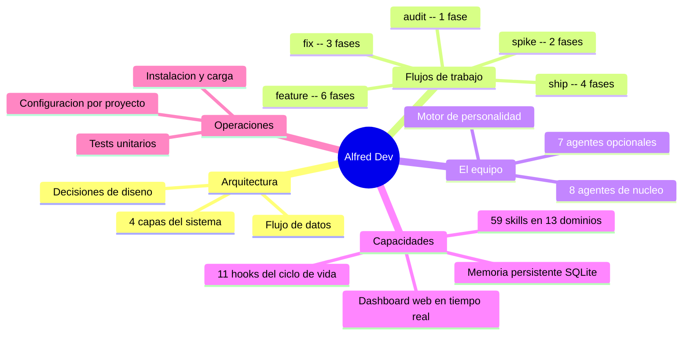

# Documentacion tecnica de Alfred Dev

Esta documentacion esta pensada para desarrolladores que necesitan entender como funciona el plugin Alfred Dev por dentro: su arquitectura, sus decisiones de diseno, como se integra en Claude Code y como contribuir. No es documentacion de usuario (eso esta en el [README del proyecto](../README.md) y en la [landing page](https://686f6c61.github.io/alfred-dev/)); es documentacion de ingenieria interna.

Alfred Dev es un plugin de Claude Code que transforma el CLI en un equipo de 15 agentes especializados. Cada agente tiene un rol definido (producto, arquitectura, desarrollo, seguridad, QA, DevOps, documentacion), herramientas restringidas y quality gates infranqueables. El plugin se organiza en 4 capas (comandos, agentes, core Python, integracion) que se coordinan a traves de un fichero de estado JSON y una base de datos SQLite para memoria persistente. Desde v0.3.0 incluye un dashboard web en tiempo real que actua como fuente de verdad externa.

El codigo fuente es la referencia definitiva, pero esta documentacion explica el **por que** detras de cada decision: por que Python y no JavaScript, por que SQLite y no JSON, por que 15 agentes y no uno solo, por que quality gates en cada transicion. Un junior debe poder leer esta documentacion de principio a fin y entender el proyecto sin ayuda externa.

---

## Mapa del proyecto

---

## Navegacion

La documentacion se organiza de lo general a lo especifico. Se recomienda leer en el orden que aparece en la tabla, aunque cada fichero es autocontenido.

| Fichero | Descripcion |
|---------|-------------|
| [architecture.md](architecture.md) | Las 4 capas del sistema, diagramas C4 y de secuencia, decisiones de diseno fundamentales |
| [flows.md](flows.md) | Los 5 flujos de trabajo con diagramas de estado, quality gates y formato de veredicto |
| [agents/README.md](agents/README.md) | Vision general del equipo de 15 agentes, modelo de colaboracion, distribucion de modelos |
| [skills.md](skills.md) | Catalogo de 59 skills organizados en 13 dominios con diagrama mindmap |
| [hooks.md](hooks.md) | Los 11 hooks que conectan Alfred con Claude Code, diagrama de secuencia, guia para crear nuevos |
| [memory.md](memory.md) | Memoria persistente: esquema SQLite, FTS5, servidor MCP, sanitizacion, el Bibliotecario |
| [gui.md](gui.md) | Dashboard web: arquitectura, protocolo WebSocket, vistas, integracion con hooks |
| [configuration.md](configuration.md) | Deteccion de stack, fichero .local.md, niveles de autonomia, agentes opcionales, composicion dinamica de equipo |
| [installation.md](installation.md) | Cadena de carga de plugins en Claude Code, scripts de instalacion, troubleshooting |
| [personality.md](personality.md) | Motor de personalidad: frases, sarcasmo, veredictos, distribucion de modelos |
| [testing.md](testing.md) | Tests unitarios: cobertura por modulo, patrones de testing, como contribuir |

### Fichas individuales de agentes

Cada agente tiene su propia ficha con personalidad, responsabilidades, quality gate, colaboraciones y frases.

| Agente | Alias | Tipo |
|--------|-------|------|
| [alfred.md](agents/alfred.md) | Alfred | Nucleo |
| [product-owner.md](agents/product-owner.md) | El Buscador de Problemas | Nucleo |
| [architect.md](agents/architect.md) | El Dibujante de Cajas | Nucleo |
| [senior-dev.md](agents/senior-dev.md) | El Artesano | Nucleo |
| [security-officer.md](agents/security-officer.md) | El Paranoico | Nucleo |
| [qa-engineer.md](agents/qa-engineer.md) | El Rompe-cosas | Nucleo |
| [devops-engineer.md](agents/devops-engineer.md) | El Fontanero | Nucleo |
| [tech-writer.md](agents/tech-writer.md) | El Traductor | Nucleo |
| [data-engineer.md](agents/data-engineer.md) | El Fontanero de Datos | Opcional |
| [ux-reviewer.md](agents/ux-reviewer.md) | El Abogado del Usuario | Opcional |
| [performance-engineer.md](agents/performance-engineer.md) | El Cronometro | Opcional |
| [github-manager.md](agents/github-manager.md) | El Conserje del Repo | Opcional |
| [seo-specialist.md](agents/seo-specialist.md) | El Rastreador | Opcional |
| [copywriter.md](agents/copywriter.md) | El Pluma | Opcional |
| [librarian.md](agents/librarian.md) | El Bibliotecario | Opcional |

---

## Por donde empezar

La ruta de lectura depende de lo que necesites:

**Soy nuevo en el proyecto y quiero entender como funciona.** Empieza por [architecture.md](architecture.md) para ver la vision macro, luego [flows.md](flows.md) para entender como se ejecutan los flujos de trabajo. Despues lee [agents/README.md](agents/README.md) para conocer al equipo.

**Quiero contribuir al plugin.** Lee [architecture.md](architecture.md) para entender las capas y luego [testing.md](testing.md) para saber como ejecutar y escribir tests. Consulta [hooks.md](hooks.md) si vas a tocar la capa de integracion o [personality.md](personality.md) si vas a anadir un agente.

**Quiero entender la arquitectura y las decisiones de diseno.** Lee [architecture.md](architecture.md) de principio a fin. Las secciones de decisiones de diseno explican el razonamiento detras de cada eleccion tecnica. Complementa con [memory.md](memory.md) para el sistema de memoria y [installation.md](installation.md) para la cadena de carga de plugins.

**Quiero anadir un agente nuevo.** Lee [agents/README.md](agents/README.md) para entender la diferencia entre nucleo y opcionales, luego cualquier ficha de agente como referencia de estructura (por ejemplo, [agents/qa-engineer.md](agents/qa-engineer.md)). Consulta [personality.md](personality.md) para entender como funciona el motor de personalidad y como registrar el agente en `personality.py`.

**Quiero configurar Alfred para mi proyecto.** Lee [configuration.md](configuration.md) para todas las opciones disponibles: deteccion de stack, niveles de autonomia, agentes opcionales, memoria persistente y personalidad.

---

## Convenciones de esta documentacion

- **Idioma**: castellano de Espana con tildes correctas.
- **Sin emojis**: se usan marcadores tipograficos en su lugar.
- **Parrafos primero**: cada seccion empieza con parrafos explicativos que dan contexto antes de recurrir a tablas, listas o diagramas.
- **Diagramas Mermaid**: se usan tipos no convencionales (C4Context, stateDiagram-v2, journey, mindmap, erDiagram, quadrantChart, timeline, sequenceDiagram con boxes) para maximizar la expresividad.
- **Referencias al codigo**: los datos tecnicos (nombres de variables, valores por defecto, patrones regex) se extraen directamente del codigo fuente y se citan con la ruta del fichero.
- **Nombre del repositorio**: `alfred-dev` (no usar `Claude-JARVIS-dev` ni `jarvis-dev`).
