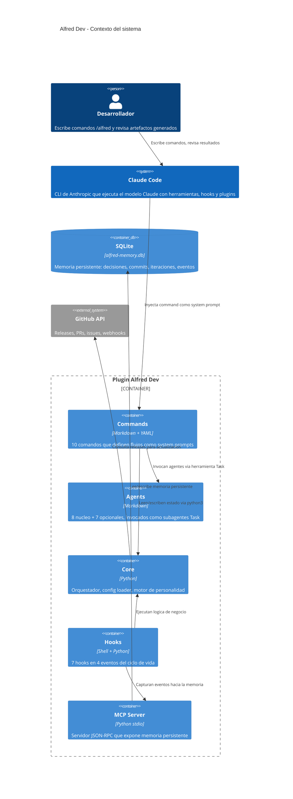
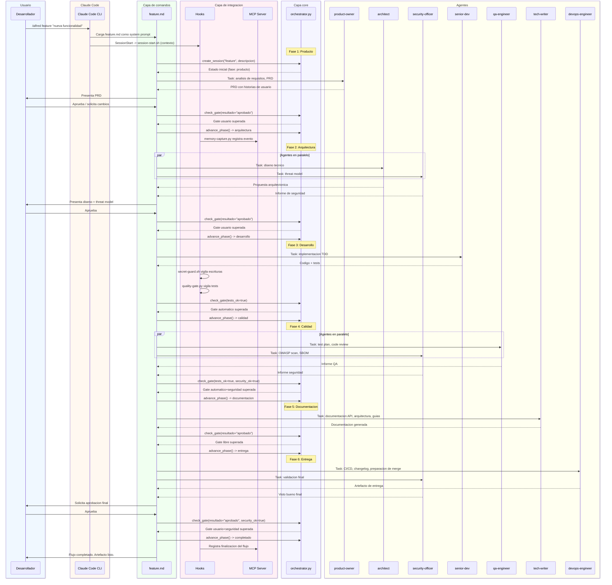
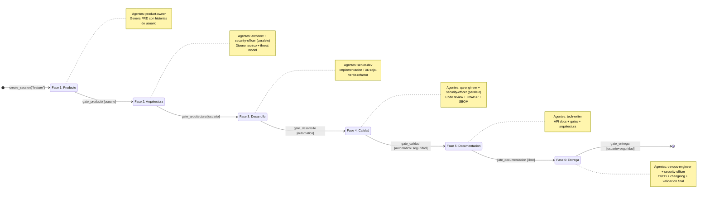

# Arquitectura del sistema

Este documento describe como esta construido Alfred Dev por dentro: sus capas, sus decisiones de diseno y como fluyen los datos desde que el usuario escribe un comando hasta que se genera el artefacto final. Es la pieza central de la documentacion tecnica del plugin y esta pensado para que cualquier desarrollador, incluidos juniors que se incorporen al proyecto, pueda entender la estructura completa sin ayuda externa.

Alfred Dev es un plugin para Claude Code que implementa un equipo virtual de ingenieria de software. El plugin no es una aplicacion independiente: funciona dentro del ecosistema de Claude Code y aprovecha sus capacidades nativas (herramientas, subagentes, hooks, MCP) para orquestar flujos de desarrollo completos. El diseno se organiza en cuatro capas con responsabilidades bien delimitadas, donde cada capa depende solo de la anterior y nunca al reves.

---

## Las cuatro capas del sistema

La arquitectura de Alfred Dev sigue un modelo de capas donde la comunicacion fluye siempre de arriba hacia abajo. Cada capa tiene una responsabilidad clara y un formato de ficheros propio. Esta separacion permite modificar una capa sin afectar a las demas, siempre que se respete la interfaz entre ellas.

### Capa de comandos (`commands/*.md`)

Los comandos son la puerta de entrada del usuario al sistema. Cuando alguien escribe `/alfred feature`, `/alfred fix` o cualquier otro comando, Claude Code busca el fichero Markdown correspondiente en el directorio `commands/` y lo inyecta como system prompt en la conversacion. Esto significa que los comandos no son scripts ejecutables: son instrucciones en lenguaje natural que le dicen a Claude que hacer paso a paso, que agentes invocar y en que orden.

Cada fichero de comando tiene dos partes: un frontmatter YAML con metadatos (descripcion del comando, hint del argumento) y un cuerpo Markdown con las instrucciones del flujo. El frontmatter le permite a Claude Code mostrar ayuda contextual; el cuerpo define las fases, las gates y las reglas que no se pueden saltar.

El plugin tiene 10 comandos registrados en `plugin.json`:

| Comando | Fichero | Proposito |
|---------|---------|-----------|
| `/alfred` | `alfred.md` | Punto de entrada principal, triaje de peticiones |
| `/alfred audit` | `audit.md` | Auditoria completa del proyecto en paralelo |
| `/alfred config` | `config.md` | Configuracion del plugin y agentes opcionales |
| `/alfred feature` | `feature.md` | Ciclo completo de desarrollo de una feature |
| `/alfred fix` | `fix.md` | Diagnostico y correccion de bugs |
| `/alfred help` | `help.md` | Ayuda contextual del plugin |
| `/alfred ship` | `ship.md` | Release, empaquetado y despliegue |
| `/alfred spike` | `spike.md` | Investigacion exploratoria con conclusiones |
| `/alfred status` | `status.md` | Estado actual del flujo y la sesion |
| `/alfred update` | `update.md` | Actualizacion del plugin |

### Capa de agentes (`agents/*.md`)

Los agentes son system prompts especializados que Claude Code ejecuta como subagentes mediante la herramienta Task. Cada agente tiene un rol definido dentro del equipo virtual, herramientas restringidas segun su ambito de actuacion y una personalidad propia que se adapta al nivel de sarcasmo configurado por el usuario.

La distincion clave en esta capa es la separacion entre agentes de nucleo y agentes opcionales. Los 8 agentes de nucleo participan en todos los flujos y son invocados programaticamente desde los commands: cuando `feature.md` dice «activa el agente product-owner», Claude Code crea un subagente Task cuyo system prompt es el contenido de `agents/product-owner.md`. Los 7 agentes opcionales, en cambio, se registran en `plugin.json` y solo estan disponibles si el usuario los activa en su configuracion.

**Agentes de nucleo** (8):

| Agente | Alias | Rol |
|--------|-------|-----|
| `product-owner` | El Buscador de Problemas | Product Owner |
| `architect` | El Dibujante de Cajas | Arquitecto |
| `senior-dev` | El Artesano | Senior dev |
| `security-officer` | El Paranoico | CSO |
| `qa-engineer` | El Rompe-cosas | QA |
| `devops-engineer` | El Fontanero | DevOps |
| `tech-writer` | El Traductor | Tech Writer |
| `alfred` | Alfred | Jefe de operaciones / Orquestador |

**Agentes opcionales** (7):

| Agente | Alias | Rol |
|--------|-------|-----|
| `data-engineer` | El Fontanero de Datos | Ingeniero de datos |
| `ux-reviewer` | El Abogado del Usuario | Revisor de UX |
| `performance-engineer` | El Cronometro | Ingeniero de rendimiento |
| `github-manager` | El Conserje del Repo | Gestor de GitHub |
| `seo-specialist` | El Rastreador | Especialista SEO |
| `copywriter` | El Pluma | Copywriter |
| `librarian` | El Bibliotecario | Archivista del proyecto |

### Capa core (`core/*.py`)

La capa core contiene la logica de negocio pura del plugin, escrita en Python. Estos modulos no tienen dependencia directa de Claude Code: son funciones y clases que reciben datos, los procesan y devuelven resultados. Se ejecutan via `python3 -c` desde los hooks o como imports desde el servidor MCP.

La capa se compone de tres modulos:

- **`orchestrator.py`** -- Maquina de estados que define 5 flujos de trabajo (feature, fix, spike, ship, audit), cada uno con sus fases secuenciales y quality gates. El orquestador gestiona la creacion de sesiones, la evaluacion de gates y el avance entre fases. El estado se persiste en un fichero JSON plano (`.claude/alfred-dev-state.json`). Desde v0.3.3, la funcion `run_flow()` acepta un parametro opcional `equipo_sesion` que permite inyectar un equipo efimero de agentes opcionales generado por la composicion dinamica (ver [configuration.md](configuration.md#composicion-dinamica-de-equipo)).

- **`config_loader.py`** -- Cargador de configuracion que lee las preferencias del usuario desde un fichero `.local.md` con frontmatter YAML y detecta automaticamente el stack tecnologico del proyecto (runtime, lenguaje, framework, ORM, test runner, bundler). Incluye un parser YAML basico como fallback para entornos sin PyYAML. Desde v0.3.3, el modulo incorpora la funcion `match_task_keywords()` y la constante `TASK_KEYWORDS` para la composicion dinamica de equipo: puntuan agentes opcionales segun la descripcion de la tarea del usuario combinada con senales del proyecto y la configuracion activa.

- **`personality.py`** -- Motor de personalidad que define la identidad, voz y frases caracteristicas de cada agente. El tono se adapta a un nivel de sarcasmo configurable (1 = profesional, 5 = acido). Con niveles altos se anaden frases mordaces al repertorio de cada agente.

### Capa de integracion (`hooks/`, `mcp/`)

La capa de integracion es el puente entre Alfred Dev y el ciclo de vida de Claude Code. Mientras que las capas anteriores definen «que hacer», esta capa define «cuando hacerlo» y «como conectar con el exterior».

**Hooks** (7 ficheros, 4 eventos del ciclo de vida):

Los hooks son scripts que Claude Code ejecuta automaticamente cuando ocurren eventos especificos. Se registran en `hooks/hooks.json` y cada uno tiene un matcher que filtra cuando se dispara.

| Hook | Evento | Matcher | Funcion |
|------|--------|---------|---------|
| `session-start.sh` | SessionStart | startup, resume, clear, compact | Inyecta contexto del proyecto al inicio de sesion |
| `stop-hook.py` | Stop | (todos) | Persiste estado y cierra recursos al terminar |
| `secret-guard.sh` | PreToolUse | Write, Edit | Bloquea escritura de secretos en ficheros |
| `quality-gate.py` | PostToolUse | Bash | Vigila resultados de tests tras ejecucion de comandos |
| `dependency-watch.py` | PostToolUse | Write, Edit | Detecta cambios en dependencias (package.json, etc.) |
| `spelling-guard.py` | PostToolUse | Write, Edit | Comprueba ortografia en ficheros modificados |
| `memory-capture.py` | PostToolUse | Write, Edit | Captura eventos relevantes para la memoria del proyecto |

**Servidor MCP** (1 fichero):

El fichero `mcp/memory_server.py` implementa un servidor MCP (Model Context Protocol) sobre stdio que expone la memoria persistente del proyecto. Claude Code lanza este proceso al inicio de sesion y lo mantiene vivo. El servidor habla JSON-RPC 2.0 con encabezados Content-Length (identico a LSP) y expone 6 herramientas:

| Herramienta MCP | Proposito |
|-----------------|-----------|
| `memory_search` | Busqueda textual en decisiones y commits (FTS5 o LIKE) |
| `memory_log_decision` | Registra una decision de diseno formal |
| `memory_log_commit` | Registra un commit y lo vincula a decisiones |
| `memory_get_iteration` | Obtiene datos de una iteracion (o la activa) |
| `memory_get_timeline` | Cronologia de eventos de una iteracion |
| `memory_stats` | Estadisticas generales de la memoria |

---

## Vision macro del sistema

El siguiente diagrama C4 muestra las relaciones entre los actores y contenedores principales del sistema. El objetivo es dar una vision de pajaro: quien habla con quien y por donde fluyen los datos.

---

## Flujo completo de `/alfred feature`

El flujo de feature es el mas completo del sistema: 6 fases con gates entre ellas, multiples agentes y coordinacion entre hooks, core y MCP. El siguiente diagrama de secuencia muestra el recorrido completo desde que el usuario escribe el comando hasta que se genera el entregable final.

Es importante entender que este flujo no es un script que se ejecuta de una vez: cada fase es una conversacion entre Claude y el usuario donde los agentes aportan su expertise y las gates determinan si se puede avanzar. El orquestador mantiene el estado para que el flujo pueda reanudarse si se interrumpe.

---

## Decisiones de diseno

Esta seccion documenta las decisiones arquitectonicas mas relevantes del plugin, con el razonamiento detras de cada una. Entender el «por que» es tan importante como entender el «que»: cuando alguien necesite cambiar algo, sabra que restricciones condicionaron la eleccion original y podra evaluar si siguen siendo validas.

### Por que Python y no JavaScript para el core

La eleccion de Python para la capa core no fue arbitraria. Python viene preinstalado en macOS y en la mayoria de distribuciones Linux, lo que significa que el plugin funciona sin instalar nada adicional. No hay `node_modules`, no hay build step, no hay dependencias que resolver antes de la primera ejecucion.

Ademas, el modulo `sqlite3` forma parte de la biblioteca estandar de Python, lo que permite usar una base de datos real sin dependencias externas. Los hooks y el servidor MCP son scripts ligeros que se ejecutan como subprocesos del CLI de Claude Code, no como modulos npm que necesiten empaquetado. Python tiene mejor soporte para scripting de sistema (manejo de ficheros, procesos, senales) que JavaScript en este contexto de uso.

### Por que SQLite y no un fichero JSON para la memoria

La memoria del proyecto almacena decisiones de diseno, commits, iteraciones y eventos con relaciones entre ellos (un commit puede implementar varias decisiones, una decision pertenece a una iteracion, etc.). Un fichero JSON plano no soporta consultas eficientes sobre estos datos, ni indices, ni transacciones atomicas, ni busqueda full-text.

SQLite es una base de datos relacional completa que viene incluida con Python. No requiere servidor, no requiere configuracion y el fichero `.db` se puede copiar, respaldar o borrar como cualquier otro fichero. Con la extension FTS5 (Full-Text Search) se pueden hacer busquedas textuales eficientes sobre decisiones y commits, algo imposible con un JSON plano sin cargar todo en memoria.

### Por que MCP stdio y no herramientas directas

El protocolo MCP (Model Context Protocol) permite que Claude Code invoque herramientas externas como si fueran nativas de su interfaz. Un servidor MCP stdio es un proceso persistente que Claude Code lanza al inicio de sesion y mantiene vivo durante toda la conversacion.

La alternativa seria ejecutar `python3 -c "..."` cada vez que un agente necesite consultar la memoria. Esto implicaria abrir y cerrar la conexion SQLite en cada invocacion, sin estado compartido entre llamadas. Con un servidor MCP persistente, la conexion se abre una sola vez, el indice FTS5 se carga en memoria y las consultas posteriores son significativamente mas rapidas. Ademas, el servidor puede mantener caches y realizar purgas de mantenimiento en segundo plano.

### Por que los agentes de nucleo no estan en `plugin.json`

Los agentes de nucleo (product-owner, architect, senior-dev, security-officer, qa-engineer, devops-engineer, tech-writer, alfred) se invocan programaticamente desde los commands mediante la herramienta Task de Claude Code. No necesitan estar registrados en `plugin.json` porque no son agentes que el usuario invoque directamente: es el system prompt del command quien decide cuando y como activar cada agente.

Los 7 agentes opcionales (data-engineer, ux-reviewer, performance-engineer, github-manager, seo-specialist, copywriter, librarian) si se registran en `plugin.json` porque Claude Code necesita conocerlos para que el usuario pueda invocarlos con la herramienta Task desde fuera de un flujo Alfred. El usuario puede activarlos o desactivarlos desde `/alfred config` segun las necesidades de su proyecto.

### El patron de estado

Todo el estado del flujo en curso se persiste en un unico fichero JSON plano: `.claude/alfred-dev-state.json`. Este fichero es el eje de coordinacion de todo el sistema:

- Los commands lo leen para saber en que fase estamos y que agentes invocar.
- Los hooks lo leen para decidir si bloquear una accion o dejarla pasar.
- El servidor MCP lo lee para asociar eventos a la iteracion correcta.
- El orquestador lo escribe con escritura atomica (write + rename) para evitar corrupcion.

Es un diseno deliberadamente simple: un solo fichero, sin procesos en segundo plano, sin base de datos para el estado transitorio. La base de datos SQLite se reserva exclusivamente para la memoria historica del proyecto (decisiones, commits, eventos). El estado transitorio (en que fase estamos, que fases se han completado, que artefactos se han generado) vive en JSON porque es efimero y su estructura es plana.

### Flujo de datos completo

Desde que el usuario escribe `/alfred feature` hasta que se genera el artefacto final, los datos atraviesan todas las capas del sistema en este orden:

1. **Usuario** -- escribe el comando con su descripcion.
2. **Claude Code** -- localiza el command correspondiente y lo carga como system prompt.
3. **Command** (`feature.md`) -- define las fases, los agentes y las gates del flujo.
4. **Core** (`orchestrator.py`) -- crea la sesion, persiste el estado, evalua gates.
5. **Agentes** -- se invocan como subagentes Task con su system prompt especializado.
6. **Hooks** -- vigilan la ejecucion: bloquean secretos, comprueban tests, capturan eventos.
7. **MCP** (`memory_server.py`) -- registra decisiones, commits y eventos en SQLite.
8. **Artefacto** -- el resultado final (codigo, documentacion, release) se entrega al usuario.

---

## Maquina de estados del orquestador

El orquestador (`core/orchestrator.py`) implementa una maquina de estados que gestiona el avance entre fases dentro de cada flujo. Cada transicion esta controlada por una gate cuyo tipo determina las condiciones que deben cumplirse para avanzar.

Existen 5 tipos de gate:

| Tipo de gate | Condiciones |
|--------------|-------------|
| `libre` | Se supera con resultado «aprobado». Sin validaciones adicionales. |
| `usuario` | Requiere aprobacion explicita del usuario. |
| `automatico` | Requiere resultado favorable y que los tests pasen. |
| `usuario+seguridad` | Requiere aprobacion del usuario y visto bueno del security-officer. |
| `automatico+seguridad` | Requiere tests verdes, seguridad OK y resultado favorable. |

El siguiente diagrama muestra la maquina de estados del flujo **feature**, que es el mas completo del sistema. Los otros flujos (fix, spike, ship, audit) siguen el mismo patron con distinto numero de fases y agentes.

### Los otros flujos del orquestador

Ademas de feature, el orquestador define 4 flujos adicionales, cada uno disenado para un tipo de tarea distinto:

**Flujo fix** (3 fases): diagnostico de la causa raiz, correccion con test de regresion, y validacion completa con seguridad. Las gates avanzan de aprobacion del usuario (diagnostico) a automatico (correccion) y terminan con automatico+seguridad (validacion).

**Flujo spike** (2 fases): exploracion libre donde el architect y el senior-dev investigan en paralelo con gate libre, seguida de consolidacion de conclusiones con gate de usuario. Es el unico flujo donde la primera gate no bloquea el avance.

**Flujo ship** (4 fases): auditoria final en paralelo (QA + seguridad), documentacion de release, empaquetado con versionado semantico, y despliegue a produccion con gate de usuario+seguridad. Este flujo es el mas restrictivo porque un error en la release afecta a todos los usuarios.

**Flujo audit** (1 fase): auditoria paralela con 4 agentes simultaneos (qa-engineer, security-officer, architect, tech-writer) y una unica gate de tipo automatico+seguridad. Es el flujo mas rapido y se usa tanto de forma independiente como al cierre de sprint.
