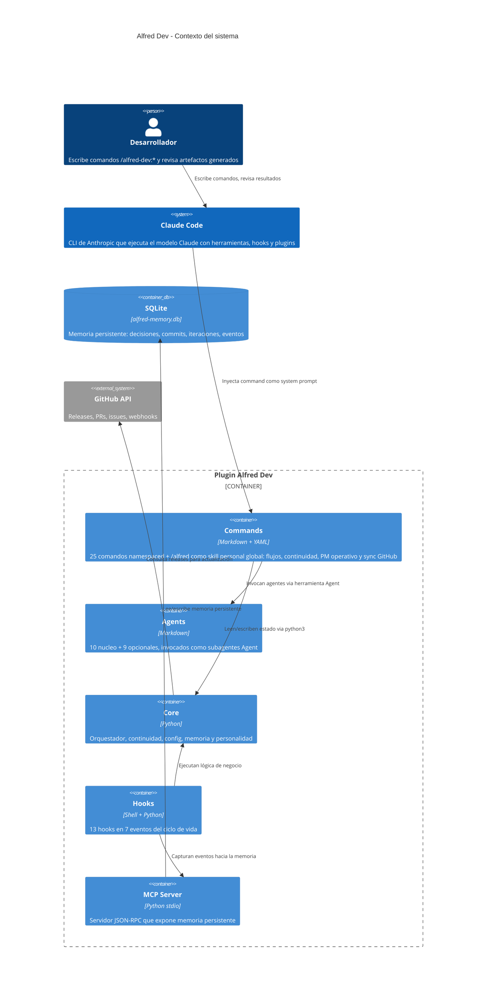
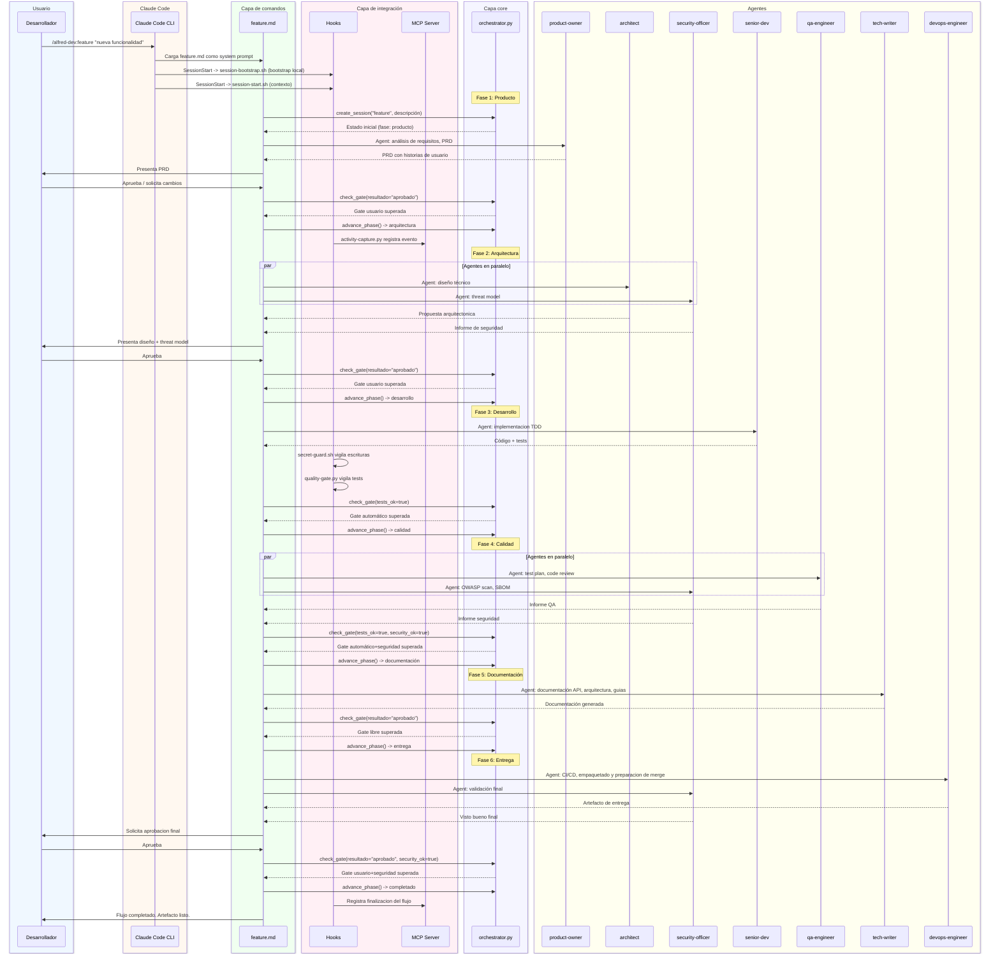
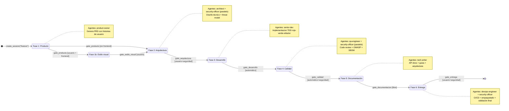

# Arquitectura del sistema

Este documento describe como esta construido Alfred Dev por dentro: sus capas, sus decisiones de diseño y como fluyen los datos desde que el usuario escribe un comando hasta que se genera el artefacto final. Es la pieza central de la documentación técnica del plugin y esta pensado para que cualquier desarrollador, incluidos juniors que se incorporen al proyecto, pueda entender la estructura completa sin ayuda externa.

Alfred Dev es un plugin para Claude Code que implementa un equipo virtual de ingenieria de software. El plugin no es una aplicación independiente: funciona dentro del ecosistema de Claude Code y aprovecha sus capacidades nativas (herramientas, subagentes, hooks, MCP) para orquestar flujos de desarrollo completos. El diseño se organiza en cuatro capas con responsabilidades bien delimitadas, donde cada capa depende solo de la anterior y nunca al reves.

---

## Las cuatro capas del sistema

La arquitectura de Alfred Dev sigue un modelo de capas donde la comunicación fluye siempre de arriba hacia abajo. Cada capa tiene una responsabilidad clara y un formato de ficheros propio. Esta separación permite modificar una capa sin afectar a las demas, siempre que se respete la interfaz entre ellas.

### Capa de comandos (`commands/*.md`)

Los comandos son la puerta de entrada del usuario al sistema. Cuando alguien escribe `/alfred-dev:feature`, `/alfred-dev:fix` o cualquier otro comando, Claude Code busca el fichero Markdown correspondiente en el directorio `commands/` y lo inyecta como system prompt en la conversacion. Esto significa que los comandos no son scripts ejecutables: son instrucciones en lenguaje natural que le dicen a Claude que hacer paso a paso, que agentes invocar y en que orden.

Cada fichero de comando tiene dos partes: un frontmatter YAML con metadatos (descripción del comando, hint del argumento) y un cuerpo Markdown con las instrucciones del flujo. El frontmatter le permite a Claude Code mostrar ayuda contextual; el cuerpo define las fases, las gates y las reglas que no se pueden saltar.

El plugin tiene 25 comandos registrados en `plugin.json` y una ruta global `/alfred` instalada como skill personal global sin shim de comando duplicado:

| Comando | Fichero | Propósito |
|---------|---------|-----------|
| `/alfred-dev:map-codebase` | `map-codebase.md` | Mapeo brownfield del repositorio |
| `/alfred-dev:memory-ui` | `memory-ui.md` | UI local para explorar la memoria SQLite del proyecto |
| `/alfred-dev:discuss` | `discuss.md` | Refinado previo y discovery persistente |
| `/alfred-dev:next` | `next.md` | Siguiente paso recomendado segun el estado |
| `/alfred-dev:pause` | `pause.md` | Pausa del trabajo actual con handoff |
| `/alfred-dev:resume` | `resume.md` | Reanudacion de una sesion pausada |
| `/alfred-dev:progress` | `progress.md` | Estado operativo, kanban y trazabilidad |
| `/alfred-dev:standup` | `standup.md` | Standup operativo breve desde SonIA |
| `/alfred-dev:blocked` | `blocked.md` | Vista de tareas bloqueadas |
| `/alfred-dev:in-progress` | `in-progress.md` | Vista de trabajo en curso |
| `/alfred-dev:verify` | `verify.md` | Validacion humana/UAT |
| `/alfred-dev:validate` | `validate.md` | Validación operativa de SonIA y continuidad |
| `/alfred-dev:search` | `search.md` | Búsqueda en artefactos y memoria SQLite |
| `/alfred-dev:sync-github` | `sync-github.md` | SonIA Sync: espejo del tablero local en GitHub Issues |
| `/alfred-dev:quick` | `quick.md` | Flujo ligero para cambios pequenos |
| `/alfred-dev:feature` | `feature.md` | Ciclo completo de desarrollo de una feature |
| `/alfred-dev:fix` | `fix.md` | Diagnóstico y correccion de bugs |
| `/alfred-dev:spike` | `spike.md` | Investigación exploratoria con conclusiones |
| `/alfred-dev:ship` | `ship.md` | Release, empaquetado y despliegue |
| `/alfred-dev:audit` | `audit.md` | Auditoria completa del proyecto en paralelo |
| `/alfred-dev:config` | `config.md` | Configuración del plugin y agentes opcionales |
| `/alfred-dev:status` | `status.md` | Estado actual del flujo y la sesión |
| `/alfred-dev:lucius` | `lucius.md` | Segunda opinión técnica externa vía Codex CLI |
| `/alfred-dev:update` | `update.md` | Actualización del plugin |
| `/alfred-dev:help` | `help.md` | Ayuda contextual del plugin |

La entrada principal del usuario es `/alfred`. No se registra una variante
namespaced `alfred` en `plugin.json`: vive en `skills/alfred/alfred/SKILL.md`
como fuente empaquetada oculta (`user-invocable: false`) para no duplicar la
entrada en el selector de Claude. El instalador la materializa como copia
personal global invocable en `~/.claude/skills/alfred/SKILL.md` y elimina el
shim personal obsoleto `~/.claude/commands/alfred.md` si existe, porque en
Claude Code actual ambas entradas visibles duplican `/alfred`. La copia personal
lee `commands/alfred.md` como contrato interno. Esta separación
evita que un comando namespaced llamado `alfred` tape el skill personal global
que Claude Code debe mostrar al escribir `/alfred`.

### Capa de agentes (`agents/*.md`)

Los agentes son system prompts especializados que Claude Code ejecuta como subagentes mediante la herramienta Agent. Cada agente tiene un rol definido dentro del equipo virtual, herramientas restringidas segun su ámbito de actuacion y una personalidad propia que se adapta al nivel de sarcasmo configurado por el usuario.

La distinción clave en esta capa es la separación entre agentes de nucleo y agentes opcionales. Los 10 agentes de nucleo participan en todos los flujos y son invocados programaticamente desde los commands: cuando `feature.md` dice «activa el agente product-owner», Claude Code crea un subagente Agent cuyo system prompt es el contenido de `agents/product-owner.md`. Los 9 agentes opcionales amplían el equipo segun el tipo de proyecto y pueden activarse desde la configuración local.

**Agentes de nucleo** (10):

| Agente | Alias | Rol |
|--------|-------|-----|
| `product-owner` | El Buscador de Problemas | Product Owner |
| `architect` | El Dibujante de Cajas | Arquitecto |
| `senior-dev` | El Artesano | Senior dev |
| `security-officer` | El Paranoico | CSO |
| `qa-engineer` | El Rompe-cosas | QA |
| `devops-engineer` | El Fontanero | DevOps |
| `tech-writer` | El Traductor | Tech Writer |
| `project-manager` | SonIA | PM operativo y trazabilidad |
| `alfred` | Alfred | Jefe de operaciones / Orquestador |
| `selina` | La Estilista | Dirección visual y sistema de diseño |

**Agentes opcionales** (9):

| Agente | Alias | Rol |
|--------|-------|-----|
| `data-engineer` | El Fontanero de Datos | Ingeniero de datos |
| `ux-reviewer` | El Abogado del Usuario | Revisor de UX |
| `performance-engineer` | El Cronometro | Ingeniero de rendimiento |
| `github-manager` | El Conserje del Repo | Gestor de GitHub |
| `seo-specialist` | El Rastreador | Especialista SEO |
| `copywriter` | El Pluma | Copywriter |
| `librarian` | El Bibliotecario | Archivista del proyecto |
| `i18n-specialist` | La Interprete | Especialista en internacionalizacion |
| `lucius` | El Director Tecnico Externo | Segunda opinion tecnica externa |

### Capa core (`core/*.py`)

La capa core contiene la lógica de negocio pura del plugin, escrita en Python. Estos modulos no tienen dependencia directa de Claude Code: son funciones y clases que reciben datos, los procesan y devuelven resultados. Se ejecutan via `python3 -c` desde los hooks o como imports desde el servidor MCP.

La capa se compone de cinco modulos principales:

- **`orchestrator.py`** -- Maquina de estados que define 6 flujos de trabajo (feature, fix, spike, ship, audit, quick), cada uno con sus fases secuenciales y quality gates. El orquestador gestiona la creación de sesiones, la evaluación de gates y el avance entre fases. El estado se persiste en un fichero JSON plano (`.claude/alfred-dev-state.json`). Desde v0.3.6, `run_flow()` puede inyectar un equipo efimero (`equipo_sesion`) generado por la composicion dinámica y, si no se le pasa uno explícito, deriva automáticamente el equipo persistido del proyecto desde `.claude/alfred-dev.local.md` para que runtime y configuración no diverjan (ver [configuration.md](configuration.md#composicion-dinámica-de-equipo)).

- **`config_loader.py`** -- Cargador de configuración que lee las preferencias del usuario desde un fichero `.local.md` con frontmatter YAML y detecta automáticamente el stack tecnologico del proyecto (runtime, lenguaje, framework, ORM, test runner, bundler). Incluye un parser YAML básico como fallback para entornos sin PyYAML. Su salida se combina con `suggest_optional_agents()` y con el catálogo canónico de `optional_agents.py` para recomendar especialistas según señales reales del proyecto sin duplicar listas entre runtime y composición dinámica. También expone builders canónicos de `equipo_sesion` persistido para que `run_flow()` y helpers como `quick` arranquen con el mismo equipo operativo, y ahora aporta la UX estructurada de `/alfred-dev:config` con `build_config_section_summaries()`, `build_config_section_menu()`, `apply_config_section_update()`, `build_config_section_change_preview()`, `update_config_section()` y `update_project_config_section()`.
- **`optional_agents.py`** -- Catálogo canónico de los 9 opcionales. Centraliza grupos, orden, labels visibles, especialidad base, integraciones por fase y los builders de menús (`build_optional_agent_group_menu()` / `build_optional_agent_group_menus()`) para que `config` y la composición dinámica no dependan de listas escritas a mano.

- **`continuity.py`** -- Capa determinista de continuidad operativa y PM ligero. Implementa `map-codebase`, `discuss`, `next`, `pause`, `resume`, `progress`, `standup`, `blocked`, `in-progress`, `verify`, `validate`, `search`, `sync-github` y los artefactos persistentes asociados (`current.md`, `handoff.md`, `uat.md`, `github-sync.md`). Como helper de mantenimiento interno, tambien expone `normalize-kanban` para normalizar tipos de tarea en tableros heredados de SonIA.

- **`memory_config.py`** -- Parser ligero de la seccion `memoria` del frontmatter local. Permite que hooks, sync y servidor MCP apliquen la misma configuracion efectiva sin duplicar logica.

- **`personality.py`** -- Motor de personalidad que define la identidad, voz y frases caracteristicas de cada agente. El tono se adapta a un nivel de sarcasmo configurable (1 = profesional, 5 = acido). Con niveles altos se añaden frases mordaces al repertorio de cada agente.

### Capa de integración (`hooks/`, `mcp/`)

La capa de integración es el puente entre Alfred Dev y el ciclo de vida de Claude Code. Mientras que las capas anteriores definen «que hacer», esta capa define «cuando hacerlo» y «como conectar con el exterior».

**Hooks** (13 ficheros visibles, 7 eventos del ciclo de vida):

Los hooks son scripts que Claude Code ejecuta automáticamente cuando ocurren eventos específicos. Se registran en `hooks/hooks.json`; `matcher` es opcional y solo se declara en eventos donde Claude Code lo soporta. En eventos como `Stop` y `UserPromptSubmit`, Alfred evita declarar `matcher` porque Claude Code lo ignora. En `UserPromptExpansion`, Alfred también omite `matcher` para cubrir todos los slash commands y prompts MCP expandidos, aunque Claude Code ya permite filtrar por `command_name`. En `PreCompact`, Alfred omite `matcher` para cubrir tanto compactaciones manuales como automáticas.

| Hook | Evento | Matcher | Función |
|------|--------|---------|---------|
| `session-bootstrap.sh` | SessionStart | startup, resume, clear, compact | Bootstrap síncrono del proyecto antes del primer prompt |
| `session-start.sh` | SessionStart | startup, resume, clear, compact | Inyecta contexto del proyecto al inicio de sesión |
| `stop-hook.py` | Stop | (todos) | Persiste estado y cierra recursos al terminar |
| `secret-guard.sh` | PreToolUse | Write, Edit | Bloquea escritura de secretos en ficheros |
| `dangerous-command-guard.py` | PreToolUse | Bash | Bloquea comandos destructivos |
| `sensitive-read-guard.py` | PreToolUse | Read | Avisa al leer ficheros con credenciales |
| `prefetch-finish-guard.py` | PreToolUse | Read, Write, Edit, Glob, Grep | Cierra el paso helper-first y evita exploracion redundante tras el prefetch |
| `quality-gate.py` | PostToolUse | Bash | Vigila resultados de tests tras ejecución de comandos |
| `evidence-guard.py` | PostToolUse | Bash | Registra evidencia real de ejecucion de tests para gates automaticas |
| `dependency-watch.py` | PostToolUse | Write, Edit | Detecta cambios en dependencias (package.json, etc.) |
| `spelling-guard.py` | PostToolUse | Write, Edit | Comprueba ortografia en ficheros modificados |
| `activity-capture.py` | PostToolUse + UserPromptSubmit + UserPromptExpansion + PreCompact + Stop | (multiples) | Captura centralizada de actividad en la memoria persistente |
| `memory-compact.py` | PreCompact | manual, auto (omitido: todos) | Inyecta decisiones críticas como contexto protegido |

**Servidor MCP** (1 fichero):

El fichero `mcp/memory_server.py` implementa un servidor MCP (Model Context Protocol) sobre stdio que expone la memoria persistente del proyecto. Claude Code lanza este proceso al inicio de sesión y lo mantiene vivo. El servidor habla JSON-RPC 2.0 sobre stdio en formato MCP actual (un mensaje JSON por linea), mantiene lectura compatible con el framing `Content-Length` historico y expone 15 herramientas:

| Herramienta MCP | Propósito |
|-----------------|-----------|
| `memory_search` | Busqueda textual en decisiones, commits y eventos con contenido (FTS5 o LIKE) |
| `memory_log_decision` | Registra una decisión de diseño formal |
| `memory_log_commit` | Registra un commit y lo vincula a decisiones |
| `memory_get_iteration` | Obtiene datos de una iteracion (o la activa) |
| `memory_get_timeline` | Cronología de eventos de una iteracion |
| `memory_stats` | Estadisticas generales de la memoria |
| `memory_manage_iteration` | Inicia o completa iteraciones |
| `memory_log_event` | Registra eventos en la cronologia |
| `memory_get_decisions` | Lista decisiones con filtros |
| `memory_purge` | Purga eventos antiguos segun retencion |
| `memory_update_decision` | Actualiza estado o etiquetas de una decision |
| `memory_link_decisions` | Relaciona decisiones entre si |
| `memory_health` | Comprueba integridad de la memoria |
| `memory_export` | Exporta decisiones a Markdown |
| `memory_import` | Importa commits o ADRs |

---

## Vision macro del sistema

El siguiente diagrama C4 muestra las relaciones entre los actores y contenedores principales del sistema. El objetivo es dar una vision de pajaro: quien habla con quien y por donde fluyen los datos.

```mermaid
C4Context
    title Alfred Dev - Contexto del sistema

    Person(user, "Desarrollador", "Escribe comandos /alfred-dev:* y revisa artefactos generados")

    System(claude, "Claude Code", "CLI de Anthropic que ejecuta el modelo Claude con herramientas, hooks y plugins")

    Container_Boundary(plugin, "Plugin Alfred Dev") {
        Container(commands, "Commands", "Markdown + YAML", "25 comandos namespaced + /alfred como skill personal global: flujos, continuidad, PM operativo y sync GitHub")
        Container(agents, "Agents", "Markdown", "10 nucleo + 9 opcionales, invocados como subagentes Agent")
        Container(core, "Core", "Python", "Orquestador, continuidad, config, memoria y personalidad")
        Container(hooks, "Hooks", "Shell + Python", "13 hooks en 7 eventos del ciclo de vida")
        Container(mcp, "MCP Server", "Python stdio", "Servidor JSON-RPC que expone memoria persistente")
    }

    ContainerDb(sqlite, "SQLite", "alfred-memory.db", "Memoria persistente: decisiones, commits, iteraciones, eventos")

    System_Ext(github, "GitHub API", "Releases, PRs, issues, webhooks")

    Rel(user, claude, "Escribe comandos, revisa resultados")
    Rel(claude, commands, "Inyecta command como system prompt")
    Rel(commands, agents, "Invocan agentes via herramienta Agent")
    Rel(commands, core, "Leen/escriben estado via python3")
    Rel(hooks, core, "Ejecutan lógica de negocio")
    Rel(mcp, sqlite, "Lee/escribe memoria persistente")
    Rel(hooks, mcp, "Capturan eventos hacia la memoria")
    Rel(core, github, "Consulta releases para actualización")

    UpdateRelStyle(user, claude, $offsetY="-20")
```

---

## Flujo completo de `/alfred-dev:feature`

El flujo de feature es el mas completo del sistema: 6 fases base mas una fase 1b condicional de estilo visual, con gates entre ellas, multiples agentes y coordinación entre hooks, core y MCP. En la práctica hablamos de un flujo de hasta 7 fases. El siguiente diagrama de secuencia muestra el recorrido completo desde que el usuario escribe el comando hasta que se genera el entregable final.

Es importante entender que este flujo no es un script que se ejecuta de una vez: cada fase es una conversacion entre Claude y el usuario donde los agentes aportan su expertise y las gates determinan si se puede avanzar. El orquestador mantiene el estado para que el flujo pueda reanudarse si se interrumpe.

```mermaid
sequenceDiagram
    box rgb(240, 248, 255) Usuario
        participant U as Desarrollador
    end
    box rgb(255, 248, 240) Claude Code
        participant CC as Claude Code CLI
    end
    box rgb(240, 255, 240) Capa de comandos
        participant CMD as feature.md
    end
    box rgb(255, 240, 245) Capa de integración
        participant HK as Hooks
        participant MCP as MCP Server
    end
    box rgb(245, 245, 255) Capa core
        participant ORC as orchestrator.py
    end
    box rgb(255, 255, 240) Agentes
        participant PO as product-owner
        participant AR as architect
        participant SO as security-officer
        participant SD as senior-dev
        participant QA as qa-engineer
        participant TW as tech-writer
        participant DO as devops-engineer
    end

    U->>CC: /alfred-dev:feature "nueva funcionalidad"
    CC->>CMD: Carga feature.md como system prompt
    CC->>HK: SessionStart -> session-bootstrap.sh (bootstrap local)
    CC->>HK: SessionStart -> session-start.sh (contexto)

    Note over ORC: Fase 1: Producto

    CMD->>ORC: create_session("feature", descripción)
    ORC-->>CMD: Estado inicial (fase: producto)
    CMD->>PO: Agent: análisis de requisitos, PRD
    PO-->>CMD: PRD con historias de usuario
    CMD->>U: Presenta PRD
    U->>CMD: Aprueba / solicita cambios
    CMD->>ORC: check_gate(resultado="aprobado")
    ORC-->>CMD: Gate usuario superada
    CMD->>ORC: advance_phase() -> arquitectura
    HK->>MCP: activity-capture.py registra evento

    Note over ORC: Fase 2: Arquitectura

    par Agentes en paralelo
        CMD->>AR: Agent: diseño técnico
        CMD->>SO: Agent: threat model
    end
    AR-->>CMD: Propuesta arquitectonica
    SO-->>CMD: Informe de seguridad
    CMD->>U: Presenta diseño + threat model
    U->>CMD: Aprueba
    CMD->>ORC: check_gate(resultado="aprobado")
    ORC-->>CMD: Gate usuario superada
    CMD->>ORC: advance_phase() -> desarrollo

    Note over ORC: Fase 3: Desarrollo

    CMD->>SD: Agent: implementacion TDD
    SD-->>CMD: Código + tests
    HK->>HK: secret-guard.sh vigila escrituras
    HK->>HK: quality-gate.py vigila tests
    CMD->>ORC: check_gate(tests_ok=true)
    ORC-->>CMD: Gate automático superada
    CMD->>ORC: advance_phase() -> calidad

    Note over ORC: Fase 4: Calidad

    par Agentes en paralelo
        CMD->>QA: Agent: test plan, code review
        CMD->>SO: Agent: OWASP scan, SBOM
    end
    QA-->>CMD: Informe QA
    SO-->>CMD: Informe seguridad
    CMD->>ORC: check_gate(tests_ok=true, security_ok=true)
    ORC-->>CMD: Gate automático+seguridad superada
    CMD->>ORC: advance_phase() -> documentación

    Note over ORC: Fase 5: Documentación

    CMD->>TW: Agent: documentación API, arquitectura, guias
    TW-->>CMD: Documentación generada
    CMD->>ORC: check_gate(resultado="aprobado")
    ORC-->>CMD: Gate libre superada
    CMD->>ORC: advance_phase() -> entrega

    Note over ORC: Fase 6: Entrega

    CMD->>DO: Agent: CI/CD, empaquetado y preparacion de merge
    CMD->>SO: Agent: validación final
    DO-->>CMD: Artefacto de entrega
    SO-->>CMD: Visto bueno final
    CMD->>U: Solicita aprobacion final
    U->>CMD: Aprueba
    CMD->>ORC: check_gate(resultado="aprobado", security_ok=true)
    ORC-->>CMD: Gate usuario+seguridad superada
    CMD->>ORC: advance_phase() -> completado
    HK->>MCP: Registra finalizacion del flujo

    CMD->>U: Flujo completado. Artefacto listo.
```

---

## Decisiones de diseño

Esta sección documenta las decisiones arquitectonicas mas relevantes del plugin, con el razonamiento detrás de cada una. Entender el «por que» es tan importante como entender el «que»: cuando alguien necesite cambiar algo, sabra que restricciones condicionaron la eleccion original y podra evaluar si siguen siendo validas.

### Por que Python y no JavaScript para el core

La eleccion de Python para la capa core no fue arbitraria. Python viene preinstalado en macOS y en la mayoria de distribuciones Linux, lo que significa que el plugin funciona sin instalar nada adicional. No hay `node_modules`, no hay build step, no hay dependencias que resolver antes de la primera ejecución.

Además, el modulo `sqlite3` forma parte de la biblioteca estandar de Python, lo que permite usar una base de datos real sin dependencias externas. Los hooks y el servidor MCP son scripts ligeros que se ejecutan como subprocesos del CLI de Claude Code, no como modulos npm que necesiten empaquetado. Python tiene mejor soporte para scripting de sistema (manejo de ficheros, procesos, señales) que JavaScript en este contexto de uso.

### Por que SQLite y no un fichero JSON para la memoria

La memoria del proyecto almacena decisiones de diseño, commits, iteraciones y eventos con relaciones entre ellos (un commit puede implementar varias decisiones, una decisión pertenece a una iteracion, etc.). Un fichero JSON plano no soporta consultas eficientes sobre estos datos, ni índices, ni transacciones atomicas, ni busqueda full-text.

SQLite es una base de datos relacional completa que viene incluida con Python. No requiere servidor, no requiere configuración y el fichero `.db` se puede copiar, respaldar o borrar como cualquier otro fichero. Con la extensión FTS5 (Full-Text Search) se pueden hacer busquedas textuales eficientes sobre decisiones, commits y eventos con contenido, algo imposible con un JSON plano sin cargar todo en memoria.

### Por que MCP stdio y no herramientas directas

El protocolo MCP (Model Context Protocol) permite que Claude Code invoque herramientas externas como si fueran nativas de su interfaz. Un servidor MCP stdio es un proceso persistente que Claude Code lanza al inicio de sesión y mantiene vivo durante toda la conversacion.

La alternativa seria ejecutar `python3 -c "..."` cada vez que un agente necesite consultar la memoria. Esto implicaria abrir y cerrar la conexión SQLite en cada invocación, sin estado compartido entre llamadas. Con un servidor MCP persistente, la conexión se abre una sola vez, el índice FTS5 se carga en memoria y las consultas posteriores son significativamente mas rapidas. Además, el servidor puede mantener caches y realizar purgas de mantenimiento en segundo plano.

### Por que los agentes viven en `agents/`

Los agentes de nucleo (alfred, product-owner, selina, architect, senior-dev, security-officer, qa-engineer, devops-engineer, tech-writer y project-manager) se invocan programaticamente desde los commands mediante la herramienta Agent de Claude Code. El manifiesto no declara la clave `agents`: Claude Code descubre los agentes desde el directorio `agents/`, que es el formato que carga correctamente en la CLI actual.

Los 9 agentes opcionales (data-engineer, ux-reviewer, performance-engineer, github-manager, seo-specialist, copywriter, librarian, i18n-specialist y lucius) viven en el mismo directorio `agents/` para que Claude Code conozca toda la plantilla publicada del plugin. La diferencia práctica no es dónde se declaran, sino cómo se usan: los de nucleo siempre forman parte de los flujos; los opcionales se activan o desactivan desde `/alfred-dev:config` segun las necesidades del proyecto. Cuando un opcional tiene integración por fase, Alfred lo incorpora automáticamente; cuando no la tiene, queda disponible como especialista bajo demanda.

### El patron de estado

Todo el estado del flujo en curso se persiste en un único fichero JSON plano: `.claude/alfred-dev-state.json`. Este fichero es el eje de coordinación de todo el sistema:

- Los commands lo leen para saber en que fase estamos y que agentes invocar.
- Los hooks lo leen para decidir si bloquear una accion o dejarla pasar.
- El servidor MCP lo lee para asociar eventos a la iteracion correcta.
- El orquestador lo escribe con escritura atomica (write + rename) para evitar corrupcion.

Es un diseño deliberadamente simple: un solo fichero, sin procesos en segundo plano, sin base de datos para el estado transitorio. La base de datos SQLite se reserva exclusivamente para la memoria histórica del proyecto (decisiones, commits, eventos). El estado transitorio (en que fase estamos, que fases se han completado, que artefactos se han generado) vive en JSON porque es efimero y su estructura es plana.

### Flujo de datos completo

Desde que el usuario escribe `/alfred-dev:feature` hasta que se genera el artefacto final, los datos atraviesan todas las capas del sistema en este orden:

1. **Usuario** -- escribe el comando con su descripción.
2. **Claude Code** -- localiza el command correspondiente y lo carga como system prompt.
3. **Command** (`feature.md`) -- define las fases, los agentes y las gates del flujo.
4. **Core** (`orchestrator.py`) -- crea la sesión, persiste el estado, evalua gates.
5. **Agentes** -- se invocan como subagentes Agent con su system prompt especializado.
6. **Hooks** -- vigilan la ejecución: bloquean secretos, comprueban tests, capturan eventos.
7. **MCP** (`memory_server.py`) -- registra decisiones, commits y eventos en SQLite.
8. **Artefacto** -- el resultado final (código, documentación, release) se entrega al usuario.

---

## Maquina de estados del orquestador

El orquestador (`core/orchestrator.py`) implementa una maquina de estados que gestiona el avance entre fases dentro de cada flujo. Cada transición esta controlada por una gate cuyo tipo determina las condiciones que deben cumplirse para avanzar.

Existen 5 tipos de gate:

| Tipo de gate | Condiciones |
|--------------|-------------|
| `libre` | Se supera con resultado «aprobado». Sin validaciones adicionales. |
| `usuario` | Requiere aprobacion explícita del usuario. |
| `automático` | Requiere resultado favorable y que los tests pasen. |
| `usuario+seguridad` | Requiere aprobacion del usuario y visto bueno del security-officer. |
| `automático+seguridad` | Requiere tests verdes, seguridad OK y resultado favorable. |

El siguiente diagrama muestra la maquina de estados del flujo **feature**, que es el mas completo del sistema. Los otros flujos (fix, spike, ship, audit) siguen el mismo patron con distinto número de fases y agentes.

```mermaid
stateDiagram-v2
    direction LR

    [*] --> producto: create_session("feature")

    state "Fase 1: Producto" as producto
    state "Fase 1b: Estilo visual" as estilo_visual
    state "Fase 2: Arquitectura" as arquitectura
    state "Fase 3: Desarrollo" as desarrollo
    state "Fase 4: Calidad" as calidad
    state "Fase 5: Documentación" as documentación
    state "Fase 6: Entrega" as entrega

    producto --> estilo_visual: gate_producto [usuario + frontend]
    producto --> arquitectura: gate_producto [sin frontend]
    estilo_visual --> arquitectura: gate_estilo_visual [usuario]
    arquitectura --> desarrollo: gate_arquitectura [usuario+seguridad]
    desarrollo --> calidad: gate_desarrollo [automático]
    calidad --> documentación: gate_calidad [automático+seguridad]
    documentación --> entrega: gate_documentacion [libre]
    entrega --> [*]: gate_entrega [usuario+seguridad]

    note right of producto
        Agentes: product-owner
        Genera PRD con historias de usuario
    end note

    note right of arquitectura
        Agentes: architect + security-officer (paralelo)
        Diseño técnico + threat model
    end note

    note right of desarrollo
        Agentes: senior-dev
        Implementacion TDD rojo-verde-refactor
    end note

    note right of calidad
        Agentes: qa-engineer + security-officer (paralelo)
        Code review + OWASP + SBOM
    end note

    note right of documentación
        Agentes: tech-writer
        API docs + guias + arquitectura
    end note

    note right of entrega
        Agentes: devops-engineer + security-officer
        CI/CD + empaquetado + validación final
    end note
```

### Los otros flujos del orquestador

Además de feature, el orquestador define 4 flujos adicionales, cada uno disenado para un tipo de tarea distinto:

**Flujo fix** (3 fases): diagnóstico de la causa raiz, correccion con test de regresión, y validación completa con seguridad. Las gates avanzan de aprobacion del usuario (diagnóstico) a automático (correccion) y terminan con automático+seguridad (validación).

**Flujo spike** (2 fases): exploracion libre donde el architect y el senior-dev investigan en paralelo con gate libre, seguida de consolidacion de conclusiones con gate de usuario. Es el único flujo donde la primera gate no bloquea el avance.

**Flujo ship** (4 fases): auditoria final en paralelo (QA + seguridad), documentación de release, empaquetado con versionado semántico, y despliegue a produccion con gate de usuario+seguridad. Este flujo es el mas restrictivo porque un error en la release afecta a todos los usuarios.

**Flujo audit** (1 fase): auditoria paralela con 4 agentes simultaneos (qa-engineer, security-officer, architect, tech-writer) y una única gate de tipo automático+seguridad. Es el flujo mas rápido y se usa tanto de forma independiente como al cierre de sprint.
