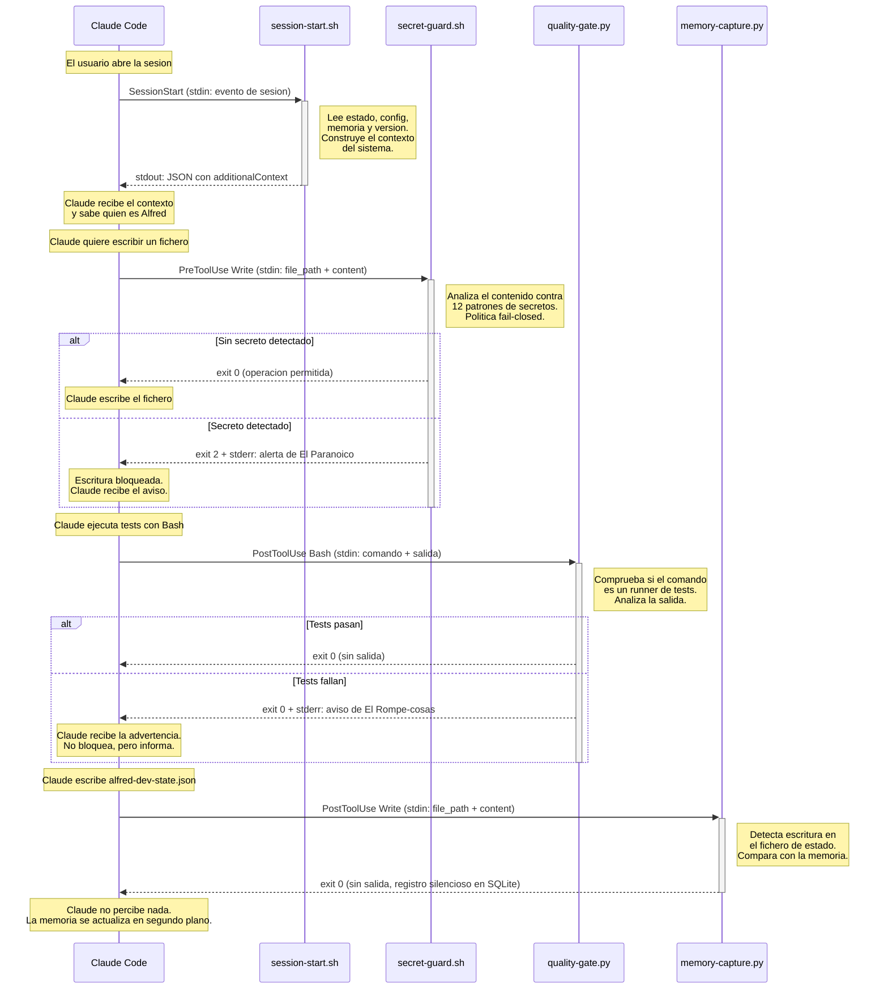

# Sistema de hooks

Los hooks son la pieza que conecta Alfred Dev con el ciclo de vida de Claude Code. Claude Code emite eventos en momentos clave de la sesion --al arrancar, antes de usar una herramienta, despues de usarla, al intentar parar-- y permite que los plugins registren scripts que se ejecutan en respuesta a esos eventos. Es, en esencia, un sistema de observadores tipificados: cada hook se suscribe a un tipo de evento concreto, con un filtro opcional (matcher) que restringe sobre que herramientas actua, y Claude Code se encarga de invocarlo en el momento preciso.

Para Alfred Dev, los hooks son el sistema nervioso del plugin. Son lo que permite inyectar contexto al arrancar la sesion para que Claude sepa quien es Alfred y que puede hacer, bloquear escrituras que contengan secretos antes de que lleguen al disco, vigilar que los tests pasen despues de cada ejecucion, detectar cambios en dependencias, corregir tildes, capturar eventos en la memoria persistente y evitar que el usuario cierre la sesion con trabajo pendiente. Sin los hooks, Alfred seria un conjunto de skills pasivos esperando a que alguien los invoque; con ellos, es un sistema proactivo que vigila, informa y protege en tiempo real.

---

## Como funcionan los hooks en Claude Code

El mecanismo de hooks de Claude Code sigue un modelo sencillo de registro, invocacion y respuesta. Entender este modelo es imprescindible para comprender por que cada hook de Alfred esta disenado como lo esta.

### Registro

Los hooks se declaran en el fichero `hooks.json` dentro del directorio `.claude-plugin` o en la raiz del plugin. Cada entrada asocia un evento del ciclo de vida con uno o mas scripts a ejecutar. La estructura basica es:

```json
{
  "hooks": {
    "NombreDelEvento": [
      {
        "matcher": "regex_que_filtra_herramientas",
        "hooks": [
          {
            "type": "command",
            "command": "ruta/al/script.sh",
            "timeout": 10,
            "async": false
          }
        ]
      }
    ]
  }
}
```

El campo `matcher` es una expresion regular que Claude Code evalua contra el nombre de la herramienta (para `PreToolUse` y `PostToolUse`) o contra el tipo de sesion (para `SessionStart`). Si no se especifica matcher, el hook se ejecuta para todas las invocaciones de ese evento. Esta distincion es importante: un hook de `PostToolUse` sin matcher se ejecutaria despues de cada operacion de cualquier herramienta, lo que generaria un coste de rendimiento innecesario.

### Invocacion

Cuando Claude Code emite un evento que coincide con un hook registrado, ejecuta el script indicado como un proceso externo. La informacion del evento se pasa por **stdin** en formato JSON. El contenido exacto del JSON varia segun el tipo de evento, pero tipicamente incluye:

- `tool_name`: nombre de la herramienta que disparo el evento (Write, Edit, Bash, etc.).
- `tool_input`: parametros que Claude envio a la herramienta (ruta del fichero, contenido, comando...).
- `tool_output`: resultado de la herramienta (solo disponible en `PostToolUse`).

### Respuesta

El script responde a traves de tres canales:

| Canal | Proposito |
|-------|-----------|
| **stdout** | Respuesta estructurada (JSON). Claude Code lo interpreta segun el tipo de evento. En `SessionStart`, el campo `hookSpecificOutput.additionalContext` se inyecta como contexto de la conversacion. En `Stop`, un objeto con `"decision": "block"` impide que Claude se detenga. |
| **stderr** | Mensajes para el usuario. Claude Code los muestra como advertencias o errores en la interfaz. Es el canal principal para comunicar avisos de seguridad, fallos de tests o sugerencias ortograficas. |
| **Exit code** | `0` indica operacion permitida, `2` indica bloqueo (solo relevante en `PreToolUse`). Cualquier otro codigo no cero se trata como error del hook y se ignora. |

### Modos de ejecucion

Los hooks pueden ser **sincronos** o **asincronos**. En modo sincrono (por defecto), Claude Code espera a que el script termine antes de continuar. Esto es imprescindible para hooks que necesitan bloquear una operacion, como `secret-guard.sh`. En modo asincrono (`"async": true`), Claude Code lanza el script y continua sin esperar el resultado, lo que es apropiado para hooks de inyeccion de contexto como `session-start.sh`.

Cada hook tiene un **timeout configurable** en segundos. Si el script no termina dentro del plazo, Claude Code lo mata y continua como si no existiera. Este mecanismo protege contra scripts colgados que podrian bloquear la sesion indefinidamente.

---

## Los 7 hooks de Alfred Dev

Alfred Dev registra siete hooks que cubren los cuatro eventos del ciclo de vida: arranque de sesion, parada, antes de usar una herramienta y despues de usarla. Cada hook tiene una responsabilidad unica y esta disenado para fallar de forma segura: si algo va mal internamente, el hook sale con codigo 0 (sin bloquear) excepto en los casos donde la politica de seguridad exige fail-closed.

### session-start.sh

**Evento:** `SessionStart` -- **Matcher:** `startup|resume|clear|compact` -- **Asincrono:** si

Este es el hook mas complejo del plugin y el primero que se ejecuta. Su mision es construir el contexto inicial que Claude recibe al arrancar, de modo que sepa quien es Alfred, que comandos tiene disponibles, cual es la configuracion del proyecto y si hay una sesion de trabajo activa que retomar.

El script recorre cinco fuentes de informacion, cada una opcional y con fallo silencioso:

1. **Presentacion del plugin.** Un bloque estatico que describe el equipo de agentes (Alfred, El Buscador de Problemas, El Dibujante de Cajas, El Artesano, El Paranoico, El Rompe-cosas, El Fontanero, El Traductor), los comandos disponibles (`/alfred feature`, `/alfred fix`, `/alfred spike`, `/alfred ship`, `/alfred audit`, `/alfred config`, `/alfred status`, `/alfred update`, `/alfred help`) y las reglas de operacion (quality gates infranqueables, TDD estricto, auditoria de seguridad por fase).

2. **Configuracion local del proyecto.** Lee `.claude/alfred-dev.local.md` si existe. Este fichero permite al usuario definir preferencias por proyecto (lenguaje, framework, convenciones especificas) que Claude incorpora a su comportamiento.

3. **Estado de sesion activa.** Lee `.claude/alfred-dev-state.json` para detectar si hay un flujo en curso (feature, fix, spike...). Si lo hay y no esta completado, extrae el comando activo, la fase actual, la descripcion y las fases completadas. Esto permite que Claude retome el trabajo donde lo dejo.

4. **Memoria persistente.** Si existe `.claude/alfred-memory.db`, consulta la base de datos SQLite a traves del modulo `core.memory` para obtener las ultimas cinco decisiones registradas y la iteracion activa, si la hay. Esto proporciona contexto historico sin necesidad de releer toda la conversacion anterior.

5. **Comprobacion de actualizaciones.** Consulta la API de GitHub (`https://api.github.com/repos/686f6c61/alfred-dev/releases/latest`) con un timeout de 3 segundos. Si hay una version nueva con formato semantico valido distinta de la actual (`0.2.1`), anade un aviso al contexto. La validacion del formato de version (`^[0-9]+\.[0-9]+\.[0-9]+(-[a-zA-Z0-9.]+)?$`) evita inyeccion de contenido arbitrario desde la respuesta de la API.

La salida es un JSON con la clave `hookSpecificOutput.additionalContext` que Claude Code inyecta como contexto del sistema. Para generar JSON seguro, el contenido se escapa a traves de `python3 -c "import json..."` en lugar de hacerlo con manipulacion de cadenas en bash, lo que evita problemas con caracteres especiales.

### stop-hook.py

**Evento:** `Stop` -- **Matcher:** ninguno -- **Timeout:** 15 s

El hook de Stop implementa un patron tomado del plugin ralph-loop: cuando Claude intenta detenerse, comprueba si hay trabajo pendiente y, en caso afirmativo, bloquea la parada con un mensaje que explica por que debe seguir.

El mecanismo funciona asi: lee `alfred-dev-state.json`, extrae la fase actual y la compara con la definicion del flujo importada desde `core.orchestrator.FLOWS`. Si la sesion existe, no esta completada y la fase tiene una quality gate pendiente, emite un JSON con `"decision": "block"` y un mensaje que incluye:

- El nombre del flujo activo y su descripcion.
- La fase actual con sus agentes asignados.
- El tipo de gate pendiente (automatico, seguridad, usuario, libre) con instrucciones especificas para cada caso.

La razon de este hook es evitar que el usuario cierre Claude Code a mitad de un flujo, perdiendo el contexto de trabajo. El tono del mensaje es deliberadamente directo ("Eh eh eh, para el carro") porque la experiencia demuestra que los mensajes educados se ignoran con mas facilidad.

Si no hay sesion activa, la sesion esta completada o el estado es incoherente, el hook sale con codigo 0 sin salida, dejando que Claude pare normalmente.

### secret-guard.sh

**Evento:** `PreToolUse` -- **Matcher:** `Write|Edit` -- **Timeout:** 5 s

Este es el unico hook que bloquea operaciones de forma activa. Se ejecuta **antes** de que Claude escriba o edite un fichero, analiza el contenido que pretende escribir y, si detecta un patron de secreto, impide la operacion con exit code 2.

La politica de seguridad es **fail-closed**: si el script no puede parsear la entrada de stdin, bloquea por precaucion. Esta decision es deliberada: es preferible un falso positivo que obliga a reintentar a un falso negativo que deja un secreto expuesto en el repositorio.

El script detecta 12 familias de patrones de secretos, mas un patron generico de asignacion de credenciales:

| Patron | Descripcion |
|--------|-------------|
| `AKIA[0-9A-Z]{16}` | AWS Access Key |
| `sk-[a-zA-Z0-9]{20,}` | Clave API con prefijo sk- (OpenAI, Stripe u otros) |
| `sk-ant-[a-zA-Z0-9\-]{20,}` | Anthropic API Key |
| `ghp_[a-zA-Z0-9]{36}` / `github_pat_...` | GitHub Personal Access Token |
| `xox[bpsa]-...` | Slack Token |
| `AIza[0-9A-Za-z\-_]{35}` | Google API Key |
| `SG\.xxx.xxx` | SendGrid API Key |
| `-----BEGIN ... PRIVATE KEY-----` | Clave privada PEM/SSH |
| `eyJ...` (tres segmentos base64) | JWT token hardcodeado |
| `mysql://...@`, `postgresql://...@`, etc. | Connection string con credenciales |
| `hooks.slack.com/services/...` | Slack Webhook URL |
| `discord.com/api/webhooks/...` | Discord Webhook URL |
| Asignacion directa (`password = "..."`, etc.) | Credencial hardcodeada en codigo |

Los ficheros `.env` se excluyen del analisis porque son el lugar legitimo para guardar secretos. La exclusion cubre `.env`, `.env.*` y cualquier fichero cuyo nombre base empiece por `.env`.

Cuando el hook bloquea, emite un mensaje en la voz de "El Paranoico" que explica que patron se detecto, por que no se debe hardcodear secretos y donde deberian ir (fichero `.env`, variables de entorno, gestor de secretos).

### quality-gate.py

**Evento:** `PostToolUse` -- **Matcher:** `Bash` -- **Timeout:** 10 s

Este hook vigila la salida de los comandos Bash para detectar ejecuciones de tests con resultados fallidos. A diferencia de `secret-guard.sh`, no bloquea: informa por stderr con la voz de "El Rompe-cosas" para que Claude sepa que debe corregir los fallos antes de avanzar.

El hook opera en dos fases. Primero determina si el comando ejecutado corresponde a un runner de tests, comparando la cadena del comando contra una lista de 17 patrones regex que cubren los ecosistemas mas comunes:

`pytest`, `vitest`, `jest`, `mocha`, `cargo test`, `go test`, `npm test`, `pnpm test`, `bun test`, `yarn test`, `python -m unittest`, `phpunit`, `rspec`, `mix test`, `dotnet test`, `maven test` / `mvn test` y `gradle test`.

Los patrones usan limites de palabra (`\b`) para evitar falsos positivos: un comando como `cat pytest.ini` no activa el hook porque `pytest` no aparece como palabra independiente en ese contexto.

Si el comando es un runner de tests, la segunda fase analiza tanto stdout como stderr del resultado buscando 12 patrones de fallo: `FAIL`, `FAILED`, `ERROR`, `failures`, `failing`, `Tests failed`, `ERRORS:`, `AssertionError`, `test result: FAILED`, `Build FAILED`, `N failed` y `not ok`.

### dependency-watch.py

**Evento:** `PostToolUse` -- **Matcher:** `Write|Edit` -- **Timeout:** 10 s

Cada nueva dependencia es una superficie de ataque que el proyecto acepta de forma implicita. Este hook existe para hacer explicita esa decision: cuando Claude modifica un fichero de dependencias, emite un aviso en la voz de "El Paranoico" que invita a reflexionar sobre la necesidad, el mantenimiento y las implicaciones de seguridad de la dependencia anadida.

El hook reconoce manifiestos de dependencias de 11 ecosistemas: Node.js (`package.json`, `package-lock.json`, `yarn.lock`, `pnpm-lock.yaml`, `bun.lockb`, `bun.lock`), Python (`pyproject.toml`, `requirements.txt` y variantes, `setup.py`, `setup.cfg`, `Pipfile`, `Pipfile.lock`, `poetry.lock`, `uv.lock`), Rust (`Cargo.toml`, `Cargo.lock`), Go (`go.mod`, `go.sum`), Ruby (`Gemfile`, `Gemfile.lock`), Elixir (`mix.exs`, `mix.lock`), PHP (`composer.json`, `composer.lock`), Java/Kotlin/Scala (`pom.xml`, `build.gradle`, `build.gradle.kts`), .NET (`packages.config`, `.csproj`, `.fsproj`) y Swift (`Package.swift`, `Package.resolved`).

La deteccion se basa en el nombre base del fichero (sin ruta), lo que la hace independiente de la estructura de directorios del proyecto.

### spelling-guard.py

**Evento:** `PostToolUse` -- **Matcher:** `Write|Edit` -- **Timeout:** 10 s

Los proyectos que documentan en castellano necesitan coherencia ortografica, y las tildes son el error mas frecuente. Este hook actua como un corrector pasivo: despues de cada escritura o edicion, analiza el contenido buscando palabras castellanas comunes escritas sin tilde y emite un aviso si encuentra alguna.

El diccionario contiene aproximadamente 80 pares de palabras agrupados por terminacion (`-cion`, `-ia`, `-ico/-ica`, `-as/-en/-es/-on`), con un filtrado automatico que elimina las entradas donde la forma sin tilde es correcta (como "estrategia" o "dependencia"). Algunos ejemplos del diccionario:

| Sin tilde | Con tilde |
|-----------|-----------|
| `funcion` | `función` |
| `metodo` | `método` |
| `codigo` | `código` |
| `parametro` | `parámetro` |
| `automatico` | `automático` |
| `configuracion` | `configuración` |
| `sesion` | `sesión` |
| `analisis` | `análisis` |

Los patrones se compilan en una unica expresion regular con limites de palabra y busqueda case-insensitive para capturar variantes como "Funcion", "FUNCION" o "funcion". El umbral minimo de hallazgos para emitir aviso es de 1 palabra (configurable via `MIN_FINDINGS`).

El hook solo inspecciona ficheros con extensiones de texto donde es probable encontrar castellano: `.md`, `.txt`, `.html`, `.py`, `.js`, `.ts`, `.jsx`, `.tsx`, `.vue`, `.svelte`, `.astro`, `.sh`, `.bash`, `.zsh`, `.css`, `.scss`, `.xml`, `.svg`, `.rst`, `.adoc` y `.toml`. Ignora rutas dentro de `node_modules`, `.git`, `dist`, `build`, `__pycache__`, `.next`, `.nuxt`, `.venv`, `venv` y `env`.

### memory-capture.py

**Evento:** `PostToolUse` -- **Matcher:** `Write|Edit` -- **Timeout:** 10 s

Este es el observador mas silencioso del sistema. No emite mensajes, no bloquea operaciones, no imprime nada por stderr. Su unica funcion es registrar eventos en la base de datos SQLite de memoria persistente (`alfred-memory.db`) cuando detecta una escritura sobre el fichero de estado de sesion (`alfred-dev-state.json`).

El hook captura tres tipos de eventos:

| Evento | Cuando se registra |
|--------|--------------------|
| `iteration_started` | Cuando se inicia una sesion y no hay iteracion activa en la base de datos. |
| `phase_completed` | Cuando el estado nuevo contiene fases completadas que aun no tienen evento registrado. La comparacion se hace por nombre de fase. |
| `iteration_completed` | Cuando la fase actual pasa a `"completado"`. Se cierra la iteracion activa. |

La memoria solo esta activa si el usuario la ha habilitado explicitamente en `.claude/alfred-dev.local.md` con la seccion `memoria: enabled: true`. El hook comprueba esta configuracion antes de hacer nada, y si no esta habilitada, sale inmediatamente.

La logica de comparacion importa `MemoryDB` desde `core.memory` y trabaja contra la iteracion activa de la base de datos. Para las fases completadas, obtiene la linea temporal de eventos (`get_timeline`) y construye un conjunto de fases ya registradas, comparandolo con las fases que aparecen en el estado nuevo. Esto evita registrar duplicados si el fichero de estado se reescribe multiples veces durante la misma fase.

El diseno de este hook es deliberadamente conservador: cualquier excepcion se captura y se descarta silenciosamente. La logica es que la memoria persistente es un servicio complementario, nunca critico. Si falla, el flujo de trabajo debe continuar sin interrupcion.

---

## Diagrama de interaccion

El siguiente diagrama muestra como interactuan los hooks con Claude Code durante una sesion tipica. Los cuatro hooks representados cubren los cuatro eventos del ciclo de vida; los otros tres (`stop-hook.py`, `dependency-watch.py` y `spelling-guard.py`) siguen patrones analogos a los representados.



---

## Tabla resumen

| Evento | Matcher | Script | Timeout | Asincrono | Bloquea | Que vigila |
|--------|---------|--------|---------|-----------|---------|------------|
| `SessionStart` | `startup\|resume\|clear\|compact` | `session-start.sh` | -- | Si | No | Inyeccion de contexto al arrancar: presentacion, configuracion, estado de sesion, memoria y actualizaciones. |
| `Stop` | _(ninguno)_ | `stop-hook.py` | 15 s | No | Si | Sesiones activas con gates pendientes. Impide cerrar Claude Code con trabajo sin terminar. |
| `PreToolUse` | `Write\|Edit` | `secret-guard.sh` | 5 s | No | Si | Secretos en el contenido de ficheros: claves API, tokens, credenciales hardcodeadas, connection strings, webhooks. |
| `PostToolUse` | `Bash` | `quality-gate.py` | 10 s | No | No | Resultado de ejecuciones de tests. Detecta fallos en 17 runners de tests y avisa sin bloquear. |
| `PostToolUse` | `Write\|Edit` | `dependency-watch.py` | 10 s | No | No | Modificaciones en manifiestos de dependencias. Sugiere revision de seguridad de las dependencias anadidas. |
| `PostToolUse` | `Write\|Edit` | `spelling-guard.py` | 10 s | No | No | Palabras castellanas sin tilde en ficheros de texto. Detecta ~80 errores comunes y avisa sin bloquear. |
| `PostToolUse` | `Write\|Edit` | `memory-capture.py` | 10 s | No | No | Escrituras en `alfred-dev-state.json`. Registra eventos de iteracion en SQLite de forma completamente silenciosa. |

---

## Como crear un nuevo hook

Alfred Dev esta disenado para que anadir hooks nuevos sea un proceso predecible. Si necesitas que el plugin reaccione a un evento del ciclo de vida que actualmente no cubre, puedes crear un hook siguiendo la estructura que se describe a continuacion.

### 1. Escribir el script

Un hook es un script ejecutable (bash o python) que lee de stdin, procesa la informacion y responde a traves de stdout, stderr y el codigo de salida. La estructura minima es:

```python
#!/usr/bin/env python3
"""
Hook <tipo_evento> para <matcher>: descripcion breve.
"""

import json
import sys


def main():
    """Punto de entrada del hook."""
    try:
        data = json.load(sys.stdin)
    except ValueError:
        # Si no se puede leer la entrada, salir sin bloquear
        sys.exit(0)

    tool_input = data.get("tool_input", {})

    # ... logica de analisis ...

    # Tres opciones de respuesta:
    # 1. Silencioso: exit 0 sin salida
    # 2. Informativo: exit 0 + mensaje en stderr
    # 3. Bloqueo: exit 2 + mensaje en stderr (solo PreToolUse)

    sys.exit(0)


if __name__ == "__main__":
    main()
```

El JSON de stdin contiene campos diferentes segun el evento:

| Evento | Campos principales en stdin |
|--------|----------------------------|
| `SessionStart` | Informacion de la sesion (tipo de inicio, metadatos). |
| `Stop` | Minimo o vacio. El hook consulta el estado del proyecto directamente. |
| `PreToolUse` | `tool_name`, `tool_input` (parametros que Claude quiere pasar a la herramienta). |
| `PostToolUse` | `tool_name`, `tool_input`, `tool_output` (resultado de la herramienta). |

### 2. Registrar en hooks.json

Anade una entrada en `hooks/hooks.json` dentro del evento correspondiente:

```json
{
  "matcher": "Write|Edit",
  "hooks": [
    {
      "type": "command",
      "command": "python3 ${CLAUDE_PLUGIN_ROOT}/hooks/mi-nuevo-hook.py",
      "timeout": 10
    }
  ]
}
```

La variable `${CLAUDE_PLUGIN_ROOT}` se resuelve automaticamente al directorio raiz del plugin. El matcher es una expresion regular que se evalua contra el nombre de la herramienta; si no se especifica, el hook se ejecuta para todas las invocaciones del evento.

### 3. Patrones de comunicacion

Alfred Dev utiliza tres patrones de comunicacion en sus hooks, cada uno con un proposito y un contrato definidos:

**Informativo (exit 0 + stderr).** El hook detecta algo que merece atencion pero no impide la operacion. El mensaje se imprime en stderr para que Claude Code lo muestre al usuario como advertencia. Es el patron que usan `quality-gate.py`, `dependency-watch.py` y `spelling-guard.py`. Ejemplo:

```python
print("[Mi Hook] He detectado algo relevante.", file=sys.stderr)
sys.exit(0)
```

**Bloqueo (exit 2 + stderr).** El hook impide que la operacion se ejecute. Solo tiene sentido en `PreToolUse`, porque en `PostToolUse` la operacion ya se ha realizado. El mensaje de stderr explica por que se bloquea. Es el patron que usa `secret-guard.sh`. Ejemplo:

```python
print("[Mi Hook] Operacion bloqueada: motivo detallado.", file=sys.stderr)
sys.exit(2)
```

**Silencioso (exit 0 sin salida).** El hook hace su trabajo internamente sin emitir nada. Claude Code y el usuario no perciben su ejecucion. Es el patron que usa `memory-capture.py` para registrar eventos en SQLite sin interrumpir el flujo.

### 4. Restricciones a tener en cuenta

Hay varias restricciones de diseno que conviene respetar para mantener la coherencia del sistema:

- **Timeout conservador.** Los hooks sincronos no deben superar los 10 segundos de timeout. Un hook que tarda mas de 10 segundos degrada la experiencia del usuario porque Claude Code espera bloqueado. Si la operacion requiere mas tiempo, considera usar `"async": true` (pero entonces no podras bloquear).

- **No modificar el contenido del evento.** Los hooks pueden leer y analizar la informacion del evento, pero no deben intentar modificarla. Un hook de `PreToolUse` puede bloquear una escritura, pero no puede alterar el contenido que Claude quiere escribir.

- **Fallo seguro.** Si el hook no puede leer su entrada, no puede acceder a un fichero necesario o sufre cualquier error interno, la decision por defecto debe ser no bloquear (exit 0). La unica excepcion son los hooks de seguridad como `secret-guard.sh`, donde la politica fail-closed (bloquear ante la duda) tiene mas sentido que fail-open.

- **Una responsabilidad por hook.** Cada hook debe hacer una cosa y hacerla bien. Si necesitas vigilar dos aspectos diferentes, crea dos hooks. Esto facilita la depuracion, el testing y la posibilidad de desactivar un hook concreto sin afectar a los demas.

- **Voz del agente.** Los mensajes de los hooks de Alfred usan la voz de un agente concreto del equipo: El Paranoico para seguridad, El Rompe-cosas para calidad. Si anades un hook nuevo, asignale un agente coherente con su funcion o crea uno nuevo si ninguno encaja.
