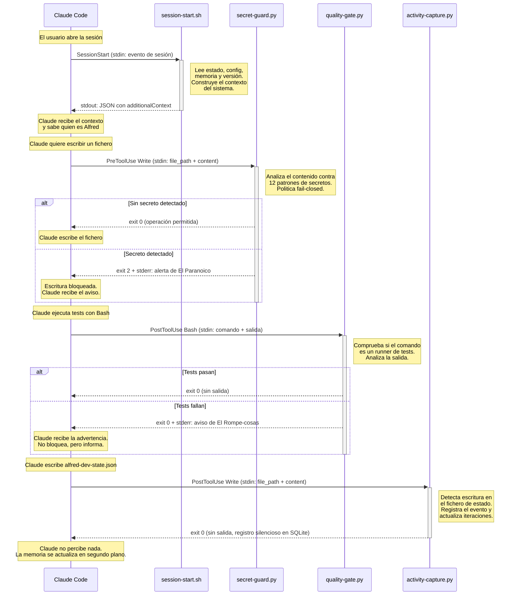

# Sistema de hooks

Los hooks son la pieza que conecta Alfred Dev con el ciclo de vida de Claude Code. Claude Code emite eventos en momentos clave de la sesión --al arrancar, antes de usar una herramienta, despues de usarla, al intentar parar-- y permite que los plugins registren scripts que se ejecutan en respuesta a esos eventos. Es, en esencia, un sistema de observadores tipificados: cada hook se suscribe a un tipo de evento concreto, con un filtro opcional (matcher) que restringe sobre que herramientas actua, y Claude Code se encarga de invocarlo en el momento preciso.

Para Alfred Dev, los hooks inyectan contexto al arrancar, bloquean secretos y comandos peligrosos, vigilan tests y evidencia, capturan memoria útil y cierran Memory UI al salir. No hay stop-hook Ralph ni hooks de ortografía o dependencias.

---

## Como funcionan los hooks en Claude Code

El mecanismo de hooks de Claude Code sigue un modelo sencillo de registro, invocación y respuesta. Entender este modelo es imprescindible para comprender por que cada hook de Alfred esta disenado como lo esta.

### Registro

Los hooks se declaran en el fichero `hooks/hooks.json` del repositorio. Cada entrada asocia un evento del ciclo de vida con uno o mas scripts a ejecutar. La estructura básica es:

```json
{
  "hooks": {
    "NombreDelEvento": [
      {
        "matcher": "regex_que_filtra_herramientas",
        "hooks": [
          {
            "type": "command",
            "command": "ruta/al/script.sh",
            "timeout": 10,
            "async": false
          }
        ]
      }
    ]
  }
}
```

El campo `matcher` solo debe usarse en eventos donde Claude Code lo soporta. En Alfred se usa para filtrar nombre de herramienta (`PreToolUse` y `PostToolUse`) o tipo de sesión (`SessionStart`). Si no se específica matcher, el hook se ejecuta para todas las invocaciones de ese evento. Esta distinción es importante: un hook de `PostToolUse` sin matcher se ejecutaria despues de cada operación de cualquier herramienta, lo que generaria un coste de rendimiento innecesario. En eventos como `UserPromptSubmit`, `Stop`, `PostToolBatch`, `TaskCreated`, `TaskCompleted`, `WorktreeCreate`, `WorktreeRemove`, `CwdChanged`, `MessageDisplay` y `TeammateIdle`, Claude Code ignora `matcher`; `release:audit` falla si Alfred declara un matcher ahí para no crear una falsa sensación de filtrado. Este plugin no registra `Stop`, `UserPromptExpansion` ni `PreCompact`. Si se registrara `PreCompact`, el matcher `manual\|auto` omitido para cubrir ambos tipos de compactación. El campo `if` solo se evalua en eventos de herramientas (`PreToolUse`, `PostToolUse`, `PostToolUseFailure`, `PermissionRequest` y `PermissionDenied`); en cualquier otro evento no debe usarse porque el handler no se ejecutaria.

### Invocación

Cuando Claude Code emite un evento que coincide con un hook registrado, ejecuta el script indicado como un proceso externo. La información del evento se pasa por **stdin** en formato JSON. El contenido exacto del JSON varia segun el tipo de evento, pero tipicamente incluye:

- `tool_name`: nombre de la herramienta que disparo el evento (Write, Edit, Bash, etc.).
- `tool_input`: parámetros que Claude envio a la herramienta (ruta del fichero, contenido, comando...).
- `tool_output`: resultado de la herramienta (solo disponible en `PostToolUse`).

### Respuesta

El script responde a traves de tres canales:

| Canal | Propósito |
|-------|-----------|
| **stdout** | Respuesta estructurada (JSON). Claude Code lo interpreta segun el tipo de evento. En `SessionStart` y `PreCompact`, el campo `hookSpecificOutput.additionalContext` se inyecta como contexto de la conversacion. El JSON debe incluir `hookSpecificOutput.hookEventName`. En `Stop`, un objeto con `"decision": "block"` impide que Claude se detenga. Cuando el aviso debe ser estructurado para el usuario, el JSON puede incluir `systemMessage`. |
| **stderr** | Mensajes breves de diagnostico o aviso. Claude Code los muestra segun el evento; Alfred lo mantiene para avisos informativos de quality-gate y lecturas sensibles. |
| **Exit code** | `0` indica operación permitida, `2` indica bloqueo (solo relevante en `PreToolUse`). Cualquier otro código no cero se trata como error del hook y se ignora. |

### Modos de ejecución

Los hooks pueden ser **sincronos** o **asincronos**. En modo síncrono (por defecto), Claude Code espera a que el script termine antes de continuar. Esto es imprescindible para hooks que necesitan bloquear una operación, como `secret-guard.py`. En modo asíncrono (`"async": true`), Claude Code lanza el script y continua sin esperar el resultado, lo que es apropiado para hooks de inyección de contexto como `session-start.sh`.

Cada hook tiene un **timeout configurable** en segundos. Si el script no termina dentro del plazo, Claude Code lo mata y continua como si no existiera. Este mecanismo protege contra scripts colgados que podrian bloquear la sesión indefinidamente.

---

## Los hooks de Alfred Dev 0.7.0

Alfred Dev registra diez scripts visibles en `SessionStart`, `SessionEnd`, `UserPromptSubmit`, `PreToolUse` y `PostToolUse`. No hay stop-hook Ralph ni hooks de compactación o ortografía. Cada hook tiene una responsabilidad única y falla de forma segura: exit 0 salvo los bloqueos de secretos y comandos peligrosos.

### session-bootstrap.sh

**Evento:** `SessionStart` -- **Matcher:** `startup|resume|clear|compact` -- **Timeout:** 10 s -- **Asíncrono:** no

Este hook ligero existe para eliminar una carrera del primer arranque en Claude Code CLI. Su misión es puramente operativa: preparar el proyecto antes de que Claude procese el primer prompt. Hace cinco cosas, todas idempotentes y locales al repo:

1. crea o corrige `.claude/alfred-dev.local.md` con autonomía CLI-first y memoria activada;
2. crea `.claude/alfred-memory.db` si aún no existe;
3. genera `.claude/settings.local.json` y `.claude/settings.json` con la allowlist mínima para los comandos helper-first;
4. crea el wrapper local `.claude/alfred-continuity.py`;
5. asegura una iteración `session` activa en la SQLite del proyecto.

El wrapper vive en el proyecto para que Claude Code pueda ejecutar helpers con
una regla Bash local y acotada, pero no confia solo en una ruta absoluta de
cache: primero usa `CLAUDE_PLUGIN_ROOT` si está disponible, luego el fallback
embebido y, si esa instalación ya fue rotada, busca la cache activa de
`alfred-dev`.

No inyecta contexto adicional en Claude ni hace llamadas de red. Precisamente por eso es síncrono: tiene que terminar antes de que el primer slash command dependa de esos artefactos.

### prompt-route.py

**Evento:** `UserPromptSubmit` -- **Matcher:** ninguno -- **Timeout:** 5 s -- **Asíncrono:** no

Si el usuario escribe en castellano sin slash, clasifica la petición
(`fix`, `quick`, `retomar`, `ship`…) e inyecta `additionalContext` para
que Claude actúe como ese comando. Si ya hay `/alfred-dev:` o no hay
señal, no dice nada. Fail-open.

### session-end.py

**Evento:** `SessionEnd` -- **Asíncrono:** si

Detiene Memory UI y, si hubo sesión o evidencia de tests, escribe
`.claude/alfred-last-cierre.md` con el bloque pegable. No inventa trabajo.

### session-start.sh

**Evento:** `SessionStart` -- **Matcher:** `startup|resume|clear|compact` -- **Asíncrono:** si

Se ejecuta justo despues del bootstrap. Inyecta el protocolo de hablar sin
slash y un briefing de tres lineas: sesion/handoff/UAT, ultima decision y
ADRs aceptados. Si el helper falla, usa un fallback corto.

El briefing se construye en `core/session_brief.py` (estado, handoff, UAT,
memoria y ADRs). No llama a GitHub. Las quality gates verificables con evidencia
siguen en los flujos, no en este hook.

La salida es un JSON con la clave `hookSpecificOutput.additionalContext` que Claude Code inyecta como contexto del sistema.

### secret-guard.py

**Evento:** `PreToolUse` -- **Matcher:** `Write|Edit|Bash|mcp__.*` -- **Timeout:** 5 s

Este es el hook que bloquea escrituras de secretos. Se ejecuta **antes** de Write, Edit, Bash o una tool MCP de escritura, analiza el contenido y, si detecta un patron de secreto, impide la operación con exit code 2.

La politica de este hook es **fail-closed**: si el script no puede parsear la entrada de stdin o no puede cargar la fuente canónica de patrones (`core/secrets.py`), bloquea por precaucion. Esta decisión es deliberada: es preferible un falso positivo que obliga a reintentar a un falso negativo que deja un secreto expuesto en el repositorio.

El script detecta 12 familias de patrones de secretos, mas un patron genérico de asignación de credenciales:

| Patron | Descripción |
|--------|-------------|
| `AKIA[0-9A-Z]{16}` | AWS Access Key |
| `sk-[a-zA-Z0-9]{20,}` | Clave API con prefijo sk- (OpenAI, Stripe u otros) |
| `sk-ant-[a-zA-Z0-9\-]{20,}` | Anthropic API Key |
| `ghp_[a-zA-Z0-9]{36}` / `github_pat_...` | GitHub Personal Access Token |
| `xox[bpsa]-...` | Slack Token |
| `AIza[0-9A-Za-z\-_]{35}` | Google API Key |
| `SG\.xxx.xxx` | SendGrid API Key |
| `-----BEGIN ... PRIVATE KEY-----` | Clave privada PEM/SSH |
| `eyJ...` (tres segmentos base64) | JWT token hardcodeado |
| `mysql://...@`, `postgresql://...@`, etc. | Connection string con credenciales |
| `hooks.slack.com/services/...` | Slack Webhook URL |
| `discord.com/api/webhooks/...` | Discord Webhook URL |
| Asignación directa (`password = "..."`, etc.) | Credencial hardcodeada en código |

Los ficheros de entorno reales se excluyen del análisis porque son el lugar legitimo para guardar secretos. La exclusion cubre `.env`, `.env.local`, `local.env` y variantes reales de `.env.*`, pero **no** plantillas como `.env.example`, `.env.sample`, `.env.template` o `.env.dist`, que se suelen versionar y por tanto no deben contener secretos reales.

Cuando el hook bloquea, emite un mensaje en la voz de "El Paranoico" que explica que patron se detecto, por que no se debe hardcodear secretos y donde deberian ir (fichero `.env`, variables de entorno, gestor de secretos).

### dangerous-command-guard.py

**Evento:** `PreToolUse` -- **Matcher:** `Bash` -- **Timeout:** 5 s

Este hook actua como segunda linea de defensa contra comandos destructivos. Se ejecuta antes de cada invocación de Bash, analiza el comando y lo bloquea (exit 2) si coincide con un patron potencialmente catastrofico.

Ademas, desde `0.4.5` autoaprueba una allowlist muy estrecha de helpers
deterministas locales de Alfred (`python3 .claude/alfred-continuity.py ...`)
para que los comandos helper-first puedan arrancar en headless sin pedir
permiso manual en su primer uso.

A diferencia de los hooks informativos, la politica de este hook es **fail-closed**: si no puede parsear la entrada, bloquea por precaucion. La razon es la misma que en `secret-guard.py`: un guard de seguridad que falla en abierto deja la puerta abierta justo en el peor momento.

El hook vigila 10 familias de patrones peligrosos:

| Patron | Descripción |
|--------|-------------|
| `rm -rf /` (o `~`, `$HOME`, `/usr`, etc.) | Borrado catastrofico del sistema, home o directorios de sistema. Cubre flags juntas (`-rf`), separadas (`-r -f`) y con `sudo`. |
| `git push --force main/master` | Force push a rama protegida con riesgo de perdida de historial. |
| `git push --force` (sin rama) | Force push sin rama explícita: avisa de que puede afectar a main/master. |
| `DROP DATABASE/TABLE/SCHEMA` | Destruccion de datos en base de datos (case-insensitive). |
| `docker system prune -af` | Eliminacion de todos los datos de contenedores, volumenes e imagenes. |
| `chmod -R 777 /` | Permisos inseguros sobre directorio raiz. |
| `:(){ :\|:& };:` | Fork bomb: denegación de servicio local. |
| `mkfs.* /dev/*` | Formateo de disco sobre dispositivo de bloque. |
| `dd of=/dev/sd*` | Escritura directa a dispositivo de bloque con dd. |
| `git reset --hard origin/main` | Descarta todos los cambios locales contra la rama remota. |

El mensaje de bloqueo incluye el comando truncado (200 caracteres), la descripción del riesgo y la sugerencia de ejecutar el comando manualmente si es realmente necesario.

### sensitive-read-guard.py

**Evento:** `PreToolUse` -- **Matcher:** `Read` -- **Timeout:** 5 s

Este hook emite un aviso informativo cuando Claude intenta leer un fichero que puede contener credenciales o claves privadas. A diferencia de los otros hooks de seguridad, no bloquea la operación: su propósito es alertar al agente para que tenga cuidado de no filtrar el contenido en respuestas, commits o artefactos generados.

El hook reconoce dos tipos de patrones:

**Por nombre base del fichero:** variables de entorno (`.env`, `.env.*`), claves privadas (`.pem`, `.key`, `.p12`, `.pfx`), claves SSH (`id_rsa`, `id_ed25519`, `id_ecdsa`), credenciales de servicios (`credentials.json`, `service-account.json`, `service-account.*.json`, `firebase-adminsdk*.json`, `.npmrc`, `.pypirc`, `terraform.tfstate`), ficheros de contrasenas (`.htpasswd`) y almacenes de claves Java (`.jks`, `.keystore`).

**Por ruta completa:** credenciales AWS (`.aws/credentials`, `.aws/config`), Docker (`.docker/config.json`), Kubernetes (`.kube/config`), estado local de Terraform (`.terraform/terraform.tfstate`), directorio SSH (`.ssh/`) y directorio GPG (`.gnupg/`).

La politica es estrictamente informativa: siempre sale con exit 0. Si no puede parsear la entrada, sale silenciosamente sin avisar.

### quality-gate.py

**Evento:** `PostToolUse` -- **Matcher:** `Bash` -- **Timeout:** 10 s

Este hook vigila la salida de los comandos Bash para detectar ejecuciones de tests con resultados fallidos. A diferencia de `secret-guard.py`, no bloquea: informa por stderr con la voz de "El Rompe-cosas" para que Claude sepa que debe corregir los fallos antes de avanzar.

El hook opera en dos fases. Primero determina si el comando ejecutado corresponde a un runner de tests, comparando la cadena del comando contra una lista de 17 patrones regex que cubren los ecosistemas mas comunes:

`pytest`, `vitest`, `jest`, `mocha`, `cargo test`, `go test`, `npm test`, `pnpm test`, `bun test`, `yarn test`, `python -m unittest`, `phpunit`, `rspec`, `mix test`, `dotnet test`, `maven test` / `mvn test` y `gradle test`.

Los runners de una sola palabra (`pytest`, `jest`, `vitest`, `mocha`, etc.) usan un ancla de posición de comando (`(?:^|[;&|])\s*`) que exige que el runner aparezca al inicio de la cadena o tras un operador shell, lo que evita falsos positivos como `cat pytest.ini` o `grep jest config.js`. Los runners de varias palabras (`cargo test`, `npm test`, etc.) usan limites de palabra (`\b`) porque su prefijo los ancla de forma natural.

Si el comando es un runner de tests, la segunda fase analiza stdout y stderr buscando patrones de fallo. Si la salida no permite decidir pero el runner devolvio `exit_code != 0`, tambien se considera fallo. El hook tolera tanto el payload historico `tool_output` como el payload actual `tool_result`, para no depender de una sola variante del runtime.

### evidence-guard.py

**Evento:** `PostToolUse` -- **Matcher:** `Bash` -- **Timeout:** 10 s

Registra evidencia de runners de tests para que las quality gates no se cierren con una afirmación verbal. Fail-open: nunca bloquea el flujo.

### activity-capture.py

**Evento:** `PostToolUse` -- **Matcher:** `Write|Edit` y `Bash` -- más `UserPromptSubmit` -- **Timeout:** 10 s

Este hook centraliza la captura de actividad en los eventos que el plugin registra. No está suscrito a `UserPromptExpansion`, `PreCompact` ni `Stop`. En `UserPromptSubmit` registra el prompt y, si aplica, deja rastro de continuidad. En `Write`/`Edit`/`Bash` captura ficheros, comandos y commits.

El hook registra cada evento en la base de datos SQLite de memoria persistente (`alfred-memory.db`) con tres niveles de detalle:

| Nivel | Propósito |
|-------|-----------|
| `summary` | Texto legible en castellano (una linea), pensado para listados rapidos. |
| `payload` | JSON estructurado con los campos clave del evento, pensado para filtrado programático. |
| `content` | Texto completo cuando aporta valor directo; en herramientas de alto volumen (`Glob`, `Grep`, `WebFetch`, `WebSearch`) se guarda un preview recortado con metadatos de truncado para evitar ruido excesivo. |

La tabla de dispatchers mapea cada tipo de evento a su función de procesamiento:

| Evento | Tipo | Que captura |
|--------|------|-------------|
| `Write` | PostToolUse | Fichero escrito: ruta, extensión, lineas y contenido completo. Si el fichero es `alfred-dev-state.json`, dispara además la lógica de seguimiento de iteraciones y fases. |
| `Edit` | PostToolUse | Fichero editado: diff old/new con conteo de lineas. |
| `Bash` | PostToolUse | Comando ejecutado: comando, exit code, stdout y stderr completos. Si detecta un `git commit` exitoso, captura además los metadatos del commit (SHA, mensaje, autor, ficheros). |
| `UserPromptSubmit` | Evento propio | Prompt del usuario: texto completo. |

La memoria solo esta activa si el usuario la ha habilitado explícitamente en `.claude/alfred-dev.local.md` con la sección `memoria: enabled: true`. El hook comprueba esta configuración antes de hacer nada, y si no esta habilitada, sale inmediatamente.

El hook excluye automáticamente ficheros de rutas internas (`.claude/`, `.git/`, `node_modules/`, `__pycache__/`, `.venv/`) y comandos triviales de lectura o navegación (`ls`, `pwd`, `cat`, etc.) para evitar ruido en el historial.

La lógica de seguimiento de iteraciones y fases (heredada de `memory-capture.py`) se activa cuando se escribe `alfred-dev-state.json`. Captura tres tipos de eventos de flujo: `iteration_started` (si no hay iteracion activa), `phase_completed` (fases nuevas que aun no estan registradas) e `iteration_completed` (cuando la fase actual pasa a `"completado"`).

La detección de commits (heredada de `commit-capture.py`) se basa en la regex `(?:^|&&|\|\||;)\s*git\s+commit\b` y se activa solo si el exit code es 0. Ejecuta `git log -1` para extraer SHA, mensaje, autor y ficheros, y los registra con `MemoryDB.log_commit()`, que es idempotente por SHA.

La politica es **fail-open**: cualquier error se imprime en stderr con prefijo `[activity-capture]` y el hook sale con código 0 sin bloquear el flujo.

---

## Diagrama de interacción

El siguiente diagrama muestra como interactuan los hooks con Claude Code durante una sesión típica. Los cuatro hooks representados cubren arranque, bloqueo de secretos, quality gates y captura; `prompt-route.py`, `session-end.py`, `dangerous-command-guard.py`, `sensitive-read-guard.py` y `evidence-guard.py` siguen patrones analogos.


```mermaid
sequenceDiagram
    participant CC as Claude Code
    participant SS as session-start.sh
    participant SG as secret-guard.py
    participant QG as quality-gate.py
    participant AC as activity-capture.py

    Note over CC: El usuario abre la sesión

    CC->>+SS: SessionStart (stdin: evento de sesión)
    Note right of SS: Lee estado, config,<br/>memoria y versión.<br/>Construye el contexto<br/>del sistema.
    SS-->>-CC: stdout: JSON con additionalContext
    Note over CC: Claude recibe el contexto<br/>y sabe quien es Alfred

    Note over CC: Claude quiere escribir un fichero

    CC->>+SG: PreToolUse Write (stdin: file_path + content)
    Note right of SG: Analiza el contenido contra<br/>12 patrones de secretos.<br/>Politica fail-closed.

    alt Sin secreto detectado
        SG-->>CC: exit 0 (operación permitida)
        Note over CC: Claude escribe el fichero
    else Secreto detectado
        SG-->>CC: exit 2 + stderr: alerta de El Paranoico
        Note over CC: Escritura bloqueada.<br/>Claude recibe el aviso.
    end
    deactivate SG

    Note over CC: Claude ejecuta tests con Bash

    CC->>+QG: PostToolUse Bash (stdin: comando + salida)
    Note right of QG: Comprueba si el comando<br/>es un runner de tests.<br/>Analiza la salida.

    alt Tests pasan
        QG-->>CC: exit 0 (sin salida)
    else Tests fallan
        QG-->>CC: exit 0 + stderr: aviso de El Rompe-cosas
        Note over CC: Claude recibe la advertencia.<br/>No bloquea, pero informa.
    end
    deactivate QG

    Note over CC: Claude escribe alfred-dev-state.json

    CC->>+AC: PostToolUse Write (stdin: file_path + content)
    Note right of AC: Detecta escritura en<br/>el fichero de estado.<br/>Registra el evento y<br/>actualiza iteraciones.
    AC-->>-CC: exit 0 (sin salida, registro silencioso en SQLite)
    Note over CC: Claude no percibe nada.<br/>La memoria se actualiza en segundo plano.
```

---

## Tabla resumen

| Evento | Matcher | Script | Timeout | Asíncrono | Bloquea | Que vigila |
|--------|---------|--------|---------|-----------|---------|------------|
| `SessionStart` | `startup\|resume\|clear\|compact\|fork` | `session-bootstrap.sh` | 10 s | No | No | Bootstrap síncrono del proyecto: config local, memoria, permisos y wrapper helper-first. |
| `SessionStart` | `startup\|resume\|clear\|compact\|fork` | `session-start.sh` | 5 s | Si | No | Briefing de sesión y protocolo de hablar sin slash. |
| `SessionEnd` | _(ninguno)_ | `session-end.py` | -- | Si | No | Detiene Memory UI y escribe el cierre. Fail-open. |
| `UserPromptSubmit` | _(ninguno)_ | `activity-capture.py` | 10 s | No | No | Captura el prompt. Fail-open. |
| `UserPromptSubmit` | _(ninguno)_ | `prompt-route.py` | 5 s | No | No | Sugiere fix/quick/retomar si el texto no trae slash. |
| `PreToolUse` | `Write\|Edit\|Bash\|mcp__.*` | `secret-guard.py` | 5 s | No | Si | Secretos en ficheros, comandos y tools MCP de escritura. |
| `PreToolUse` | `Bash` | `dangerous-command-guard.py` | 5 s | No | Si | Comandos destructivos: rm -rf /, force push, DROP DATABASE, docker prune, fork bombs. |
| `PreToolUse` | `Read` | `sensitive-read-guard.py` | 5 s | No | No | Lectura de ficheros sensibles. Avisa sin bloquear. |
| `PostToolUse` | `Bash` | `activity-capture.py` | 10 s | No | No | Captura comandos y commits. |
| `PostToolUse` | `Bash` | `quality-gate.py` | 10 s | No | No | Resultado de ejecuciones de tests. Avisa sin bloquear. |
| `PostToolUse` | `Bash` | `evidence-guard.py` | 10 s | No | No | Registra evidencia real de tests para gates automaticas. |
| `PostToolUse` | `Write\|Edit` | `activity-capture.py` | 10 s | No | No | Captura escrituras y seguimiento de fases. |

---

## Como crear un nuevo hook

Alfred Dev esta disenado para que añadir hooks nuevos sea un proceso predecible. Si necesitas que el plugin reaccione a un evento del ciclo de vida que actualmente no cubre, puedes crear un hook siguiendo la estructura que se describe a continuacion.

### 1. Escribir el script

Un hook es un script ejecutable (bash o python) que lee de stdin, procesa la información y responde a traves de stdout, stderr y el código de salida. La estructura mínima es:

```python
#!/usr/bin/env python3
"""
Hook <tipo_evento> para <matcher>: descripción breve.
"""

import json
import sys


def main():
    """Punto de entrada del hook."""
    try:
        data = json.load(sys.stdin)
    except ValueError:
        # Si no se puede leer la entrada, salir sin bloquear
        sys.exit(0)

    tool_input = data.get("tool_input", {})

    # ... lógica de análisis ...

    # Tres opciones de respuesta:
    # 1. Silencioso: exit 0 sin salida
    # 2. Informativo: exit 0 + mensaje en stderr
    # 3. Bloqueo: exit 2 + mensaje en stderr (solo PreToolUse)

    sys.exit(0)


if __name__ == "__main__":
    main()
```

El JSON de stdin contiene campos diferentes segun el evento:

| Evento | Campos principales en stdin |
|--------|----------------------------|
| `SessionStart` | Información de la sesión (tipo de inicio, metadatos). |
| `Stop` | Mínimo o vacio. El hook consulta el estado del proyecto directamente. |
| `PreToolUse` | `tool_name`, `tool_input` (parámetros que Claude quiere pasar a la herramienta). |
| `PostToolUse` | `tool_name`, `tool_input`, `tool_output` (resultado de la herramienta). |

### 2. Registrar en hooks.json

Añade una entrada en `hooks/hooks.json` dentro del evento correspondiente:

```json
{
  "matcher": "Write|Edit",
  "hooks": [
    {
      "type": "command",
      "command": "python3",
      "args": [
        "${CLAUDE_PLUGIN_ROOT}/hooks/mi-nuevo-hook.py"
      ],
      "timeout": 10
    }
  ]
}
```

La variable `${CLAUDE_PLUGIN_ROOT}` se resuelve automáticamente al directorio raiz del plugin. Declárala en `args`, no dentro de un string de shell, para que rutas con espacios o caracteres especiales funcionen sin comillas manuales. Esa ruta pertenece a la instalación de una versión concreta y puede cambiar al actualizar el plugin; no guardes estado persistente dentro de ella. El matcher es una expresión regular que se evalua contra el nombre de la herramienta; si no se específica, el hook se ejecuta para todas las invocaciones del evento.

### 3. Patrones de comunicación

Alfred Dev utiliza tres patrones de comunicación en sus hooks, cada uno con un propósito y un contrato definidos:

**Informativo (exit 0 + stderr).** El hook detecta algo que merece atencion pero no impide la operación. El mensaje se imprime en stderr para que Claude Code lo muestre al usuario como advertencia. Es el patron que usan `quality-gate.py` y `sensitive-read-guard.py`. Ejemplo:

```python
print("[Mi Hook] He detectado algo relevante.", file=sys.stderr)
sys.exit(0)
```

**Bloqueo (exit 2 + stderr).** El hook impide que la operación se ejecute. Solo tiene sentido en `PreToolUse`, porque en `PostToolUse` la operación ya se ha realizado. El mensaje de stderr explica por que se bloquea. En este patrón stdout debe quedar vacío: Claude Code ignora cualquier JSON cuando el proceso sale con `2`. Es el patron que usan `secret-guard.py` y `dangerous-command-guard.py`. Ejemplo:

```python
print("[Mi Hook] Operación bloqueada: motivo detallado.", file=sys.stderr)
sys.exit(2)
```

No envuelvas hooks bloqueantes con `|| true`: eso convierte el `exit 2` en
éxito y neutraliza el bloqueo.

Cuando el bloqueo necesita comunicar una decisión a Claude Code, emite tambien
JSON por stdout con `{"decision": "block", "reason": "..."}` y sal con código
`0`; no mezcles JSON de control con `exit 2`. Los hooks que inyectan contexto
usan `hookSpecificOutput.additionalContext`; los avisos estructurados para el
usuario deben preferir `systemMessage`.

**Silencioso (exit 0 sin salida).** El hook hace su trabajo internamente sin emitir nada. Claude Code y el usuario no perciben su ejecución. Es el patron que usa `activity-capture.py` para registrar eventos en SQLite sin interrumpir el flujo.

### 4. Restricciones a tener en cuenta

Hay varias restricciones de diseño que conviene respetar para mantener la coherencia del sistema:

- **Timeout conservador.** Los hooks sincronos no deben superar los 10 segundos de timeout. Un hook que tarda mas de 10 segundos degrada la experiencia del usuario porque Claude Code espera bloqueado. Si la operación requiere mas tiempo, considera usar `"async": true` (pero entonces no podras bloquear).

- **No modificar el contenido del evento.** Los hooks pueden leer y analizar la información del evento, pero no deben intentar modificarla. Un hook de `PreToolUse` puede bloquear una escritura, pero no puede alterar el contenido que Claude quiere escribir.

- **Fallo seguro.** Si el hook no puede leer su entrada, no puede acceder a un fichero necesario o sufre cualquier error interno, la decisión por defecto debe ser no bloquear (exit 0). Las excepciones son los hooks de seguridad que protegen escrituras o comandos destructivos, como `secret-guard.py` y `dangerous-command-guard.py`, donde la politica fail-closed (bloquear ante la duda) tiene mas sentido que fail-open.

- **Una responsabilidad por hook.** Cada hook debe hacer una cosa y hacerla bien. Si necesitas vigilar dos aspectos diferentes, crea dos hooks. Esto facilita la depuración, el testing y la posibilidad de desactivar un hook concreto sin afectar a los demas.

- **Voz del agente.** Los mensajes de los hooks de Alfred usan la voz de un agente concreto del equipo: El Paranoico para seguridad, El Rompe-cosas para calidad. Si anades un hook nuevo, asignale un agente coherente con su función o crea uno nuevo si ninguno encaja.
