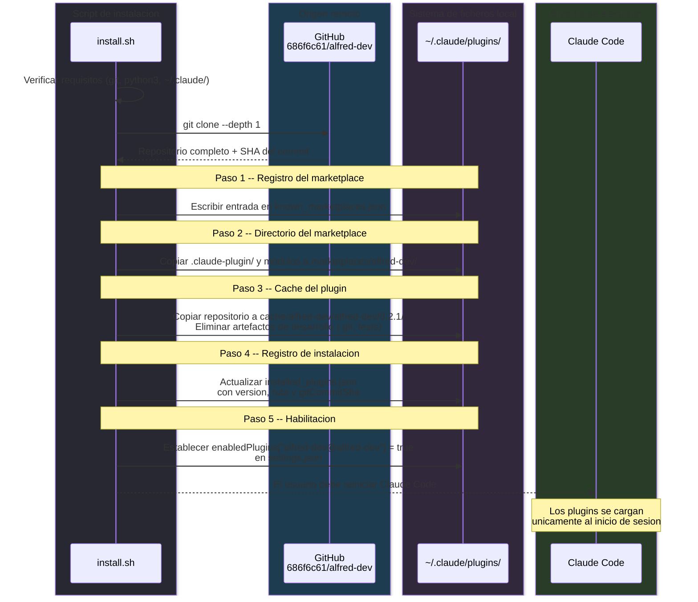

# Instalacion y cadena de carga

Instalar un plugin en Claude Code no es tan simple como copiar ficheros a un directorio. Claude Code implementa un sistema de carga por eslabones: el plugin debe estar registrado en tres ficheros JSON distintos y existir fisicamente en dos directorios concretos dentro de `~/.claude/plugins/`. Si falta cualquiera de estos cinco eslabones, Claude Code ignora el plugin de forma silenciosa, sin mostrar ningun error ni advertencia. Este documento explica cada paso del proceso, por que es necesario y como los scripts de instalacion lo automatizan.

La razon de esta arquitectura en cadena es doble. Por un lado, Claude Code necesita distinguir entre plugins que simplemente estan descargados y plugins que el usuario ha decidido activar de forma explicita. Por otro, el sistema de marketplaces permite que varios repositorios publiquen plugins independientes, y cada uno necesita su propio registro. El resultado es un modelo de cinco eslabones donde cada pieza cumple una funcion especifica.

---

## Los cinco eslabones de la cadena de carga

Cada eslabon tiene una responsabilidad concreta. Si alguno falta o esta mal configurado, el plugin no se carga y Claude Code no emite ningun diagnostico. Por eso es fundamental entender que hace cada uno y donde se ubica.

### 1. Registro del marketplace

**Fichero:** `~/.claude/plugins/known_marketplaces.json`

Claude Code solo busca plugins en marketplaces que conozca. El marketplace oficial de Anthropic viene registrado de serie, pero los plugins externos --como Alfred Dev-- necesitan registrar su propio marketplace, que en la practica es un repositorio de GitHub. Este fichero contiene un mapa donde la clave es el nombre del marketplace y el valor describe su origen y ubicacion local.

Para Alfred Dev, la entrada tiene esta forma:

```json
{
  "alfred-dev": {
    "source": {
      "source": "github",
      "repo": "686f6c61/alfred-dev"
    },
    "installLocation": "~/.claude/plugins/marketplaces/alfred-dev",
    "lastUpdated": "2026-02-21T10:00:00.000Z"
  }
}
```

Sin este registro, Claude Code desconoce la existencia del marketplace y, por tanto, de todos sus plugins.

### 2. Directorio del marketplace

**Ruta:** `~/.claude/plugins/marketplaces/alfred-dev/`

Es la copia local del catalogo del marketplace. El fichero clave que Claude Code lee es `.claude-plugin/marketplace.json`, que describe los plugins disponibles en ese marketplace: nombre, descripcion, version y ruta del codigo fuente. Ademas, el directorio contiene una copia de los ficheros del plugin (agentes, comandos, skills) que Claude Code utiliza para la resolucion de dependencias.

La razon de tener esta copia separada de la cache es que Claude Code trata el marketplace como un catalogo consultable --para listar plugins disponibles, por ejemplo-- mientras que la cache es la copia de ejecucion real.

### 3. Cache del plugin

**Ruta:** `~/.claude/plugins/cache/alfred-dev/alfred-dev/<version>/`

Este directorio contiene todos los ficheros que Claude Code carga al iniciar sesion: agentes, comandos, hooks, skills, modulos del nucleo, servidores MCP y el manifiesto `.claude-plugin/plugin.json`. Es la copia operativa del plugin, la que realmente se ejecuta.

La estructura versionada (`cache/alfred-dev/alfred-dev/0.2.1/`) permite que coexistan varias versiones en disco, aunque Claude Code solo carga la que esta referenciada en `installed_plugins.json`. Esto facilita las actualizaciones y los rollbacks sin perder la version anterior.

Los artefactos de desarrollo (directorio `.git`, tests, scripts de instalacion) se eliminan de la cache durante la instalacion para mantener limpio el entorno de ejecucion.

### 4. Registro de instalacion

**Fichero:** `~/.claude/plugins/installed_plugins.json`

Este fichero es el inventario central de plugins instalados. Cada entrada registra la ruta de la cache, la version, la fecha de instalacion y el SHA del commit de Git desde el que se instalo. Sin este registro, Claude Code ignora por completo el directorio de la cache, aunque contenga todos los ficheros necesarios.

La clave de cada plugin sigue el formato `<plugin>@<marketplace>`, que en el caso de Alfred Dev es `alfred-dev@alfred-dev`. La entrada tiene esta estructura:

```json
{
  "version": 2,
  "plugins": {
    "alfred-dev@alfred-dev": [
      {
        "scope": "user",
        "installPath": "~/.claude/plugins/cache/alfred-dev/alfred-dev/0.2.1",
        "version": "0.2.1",
        "installedAt": "2026-02-21T10:00:00.000Z",
        "lastUpdated": "2026-02-21T10:00:00.000Z",
        "gitCommitSha": "abc123..."
      }
    ]
  }
}
```

El campo `gitCommitSha` es especialmente relevante para plugins externos: permite verificar que la copia local corresponde a un commit concreto del repositorio de origen.

### 5. Habilitacion

**Fichero:** `~/.claude/settings.json` (seccion `enabledPlugins`)

Un plugin puede estar instalado (eslabones 1 a 4 completos) pero no activo. Este ultimo eslabon es un mapa booleano que permite al usuario habilitar o deshabilitar plugins sin desinstalarlos. Claude Code solo carga los plugins cuya clave tenga valor `true`.

```json
{
  "enabledPlugins": {
    "alfred-dev@alfred-dev": true
  }
}
```

Este diseno separa la gestion del ciclo de vida (instalar/desinstalar) de la preferencia del usuario (activar/desactivar), lo que permite desactivar temporalmente un plugin sin perder su configuracion.

### Resumen de los cinco eslabones

| # | Eslabon | Ubicacion | Funcion |
|---|---------|-----------|---------|
| 1 | Registro del marketplace | `known_marketplaces.json` | Dar a conocer el repositorio de plugins a Claude Code |
| 2 | Directorio del marketplace | `marketplaces/alfred-dev/` | Catalogo local de plugins disponibles |
| 3 | Cache del plugin | `cache/alfred-dev/alfred-dev/0.2.1/` | Ficheros operativos que Claude Code carga en ejecucion |
| 4 | Registro de instalacion | `installed_plugins.json` | Inventario con version, ruta y SHA del commit |
| 5 | Habilitacion | `settings.json > enabledPlugins` | Interruptor de activacion/desactivacion |

---

## Diagrama del proceso de instalacion

El siguiente diagrama muestra la secuencia completa que ejecuta `install.sh`. Los cinco pasos se corresponden con los cinco eslabones descritos arriba. El script clona el repositorio una sola vez y distribuye los ficheros a los directorios correspondientes.



---

## Script de instalacion para macOS y Linux

**Fichero:** `install.sh`

**Uso:**

```bash
curl -fsSL https://raw.githubusercontent.com/686f6c61/alfred-dev/main/install.sh | bash
```

El script esta disenado para ser idempotente: si se ejecuta varias veces, sobreescribe la instalacion anterior sin dejar residuos ni provocar conflictos. No es necesario desinstalar antes de reinstalar.

### Variables principales

Las variables al inicio del script definen toda la configuracion. Estan centralizadas para facilitar su modificacion si cambia la estructura del plugin.

| Variable | Valor | Proposito |
|----------|-------|-----------|
| `PLUGIN_NAME` | `alfred-dev` | Identificador del plugin en todo el sistema |
| `REPO` | `686f6c61/alfred-dev` | Repositorio de GitHub de origen |
| `VERSION` | `0.2.1` | Version que se instala |
| `CLAUDE_DIR` | `$HOME/.claude` | Directorio raiz de Claude Code |
| `PLUGINS_DIR` | `$CLAUDE_DIR/plugins` | Directorio base de plugins |
| `INSTALL_DIR` | `cache/alfred-dev/alfred-dev/0.2.1` | Ruta final de la cache versionada |

### Verificaciones previas

Antes de tocar nada en el sistema de ficheros, el script comprueba tres requisitos:

1. **`$HOME` valido:** la variable debe existir y apuntar a un directorio real. Si no, las rutas derivadas serian incorrectas.
2. **Directorio `~/.claude/`:** debe existir, lo que implica que Claude Code esta instalado.
3. **Dependencias:** `git` y `python3` deben estar disponibles en el PATH.

Si alguna verificacion falla, el script aborta con un mensaje explicativo.

### Escritura atomica con Python

Todas las operaciones sobre ficheros JSON utilizan una funcion de escritura atomica implementada con Python: se escribe un fichero temporal en el mismo directorio y luego se renombra con `os.replace()`. La razon de usar este patron --en vez de escribir directamente-- es evitar la corrupcion del fichero si el proceso se interrumpe a mitad de escritura. Un `os.replace()` es una operacion atomica a nivel del sistema de ficheros, asi que el fichero destino siempre contiene JSON valido.

El script delega en Python (en lugar de `jq` u otras herramientas) porque `python3` tiene mayor presencia en instalaciones estandar de macOS y Linux, y porque la logica de actualizacion de JSON requiere mas control del que ofrece un simple `jq`.

### Limpieza ante interrupciones

El script registra un trap `cleanup` en `EXIT` que elimina el directorio temporal de clonacion si el proceso aborta por error, `SIGINT` u otra senal. En el camino feliz, el directorio temporal se limpia explicitamente antes de terminar, sin esperar al trap.

### Estructura de directorios copiados al marketplace

El script copia al directorio del marketplace tanto los metadatos (`.claude-plugin/marketplace.json`, `.claude-plugin/plugin.json`) como los modulos funcionales:

- `agents/`, `commands/`, `skills/`, `hooks/`, `core/`, `templates/`
- Ficheros raiz: `README.md`, `package.json`, `uninstall.sh`, `uninstall.ps1`

Solo se copian los directorios y ficheros que existen; el script no falla si alguno esta ausente.

### Limpieza de la cache

Despues de copiar el repositorio clonado a la cache, el script elimina artefactos que no son necesarios en tiempo de ejecucion: `.git/`, `site/`, `install.sh`, `tests/`, `.pytest_cache/`. Esto reduce el tamano de la cache y evita confusiones entre los ficheros de desarrollo y los operativos.

---

## Script de instalacion para Windows

**Fichero:** `install.ps1`

**Uso (PowerShell):**

```powershell
irm https://raw.githubusercontent.com/686f6c61/alfred-dev/main/install.ps1 | iex
```

La logica es identica a la del script bash, con las adaptaciones propias de PowerShell. Las principales diferencias son:

### Diferencias con el script bash

| Aspecto | Bash (`install.sh`) | PowerShell (`install.ps1`) |
|---------|---------------------|---------------------------|
| Ruta base | `$HOME/.claude` | `$env:USERPROFILE\.claude` |
| Lectura de JSON | `python3` con `json.load` | `ConvertFrom-Json` nativo |
| Escritura de JSON | `python3` con `json.dump` | `ConvertTo-Json -Depth 10` nativo |
| Escritura atomica | `tempfile.mkstemp` + `os.replace` | `[System.IO.Path]::GetTempFileName()` + `Move-Item -Force` |
| Copia de ficheros | `cp -r` | `Copy-Item -Recurse -Force` |
| Dependencias | `git`, `python3` | Solo `git` (PowerShell tiene JSON nativo) |

La ventaja del script PowerShell es que no requiere `python3` como dependencia: PowerShell incluye cmdlets nativos para manipular JSON (`ConvertFrom-Json`, `ConvertTo-Json`). La escritura atomica se implementa con `[System.IO.Path]::GetTempFileName()` seguido de `Move-Item -Force`, que ofrece las mismas garantias de integridad.

Las funciones auxiliares `Read-JsonFile` y `Write-JsonFileAtomic` encapsulan la lectura con manejo de errores y la escritura atomica respectivamente, manteniendo la misma estructura que el script bash.

---

## Desinstalacion

Los scripts de desinstalacion (`uninstall.sh` para macOS/Linux, `uninstall.ps1` para Windows) eliminan los cinco eslabones de la cadena de carga en el orden logico adecuado.

**macOS / Linux:**

```bash
curl -fsSL https://raw.githubusercontent.com/686f6c61/alfred-dev/main/uninstall.sh | bash
```

**Windows (PowerShell):**

```powershell
irm https://raw.githubusercontent.com/686f6c61/alfred-dev/main/uninstall.ps1 | iex
```

### Que se elimina

El proceso de desinstalacion toca exclusivamente los componentes del plugin dentro de `~/.claude/plugins/` y `~/.claude/settings.json`. La siguiente tabla detalla cada operacion en el orden en que se ejecuta:

| Orden | Operacion | Descripcion |
|-------|-----------|-------------|
| 1 | Eliminar cache | Borra `~/.claude/plugins/cache/alfred-dev/` con todas las versiones |
| 2 | Eliminar directorio de marketplace | Borra `~/.claude/plugins/marketplaces/alfred-dev/` |
| 3 | Limpiar `known_marketplaces.json` | Elimina la entrada `alfred-dev` del mapa de marketplaces conocidos |
| 4 | Limpiar `installed_plugins.json` | Elimina la entrada `alfred-dev@alfred-dev` del inventario de plugins |
| 5 | Limpiar `settings.json` | Elimina la clave `alfred-dev@alfred-dev` de `enabledPlugins` |

### Que no se elimina

Los scripts de desinstalacion no tocan los ficheros de configuracion local del proyecto. Esto es intencional: si el usuario reinstala el plugin mas adelante, su configuracion de proyecto se conserva. Los ficheros que permanecen son:

- `.claude/alfred-dev.local.md` -- configuracion local del proyecto
- `.claude/alfred-dev-state.json` -- estado persistente del plugin

Para una limpieza total, estos ficheros deben eliminarse manualmente desde cada proyecto donde se haya utilizado Alfred Dev.

Despues de la desinstalacion, es necesario reiniciar Claude Code para que los cambios surtan efecto.

---

## Actualizacion

La actualizacion se gestiona a traves del comando `/alfred update`, que comprueba si hay una version mas reciente en GitHub y ofrece instalarla.

### Como funciona el proceso

El flujo de actualizacion consta de cuatro pasos que el comando ejecuta de forma interactiva:

**Paso 1 -- Obtener la version instalada.** El comando busca el fichero `plugin.json` mas reciente dentro de `~/.claude/plugins/cache/alfred-dev/` y lee el campo `version`. Si coexisten varias versiones en cache (por actualizaciones previas), selecciona la mas reciente por fecha de modificacion.

**Paso 2 -- Consultar la ultima release en GitHub.** Hace una peticion a la API de GitHub en `https://api.github.com/repos/686f6c61/alfred-dev/releases/latest` y extrae el `tag_name` (version), el `name` (titulo de la release), el `body` (notas del cambio) y la fecha de publicacion.

**Paso 3 -- Comparar versiones.** Si el `tag_name` (sin el prefijo `v`) es distinto de la version instalada, muestra al usuario las notas de la release y le pregunta si quiere actualizar. Si las versiones coinciden, informa de que el plugin esta al dia y termina.

**Paso 4 -- Ejecutar la actualizacion.** Si el usuario acepta, el comando detecta la plataforma (`uname -s`) y ejecuta el instalador correspondiente:

- **macOS / Linux:** `curl -fsSL https://raw.githubusercontent.com/686f6c61/alfred-dev/main/install.sh | bash`
- **Windows:** `irm https://raw.githubusercontent.com/686f6c61/alfred-dev/main/install.ps1 | iex`

Los instaladores son idempotentes: sobreescriben la cache con la nueva version, actualizan `installed_plugins.json` con el nuevo SHA y version, y mantienen la habilitacion en `settings.json`. No es necesario desinstalar antes de actualizar.

Tras la actualizacion, el usuario debe reiniciar Claude Code para que se cargue la nueva version.

---

## Resolucion de problemas

Claude Code no ofrece diagnosticos cuando un plugin no se carga. El fallo es completamente silencioso: el plugin simplemente no aparece. Esto hace que la depuracion requiera verificar los cinco eslabones de la cadena de forma manual y sistematica.

### Claude Code no detecta el plugin

Es el problema mas frecuente y casi siempre se debe a que falta uno de los cinco eslabones. La forma mas fiable de diagnosticarlo es verificar cada uno en orden:

```bash
# 1. Comprobar que el marketplace esta registrado
python3 -c "import json; print(json.dumps(json.load(open('$HOME/.claude/plugins/known_marketplaces.json')), indent=2))"

# 2. Comprobar que el directorio del marketplace existe y tiene el catalogo
ls -la ~/.claude/plugins/marketplaces/alfred-dev/.claude-plugin/

# 3. Comprobar que la cache existe y contiene plugin.json
ls -la ~/.claude/plugins/cache/alfred-dev/alfred-dev/0.2.1/.claude-plugin/

# 4. Comprobar el registro de instalacion
python3 -c "import json; d=json.load(open('$HOME/.claude/plugins/installed_plugins.json')); print(json.dumps(d.get('plugins',{}).get('alfred-dev@alfred-dev','NO ENCONTRADO'), indent=2))"

# 5. Comprobar la habilitacion
python3 -c "import json; d=json.load(open('$HOME/.claude/settings.json')); print(d.get('enabledPlugins',{}).get('alfred-dev@alfred-dev','NO HABILITADO'))"
```

Si alguno de estos comandos devuelve un resultado inesperado, ese es el eslabon roto. La solucion mas directa suele ser reinstalar el plugin ejecutando de nuevo el script de instalacion.

### Error "marketplace no registrado"

Si `known_marketplaces.json` no contiene la entrada `alfred-dev`, Claude Code no sabe donde buscar el plugin. Esto puede ocurrir si el fichero se reinicio o si otra herramienta lo sobreescribio. La solucion es ejecutar de nuevo el instalador, que registra el marketplace de forma idempotente.

### El plugin no se carga tras instalar

Claude Code carga los plugins unicamente al inicio de sesion. Si el plugin se acaba de instalar pero Claude Code ya estaba ejecutandose, no lo detectara hasta el siguiente reinicio. La solucion es cerrar Claude Code completamente y volver a abrirlo.

### Permisos en macOS

Si los scripts no se ejecutan, es probable que no tengan permiso de ejecucion. Aunque el metodo recomendado (`curl | bash`) no requiere permisos especiales en el script remoto, si se descarga manualmente el fichero hay que asegurarse de que tiene permisos adecuados:

```bash
chmod +x install.sh
```

### El fichero JSON esta corrupto

Si algun fichero JSON (`known_marketplaces.json`, `installed_plugins.json`, `settings.json`) contiene JSON invalido, tanto la instalacion como la carga del plugin fallaran. El script de instalacion muestra un mensaje de error especifico indicando cual fichero esta corrupto y como restaurarlo. Por ejemplo:

```bash
# Restaurar known_marketplaces.json
echo '{}' > ~/.claude/plugins/known_marketplaces.json

# Restaurar installed_plugins.json
echo '{"version":2,"plugins":{}}' > ~/.claude/plugins/installed_plugins.json
```

Despues de restaurar el fichero, se puede ejecutar el instalador de nuevo para reconstruir las entradas del plugin.

### Resumen rapido de diagnostico

| Sintoma | Causa probable | Solucion |
|---------|---------------|----------|
| Plugin invisible en Claude Code | Falta algun eslabon de la cadena | Verificar los 5 eslabones en orden |
| "marketplace no registrado" | `known_marketplaces.json` sin la entrada | Reinstalar con `install.sh` |
| Plugin instalado pero no aparece | Claude Code no se ha reiniciado | Cerrar y abrir Claude Code |
| Script no se ejecuta en macOS | Sin permisos de ejecucion | `chmod +x install.sh` |
| Error de JSON invalido | Fichero corrupto por interrupcion | Restaurar el fichero y reinstalar |
| Fallo de red al actualizar | Sin conexion o rate limit de GitHub | Reintentar mas tarde |
