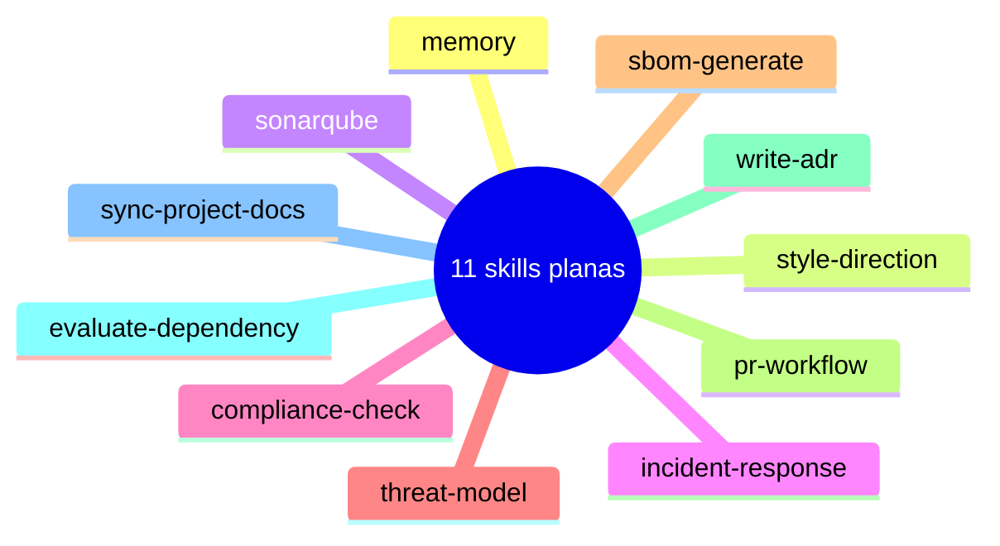

# Catalogo de skills

Los skills son las capacidades concretas que los agentes de Alfred pueden ejecutar. Cada skill es un fichero Markdown (`SKILL.md`) que contiene instrucciones paso a paso para una tarea específica: desde disenar un esquema de base de datos hasta auditar la accesibilidad de una interfaz. Los agentes no parten de una página en blanco: siguen las instrucciones del skill asignado para hacer el resultado más consistente, revisable y fácil de contrastar con evidencia.

La razon de separar los skills de los agentes es la misma por la que una empresa separa los procedimientos de los roles: un procedimiento (skill) puede ser ejecutado por diferentes personas (agentes) segun el contexto, y un mismo rol puede dominar multiples procedimientos. Esta separación permite que el sistema crezca sin acoplar capacidades a identidades.

El repositorio mantiene un **catalogo de 11 skills** planas en `skills/<nombre>/SKILL.md`. Cubren proceso propio de Alfred: memory, estilo visual, SonarQube, incidente, compliance, threat-model, SBOM, flujo de PRs, ADR, evaluación de dependencias y sync de docs vivas.

Los skills con side effects (SonarQube, companion visual, incident-response, pr-workflow) van con `disable-model-invocation: true`.

## Mapa



| Skill | Uso |
|-------|-----|
| `memory` | Consulta y política de escritura de la memoria SQLite |
| `style-direction` | Dirección visual de Selina |
| `sonarqube` | Preflight y análisis SonarQube |
| `incident-response` | Respuesta a incidentes |
| `compliance-check` | Comprobaciones de compliance |
| `threat-model` | Modelo de amenazas |
| `sbom-generate` | Generación de SBOM |
| `pr-workflow` | Flujo de pull request |
| `write-adr` | Architecture Decision Records en `docs/adr/` |
| `evaluate-dependency` | Veredicto de paquetes nuevos |
| `sync-project-docs` | Índice y sync de `docs/project/` |

## Como se ejecutan los skills

Los skills no sustituyen a los slash commands. Claude Code los descubre en `skills/<nombre>/SKILL.md`. El usuario interactua con los flujos (`/alfred-dev:feature`, `/alfred-dev:fix`, `/alfred-dev:audit`, etc.) y Alfred usa el skill si aporta procedimiento.

El único opcional del runtime es Lucius. Selina entra si hay frontend. No hay data-engineer, github-manager, copywriter ni el resto del catálogo 0.6.

---

## Como crear un nuevo skill

Crear un skill nuevo es el mecanismo para expandir las capacidades de Alfred sin modificar la lógica de los agentes ni de los flujos. Un skill bien escrito permite que cualquier agente lo ejecute de forma autonoma y que el resultado sea consistente independientemente del contexto.

### Estructura del fichero

Cada skill es un fichero `SKILL.md` dentro de un subdirectorio con nombre descriptivo en kebab-case, ubicado en el dominio correspondiente:

```
skills/<nombre-del-skill>/SKILL.md
```

Por ejemplo: `skills/threat-model/SKILL.md`.

### Secciones obligatorias

El fichero sigue esta estructura:

```markdown
---
name: nombre-del-skill
description: "Frase que describe cuando usar este skill"
---

# Titulo descriptivo del skill

## Resumen

Parrafo que explica que hace el skill, por que es necesario y que
resultado produce. El resumen debe permitir a cualquier persona
decidir si este skill es el adecuado para su tarea sin necesidad
de leer el proceso completo.

## Proceso

Pasos numerados que el agente debe seguir. Cada paso incluye:

1. **Nombre del paso en negrita.** Explicacion de que hacer, por que
   y como verificar que se ha hecho correctamente.

2. **Segundo paso.** Los pasos deben ser lo bastante concretos para
   que no haya ambiguedad, pero lo bastante genéricos para que
   funcionen en diferentes proyectos y stacks.

## Criterios de exito

Lista de condiciones que deben cumplirse para considerar que el
skill se ha ejecutado correctamente. Estos criterios son la
definición de "hecho" del skill.
```

### Pautas de redaccion

Al escribir un skill nuevo, conviene tener en cuenta los siguientes principios:

- **Explica el "por que", no solo el "que".** Un paso que dice "crear índice en la columna X" es menos util que uno que dice "crear índice en la columna X porque el EXPLAIN muestra un full table scan". El razonamiento detrás de cada accion es lo que permite al agente adaptarse a situaciones imprevistas.

- **Se concreto pero no rigido.** Los pasos deben dar instrucciones claras sin asumir un stack específico, salvo que el skill sea inherentemente específico de un ecosistema (como `sonarqube`). Usar ejemplos de multiples stacks cuando sea relevante.

- **Incluye "que NO hacer".** Los errores comunes y los antipatrones son tan valiosos como las instrucciones positivas. Una sección que previene errores ahorra mas tiempo que una que los corrige.

- **Los criterios de exito son verificables.** Cada criterio debe poder responderse con un "si" o un "no" objetivo. "El código es de buena calidad" no es verificable; "los tests pasan y no hay vulnerabilidades críticas sin resolver" si lo es.

- **Un skill, una responsabilidad.** Si un skill intenta cubrir demasiado, dividirlo. Es preferible tener dos skills específicos que uno genérico que intente hacer todo.

### Asignación a un agente

Una vez creado el skill, hay que asignarlo a un agente editando el fichero del agente correspondiente en `agents/`. La asignación se refleja en la descripción del agente y en la configuración de los flujos que deben invocarlo. El skill no tiene efecto hasta que un agente lo referencia como parte de su repertorio de capacidades.
